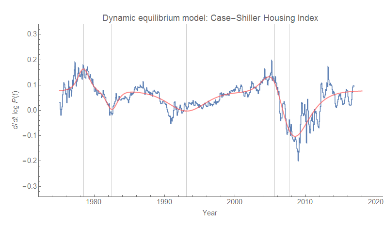
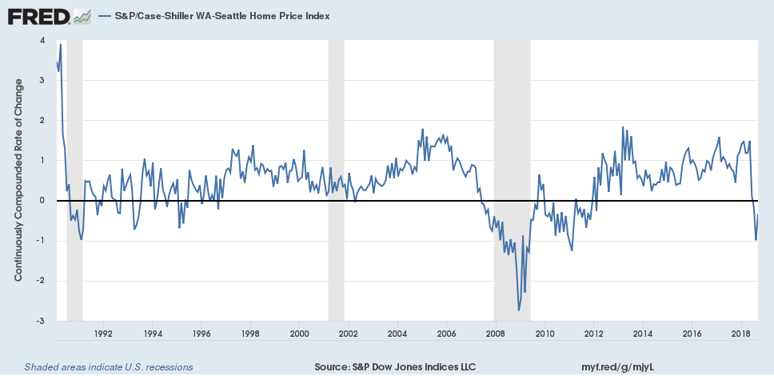

_It's easy if you try._

I've been writing [my forthcoming book](http://www.arandomphysicist.com/2018/11/a-workers-history-of-united-states-1948.html) — trying to dot all the _i_'s and cross all the _t_'s with the data analysis — and I came across something that was a bit shocking. There seemed to be some trouble in the Case-Shiller housing price index model which had some ambiguity with the shocks. While there was a decent fit to the CS index **_level_**, the growth rate was not well-described. This is not a good qualitative fit to this growth rate data:

But if you squint at that data, you see a pattern that looks a bit more like the pattern in wage growth — see the [dynamic information equilibrium model (DIEM) described here](https://informationtransfereconomics.blogspot.com/2018/02/dynamic-equilibrium-in-wage-growth.html). So I went to Shiller's [(continuously updated) data](http://www.econ.yale.edu/~shiller/data.htm) directly to get a longer term time series, and sure enough a DIEM describes CS index (i.e. housing price) growth pretty well:

The dashed line shows a fit to the small fluctuations in the aftermath of the Great Recession ([possible step response to the recession shock](https://informationtransfereconomics.blogspot.com/2017/11/unemployment-rate-step-response-over.html)) that aren't that big in the growth rate, but create a noticeable effect in the level.

Here, you can see the large effect on the level of those two post-recession fluctuations in the growth rate (difference between the dashed and solid green curves). Overall, this is a great description of both the level and the growth rate of housing prices. But it raises a big question:

_Where's the housing "bubble"?_ 

In the aftermath of the S&L crisis of the late 80s, the growth rate for housing prices in equilibrium increases steadily — much like wages. But there's no positive shock sending prices higher, no event between 1990 and 2006, just steady acceleration. Sure, the growth rate becomes insane at the end of that trajectory (> 10%), but that's the result of the equilibrium process. There's no "bubble" unless there's always a bubble.

Did new ways of financing allow this acceleration to increase for a longer time? There's some evidence [that wage growth is cut off by recessions](https://informationtransfereconomics.blogspot.com/2018/10/limits-to-wage-growth.html) (i.e. when wage growth reaches NGDP growth, it triggers a recession). What is the corresponding housing price growth limit? [The pattern of debt growth roughly matches](https://informationtransfereconomics.blogspot.com/2018/07/does-accelerating-debt-growth-cause.html) the housing price growth starting in the late 80s, but the shock to debt growth in the Great Recession comes well after the shock to housing prices.

However, this improved interpretation of the housing price data puts the negative shock [right when the immigration freak-out was happening](https://informationtransfereconomics.blogspot.com/2018/11/an-information-equilibrium-history-of.html) and the shock to construction hires (not construction openings, but hires). This would raise a question as to why a shock to the supply of new housing would cause prices to fall. [I've previously discussed](https://informationtransfereconomics.blogspot.com/2016/04/affordable-housing-through-increased.html) how increasing the supply of housing should actually increase prices because it should be considered more as general equilibrium (supply doesn't increase much faster than demand). But also the dynamic information equilibrium model that produces this kind of accelerating growth rate is (_d/dt_) log _CS_ ⇄ _CS_ (just like the [wage growth model](https://informationtransfereconomics.blogspot.com/2018/02/dynamic-equilibrium-in-wage-growth.html)). This has the interpretation that the demand for housing is related to the growth rate of housing prices (since the left side is demand). 

It's important to note that the shock to housing price growth rate comes before any decline in housing prices. The decline in growth rate would only have become noticeable in early 2006, but whatever the shock was that triggered it could have come as early as mid-2005 — which points to another possibility: hurricane Katrina. Or maybe simply housing prices themselves were the cause. Eventually, regardless of creative financing options, people become unable to afford prices that grow faster than income. It's not so much of a bubble, but supply and demand for a scarce resource. Maybe demand for housing really was that great. Judging by the increase in homelessness in the aftermath (e.g. [Seattle](https://informationtransfereconomics.blogspot.com/2018/01/a-bad-dynamic-equilibrium-homelessness.html)), that is a plausible explanation. If it was truly a bubble, then there'd be a glut of housing, but prices seem to have continued on their previous path \[1\].

**Update 5 December 2018** 

See Kenneth Duda's comment below and my response for a bit more on possible causes, including [the OTS decision to loosen requirements set by the CRA](https://web.archive.org/web/20081211054306/http://financialservices.house.gov/pr04132005.html). I would like to point out that the difference between the dashed green curve and the solid one in the CS-level diagram above could be interpreted as a result of mis-management by the Fed and the government in 2008. However, it could also be interpreted as a measure of the general level of panic and overreaction (the downturn appears to overshoot the price level path resulting in a deeper dive than indicated by later prices).

...

**Update 9 December 2018**

Per Todd Zorick's comment below and expanding on footnote \[1\], here are the housing price indices for Seattle:

And for Dallas:

As you can tell, the shocks are quite different. Dallas doesn't have much of a housing collapse, but seems to be undergoing a fairly large shock over the past couple years. Do note that the time periods are different (since the 90s for Seattle, since 2000 for Dallas) because that was the data on FRED.

**Footnotes:**

\[1\] I will note that recent data from [Seattle shows a decline](https://fred.stlouisfed.org/series/SEXRSA) (a similar turnaround might be visible in the Shiller data as a downward deviation at the end of the graph above):

You can also see the tail end of the drop in 1990 associated with the birth of grunge.

It is possible this is part of the early signs of [the hypothetical upcoming recession](https://informationtransfereconomics.blogspot.com/2018/06/jolts-data-and-2019-recession.html).
