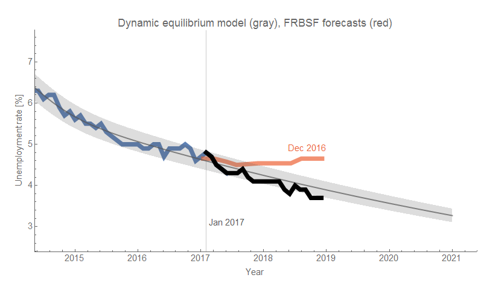
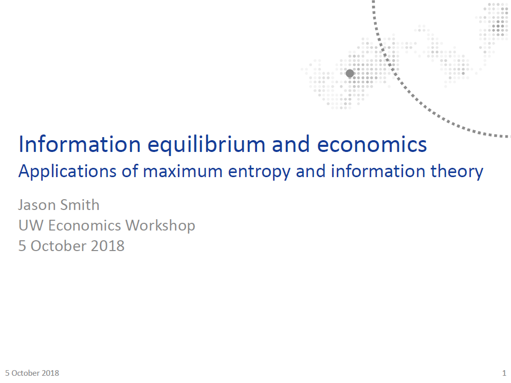
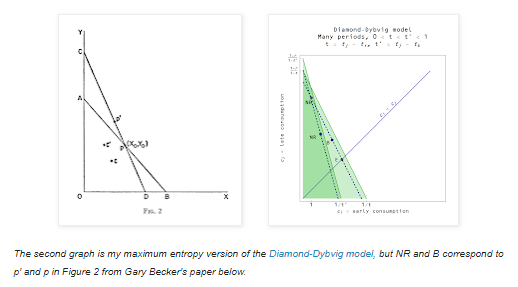
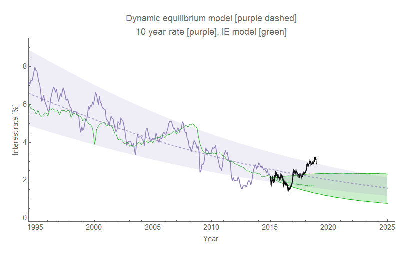
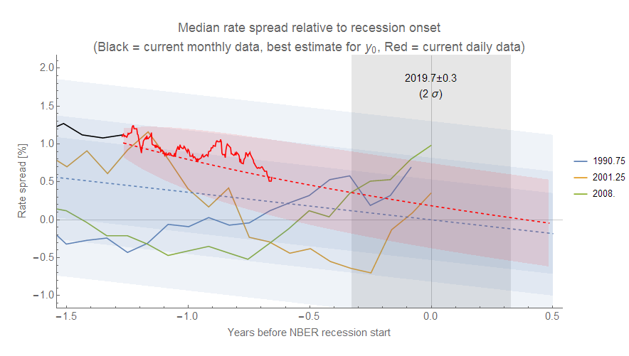
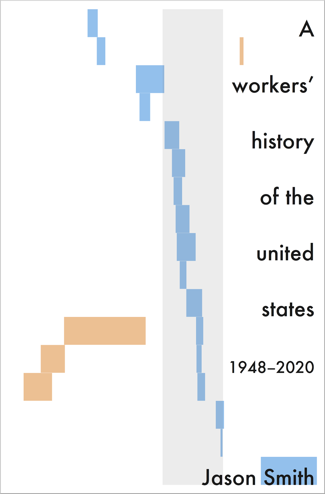

We're coming up on the end of 2018. I'd first like to say thank you to everyone who has been reading and sharing the blog posts and the tweets. I've slowed down a bit — only 169 posts in 2018 up until today, well below the peak of 375 in 2015. And many of those posts were just checking the validity of the forecasts with each data release! In part, that's due to the fact that a project I was working on where I had to travel once a month to the middle of nowhere for one to two weeks ended in 2016. I don't have as many evenings sitting in a hotel room with nothing to do besides research and writing these days. Only one post from this year cracked the top 10 of all time on this blog — it was my critique of macro written from the perspective of having seen both the 10 years of econ criticism since the Great Recession alongside 10 years of defenses. I titled it _[Macro criticism, but not that kind](https://informationtransfereconomics.blogspot.com/2018/05/macro-criticism-but-not-that-kind.html)_ in reference to the torrent of "[lazy econ critiques](https://noahpinionblog.blogspot.com/2015/10/lazy-econ-critiques.html)" as well as [Noah Smith's Bloomberg article](https://www.bloomberg.com/opinion/articles/2018-04-25/critics-of-economics-are-dwelling-in-the-past) (_Econ Critics Are Stuck in the Past_) written a few weeks before. I also think it's relevant that my critique of macro comes alongside empirically accurate forecasts of e.g. [the unemployment rate compared to Fed macroeconomists](https://informationtransfereconomics.blogspot.com/2018/12/the-last-employment-situation-report-of.html) (FRBSF, FOMC) — at least it's not lazy.

**Dynamic equilibrium**

This year kicked off with me [posting the dynamic information equilibrium paper](https://informationtransfereconomics.blogspot.com/2018/01/new-paper-up-at-ssrn.html) to SSRN. It also included the application to ensembles of information equilibrium relationships (markets) — i.e. "macro". While I had been working on it [since the summer of 2017](https://informationtransfereconomics.blogspot.com/2017/06/self-similarity-of-macro-and-micro.html), a message from Fabio Ghironi at the UW econ department prompted me to finish it over the holiday break. That eventually lead to my participation in the "[Outside the Box](https://informationtransfereconomics.blogspot.com/2018/10/outside-box-workshop.html)" economics workshop Fabio organized in October.

**Heroes**

Another unexpected message came from one of my blogging heroes — Cosma Shalizi. Blogging is really about writing that wouldn't find a place in any traditional outlet. Although he's not blogging as much these days, he wrote [one of the greatest examples of the form](http://crookedtimber.org/2012/05/30/in-soviet-union-optimization-problem-solves-you/) with a perfect title (hilarious enough on its own, although [the reference](https://en.wikipedia.org/wiki/Yakov_Smirnoff) now may be lost on the younger generations). A book review that ties together computational complexity and economics, I link to it any time I can find a way to work it in.

Cosma wrote me to let me know he was reading [my book](https://www.amazon.com/Random-Physicist-Takes-Economics-ebook/dp/B0754X3PYF/ref=as_li_ss_tl?ie=UTF8&qid=1544822158&sr=8-1&keywords=random+physicist+takes+on+economics&linkCode=ll1&tag=arandomphysic-20&linkId=b8f489640262461bda2380b7d8b02e4f&language=en_US) (!) and that he'd had the same interpretation of Gary Becker's paper written up in a draft blog post. I told him he should post it — it does a great job of addressing the supply side (which I sort of skipped over). [He did](http://bactra.org/weblog/1155.html), and [I tweeted about it](https://twitter.com/infotranecon/status/1038193325084368896).

I should also add that I owe a debt of gratitude to another great blogger, economist David Glasner, for [pointing the paper out to me](https://informationtransfereconomics.blogspot.com/2015/10/gary-beckers-emergent-rational-agents.html) a few years ago. 

**Rethinking interest rates**

This year prompted me [to rethink the interest rate model](https://informationtransfereconomics.blogspot.com/2018/06/rethinking-interest-rates.html) that was actually [one of the first decent models](https://informationtransfereconomics.blogspot.com/2013/08/the-interest-rate-in-information.html) I put together with the information equilibrium framework. The large deviation that began with the 2016 election [is well outside the normal range of errors](https://informationtransfereconomics.blogspot.com/2018/05/three-sigma-deviation-in-10-year-rate.html) — but such deviations have been signs of recessions (and [model error is generally worse close to yield curve inversions](https://informationtransfereconomics.blogspot.com/2018/10/interest-rates-and-model-scope.html)). Recently, interest rates have been coming back down and a future recession could bring the model right back in alignment with data (i.e. we might have just underestimated the errors). As it is, it seems the dynamic equilibrium model where the interest rate is a price is accurate, but the supply and demand related to it are only approximated by the monetary base (minus reserves) and aggregate demand measured by NGDP.

**A recession in late 2019?**

I put my neck out and said that the [negative deviation in the JOLTS openings data was the first signs of an upcoming recession](https://informationtransfereconomics.blogspot.com/2018/06/jolts-data-and-2019-recession.html) (i.e. a slowing in businesses expanding). The shocks to the JOLTS data series appear to lead the rise unemployment rate by almost a year, and with the [yield curve heading for inversion](https://informationtransfereconomics.blogspot.com/2018/06/yield-curve-inversion-and-future.html) on roughly the same time scale I'm around 80% confident in this forecast. There's also wage growth rising to levels comparable with NGDP growth, which [seems to be associated with the past few recessions](https://informationtransfereconomics.blogspot.com/2018/10/limits-to-wage-growth.html). At the very least, I hope to learn something!

**A new book**

At the end of this year, [I set myself a deadline for my second book](http://www.arandomphysicist.com/2018/11/a-workers-history-of-united-states-1948.html) — _A Workers' History of the United States 1948-2020_ — for the end of next year. Collecting the information together has actually led to some additional insights (e.g. [the effect of unions on inequality](https://informationtransfereconomics.blogspot.com/2018/11/unions-inequality-and-labor-share.html) and [the (lack of) a housing bubble](https://informationtransfereconomics.blogspot.com/2018/12/imagine-theres-no-bubble.html)).

**\*  \*  \***

This has been another great year, and I'd like to thank everyone again for reading and sharing. Without you, this would likely just be a series of crackpot comments on other people's blogs (which is really not too far off the mark).

If you're interested, [here's a link to the year in review for 2017](https://informationtransfereconomics.blogspot.com/2017/12/information-transfer-economics-year-in.html). Also, click to enlarge any images above.
