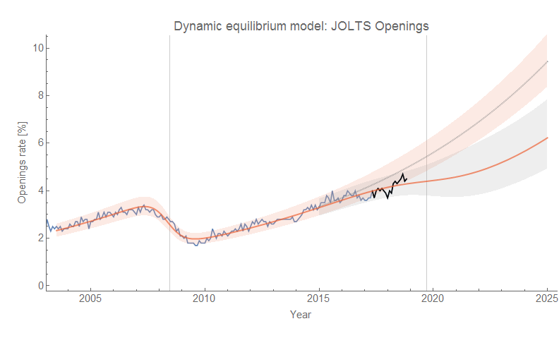
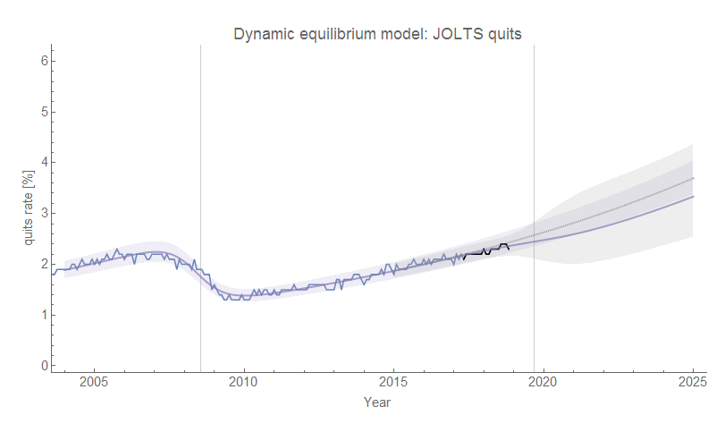
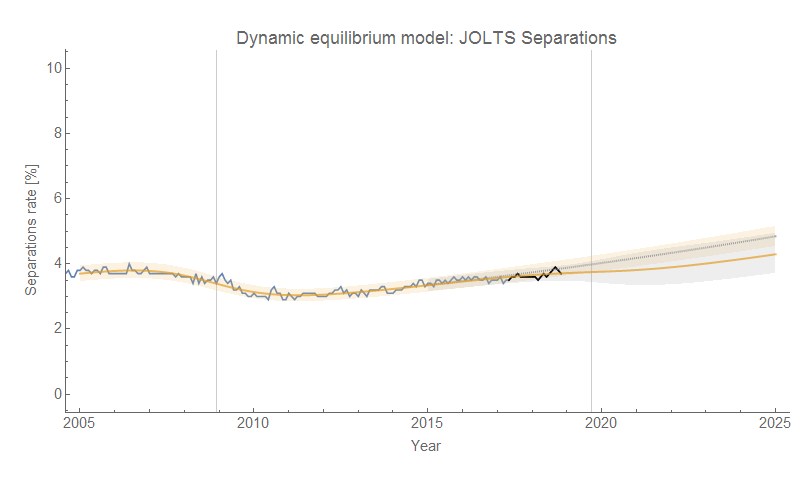
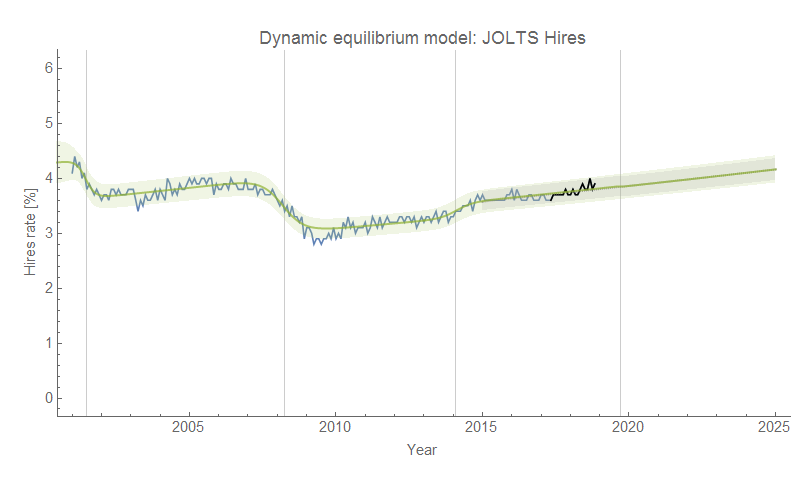
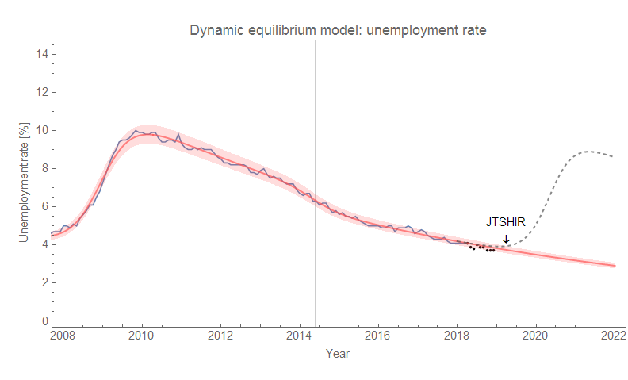

Checking in on the [dynamic information equilibrium model](https://papers.ssrn.com/sol3/papers.cfm?abstract_id=3094757) forecasts, and everything is pretty much status quo. Job openings are still on a biased deviation. Click to enlarge.

[Based on this model](https://informationtransfereconomics.blogspot.com/2018/10/building-models.html) which puts hires as a leading indicator, we should continue to see the unemployment rate fall through March of 2019 (5 months from October 2018):

The dashed line shows a possible recession counterfactual (with average magnitude and width, i.e. steepness) constrained by the fact that the JOLTS hires data is not showing any sign of a shock.

[Here's the previous update](https://informationtransfereconomics.blogspot.com/2018/11/data-dump-jolts-cpi.html) from November (with September 2018 JOLTS data).
