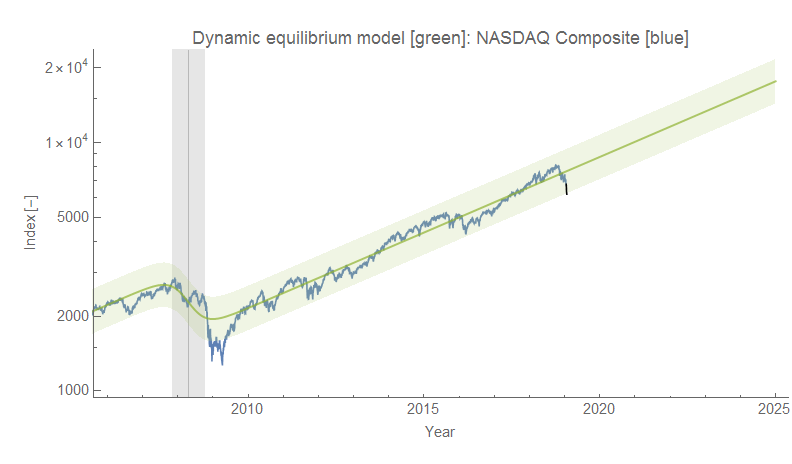
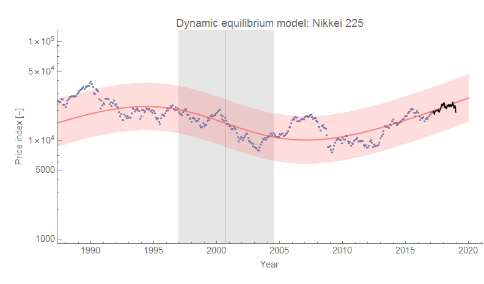
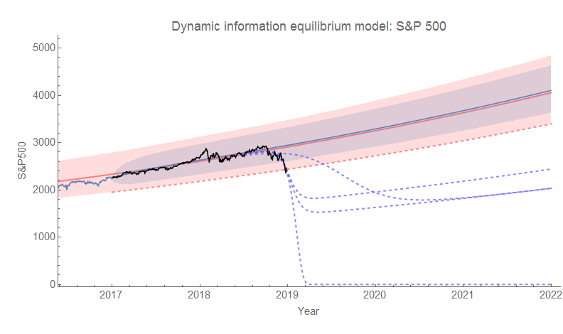
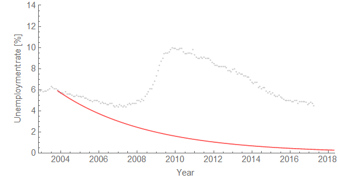

The US markets are closed today for the holiday, but the Nikkei dropped 5% (the Nikkei, however, is far more volatile than the US markets so this doesn't represent anything too out of the ordinary). I've updated the [S&P 500 counterfactuals](https://informationtransfereconomics.blogspot.com/2018/12/this-is-fine.html) based on the latest data (keeping the "lol capitalizm iz doomd" fit that goes to zero because I love dark humor):

Funny enough (again, dark humor) the unconstrained fit now matches up with "median shock amplitude" fit (the two middle dashed blue curves are basically on top of each other). The truth is that fitting the leading edge of the data to a logistic function (_and then taking the exponential_) is not terribly stable, so expect many many revisions \[1\] to that counterfactual until we are about 1/2 the way through the shock.

Here are the Nikkei and the NASDAQ (the latter is pretty similar to the S&P 500). Click to enlarge:

**Update 26 December 2018**

And today it jumped back up a bit. New unconstrained counterfactual amplitude is now a bit smaller than the median shock. Probably a good place to link [to this post about volatility regimes](https://informationtransfereconomics.blogspot.com/2018/01/structural-breaks-volatility-regimes.html). Click to enlarge:

**Update 7 January 2019**

**Footnotes:**

\[1\] For an example, see the undershooting and overshooting on the estimate of the size of the Great Recession in the unemployment rate data (click to enlarge):

