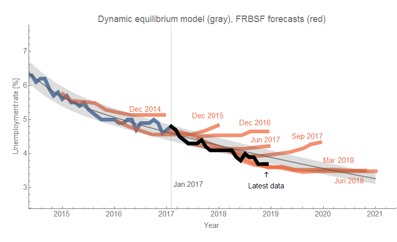
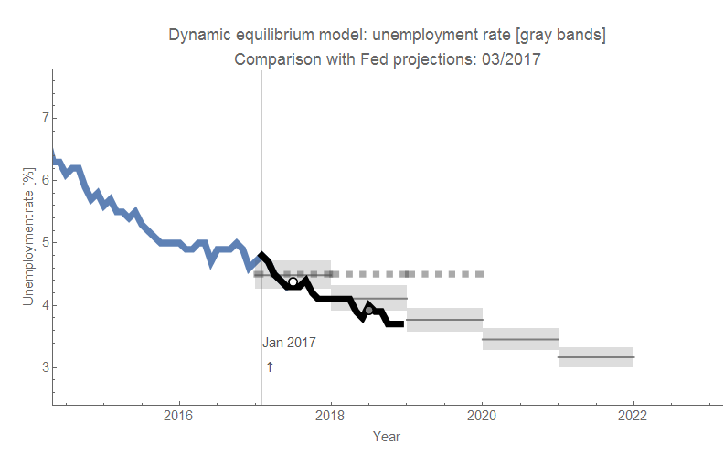
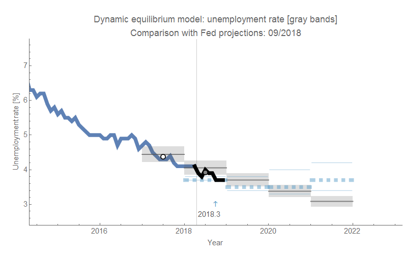
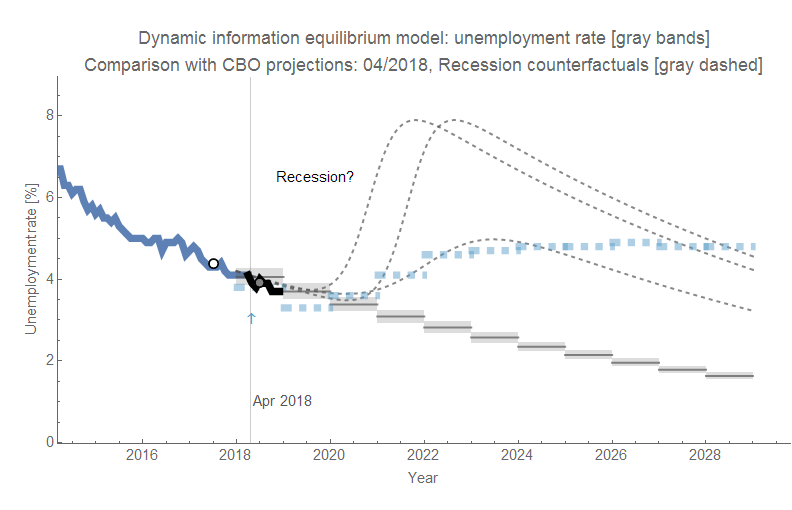
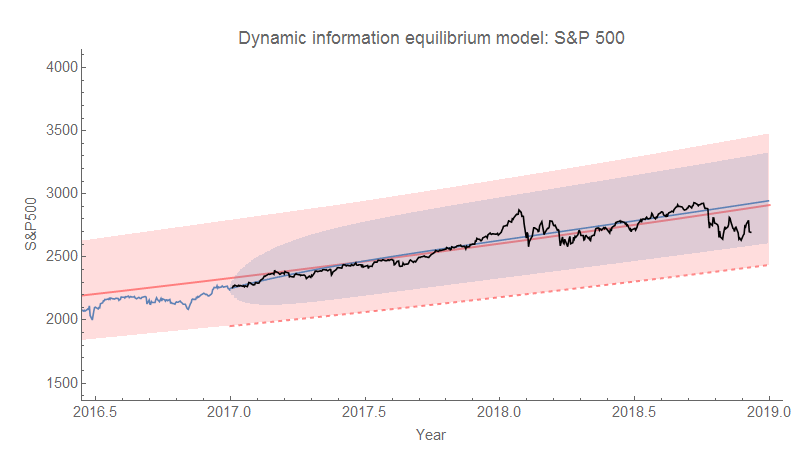

Next month, this [dynamic information equilibrium model](https://papers.ssrn.com/sol3/papers.cfm?abstract_id=3094757) (DIEM) forecast will be 2 years old \[1\]. It's been pretty much spot on (shown alongside some of the forecasts published by the FRBSF's [FedViews](https://www.frbsf.org/economic-research/publications/fedviews/)):

It's biased a little high with today's 3.7% number, but compared to the competition — the FRBSF forecast had us at 4.7% compared to the DIEM's 3.9 ± 0.2% — the miss distance is 5 times smaller (1.0 pp vs 0.2 pp):

The FOMC forecast a 4.5% unemployment rate average for 2018. With almost all the data (which is why the average point is gray inside a black circle instead of white), it's looking closer to 3.9% — a 0.6 pp difference. The DIEM annual average is 4.1% — a 0.2 pp difference (3 times smaller).  

I'm also tracking a couple of forecasts (versus the FOMC [and the CBO](https://informationtransfereconomics.blogspot.com/2018/10/the-cbo-forecasts-unemployment-and-so.html)) based on forecasts made this year. The DIEM is a little lower because the data from 2017 gives us a better indication of the size of the 2014 shock to unemployment (the "[mini-boom](https://informationtransfereconomics.blogspot.com/2018/10/extended-jolts-hires-series-and-2014.html)"). I show some possible counterfactual recessions in [the DIEM consistent with the CBO's forecast](https://informationtransfereconomics.blogspot.com/2018/10/the-cbo-forecasts-unemployment-and-so.html) (i.e. if the CBO forecast is accurate through 2022, then there'd be a recession shock in the DIEM)

**Markets**

As of writing this, the S&P 500 was down almost 2%. I thought I'd update the S&P 500 forecast (also [from almost two years ago](https://informationtransfereconomics.blogspot.com/2017/01/what-about-s-500.html) \[2\], and also pretty spot on) to show some more of the recent volatility. The last update was [here](https://informationtransfereconomics.blogspot.com/2018/11/data-dump-jolts-cpi.html). We're skirting the edge of the AR process band, but we're still inside the 60-year volatility band of the DIEM model, the lower edge of which (marked by a red dashed line) indicates the need to posit another shock to the DIEM.

[per the original model description](https://informationtransfereconomics.blogspot.com/2018/06/yield-curve-inversion-and-future.html)

**Footnotes:**

\[1\] The model itself was born [in a January 10, 2017 blog post](https://informationtransfereconomics.blogspot.com/2017/01/a-dynamic-equilibrium-in-jolts-data.html) when I derived it from an information equilibrium relationship for JOLTS data similar to a matching model.

\[2\] I feel like I just have to show the S&P 500 forecast before all those points:

