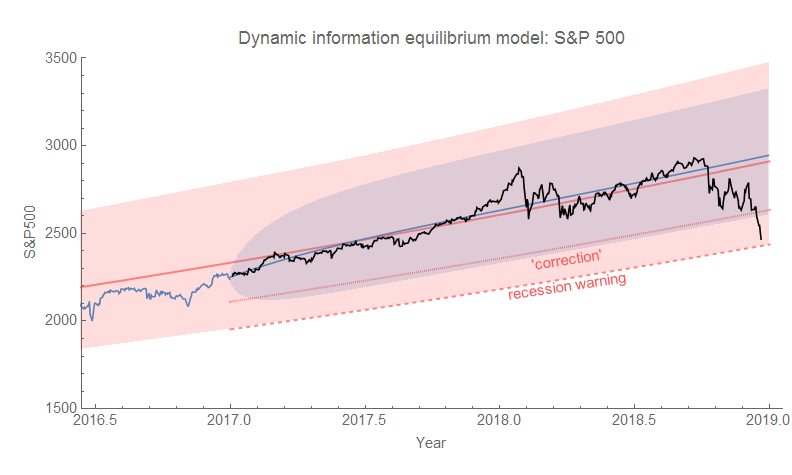
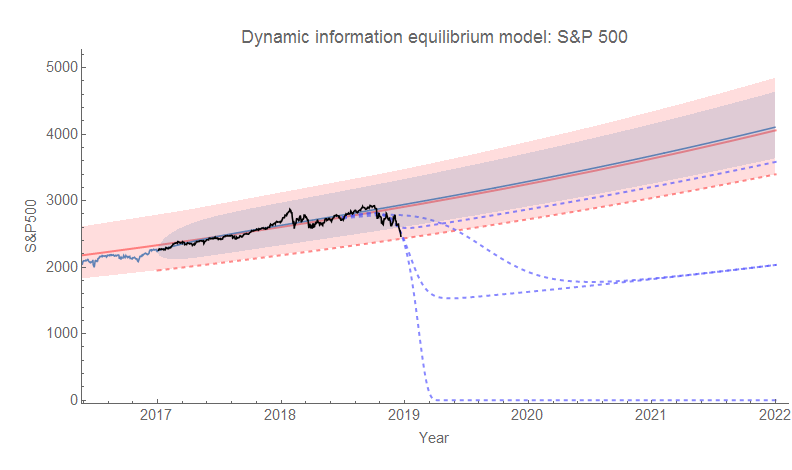

[Title reference](https://www.theverge.com/2016/5/5/11592622/this-is-fine-meme-comic)

We're out of the AR process volatility (estimated since 2010, blue region), but not yet out of the approximately 70-year 90% volatility (January 1, 1950-December 31, 2016, red region) of the [S&P 500 estimated using the dynamic information equilibrium model](https://informationtransfereconomics.blogspot.com/2017/01/what-about-s-500.html) (DIEM). In fact, the S&P 500 has been this low before (relative to the the DIEM) — in February 2016. That was towards the end of the period of decline in the months after the first Fed rate increase since the 2008 recession. The index subsequently recovered. Prior to that, we skimmed the lower edge of the 90% confidence interval in 2011 [as Europe was going into a double dip recession](https://www.theatlantic.com/business/archive/2013/05/thats-a-depression-europes-double-dip-is-officially-longer-than-its-great-recession/275903/). We can see both of these in the a longer view:

But also looking at the longer run, most of these dips are just that — dips associated with a recession. There are only two major collapses that warrant adding a shock to the model (dot-com bust and 2008). Of course, it's possible to model the longer negative shock in the 70s as a series of smaller shocks, but none are close to the scale of 2001 and 2008.

Given most of the history of the market, we should expect the current dip — should it extend significantly below the confidence limit — to be just that: a dip likely associated with a recession or at least (seemingly unnecessary) Fed rate hikes. However, given the recent history of the market, we might expect a larger collapse as part of [what I've called the "asset bubble era"](https://informationtransfereconomics.blogspot.com/2018/01/24-growth-forever.html). This period, roughly since the 90s, is period after the demographic shock of the 60s and 70s has faded, inflation has subsided, and e.g. labor force participation ceased rising rapidly.

Note that as part of the asset bubble era, the asset bubble doesn't have to be reflected as a bubble in the market itself. The dot-com bubble was, but the "housing bubble" was accompanied by basically equilibrium growth in the S&P 500 index. However as part of the asset bubble era it might be accompanied by a new shock. Of course, it's quite early so estimates of the shock parameters are going to be wildly uncertain. I included several counterfactuals (dashed blue) with different constraints in this graph:

Two of the paths constrain the amplitude of the shock to be the median (absolute value) amplitude of all the previous shocks. One of those leaves the shock duration and timing to be fit to data, the other just leaves the duration. The timing was constrained to be the value indicated by the timing estimated [from yield curve inversion](https://informationtransfereconomics.blogspot.com/2018/06/yield-curve-inversion-and-future.html). The third (and smallest) fits all three parameters. This is probably showing [the undershooting and overshooting](https://informationtransfereconomics.blogspot.com/2018/04/overshooting-bitcoin-case-study.html) that is a drawback of fitting logistic functions to partial shocks.

I also included my joke path ("lol capitalizm iz doomd") I showed on Twitter the other day where the S&P 500 collapses to zero. I'd say that is unlikely (it is, however, the result of doing the fit with just a fixed shock timing).

Have we entered a new era since the 1990s where recessions coincide with major collapses in the stock market? Or will we return to the era before the 1990s where markets fall during recessions, but rebound quickly? My hunch is the former and I'm not looking forward to the economy in 2019.

...

**Update 21 December 2018**

We've pierced the toast the 90% confidence interval (updated counterfactuals):

