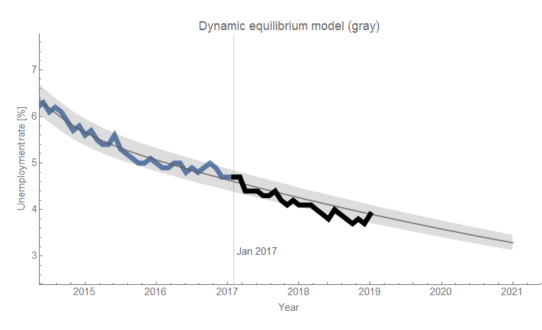
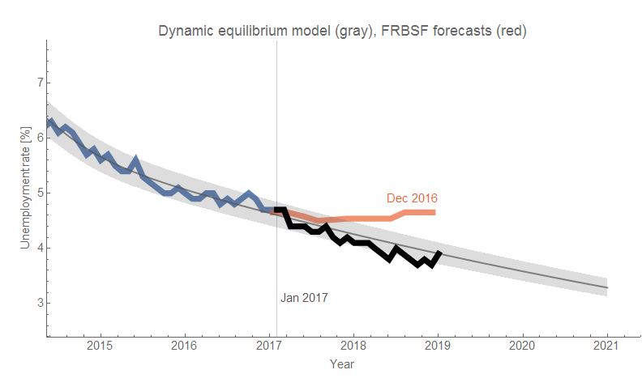
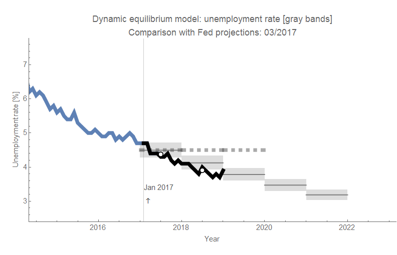
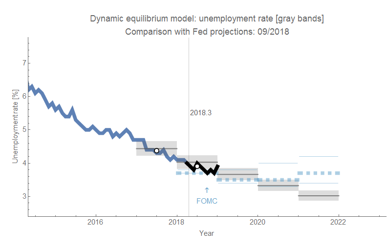
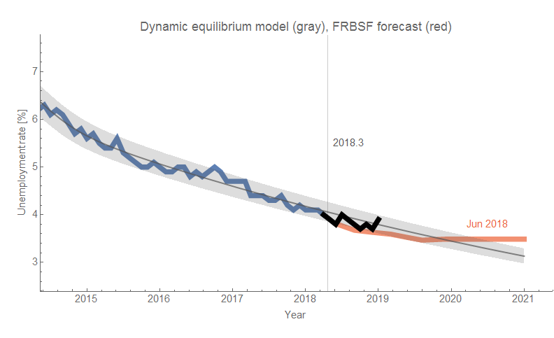
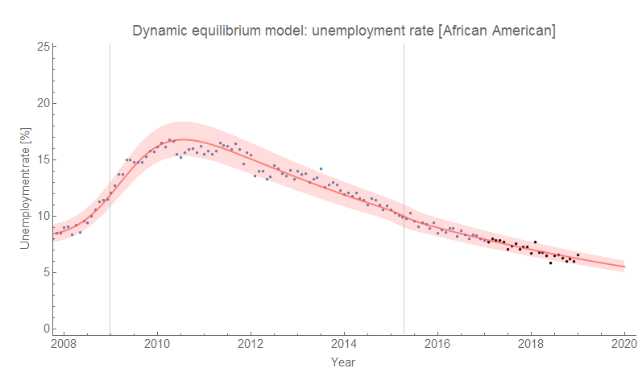

I'm just now back from vacation, so I missed the December unemployment situation data. The (seasonally adjusted) unemployment rate ticked up in December to pretty much exactly where the [dynamic information equilibrium model](https://papers.ssrn.com/sol3/papers.cfm?abstract_id=3094757) expected it two years ago back in January 2017:

[As was discussed in early December](https://informationtransfereconomics.blogspot.com/2018/12/the-last-employment-situation-report-of.html), the DIEM was much more successful than the overshooting FOMC and FRBSF forecasts (click to enlarge any graph):

What's even more interesting is that the more recent forecasts from the FOMC and FRBSF (vintage September 2018 and June 2018, respectively) are now undershooting the data while a comparable vintage forecast from the DIEM ([April 2018, to compare with the CBO forecast](https://informationtransfereconomics.blogspot.com/2018/10/the-cbo-forecasts-unemployment-and-so.html)) is pretty accurate:

It's as if the FOMC and FRBSF forecasts "over-learned" from their tendency to be too high as unemployment continued downwards but now are too low as the log-linear decline (in the DIEM) flattens out.

...

**Update**

Here is the DIEM forecast of the unemployment rate for African Americans getting it right over the same two year period:

There's also the "prime age" civilian labor force participation rate:

