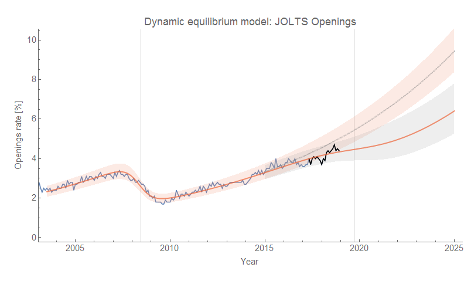
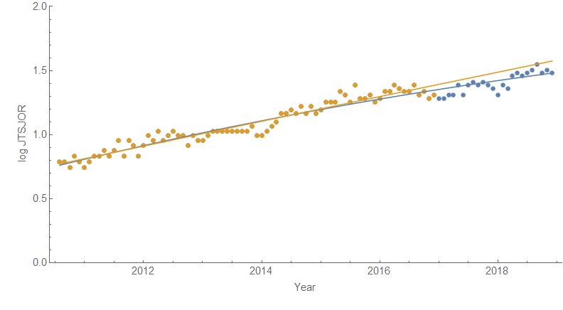
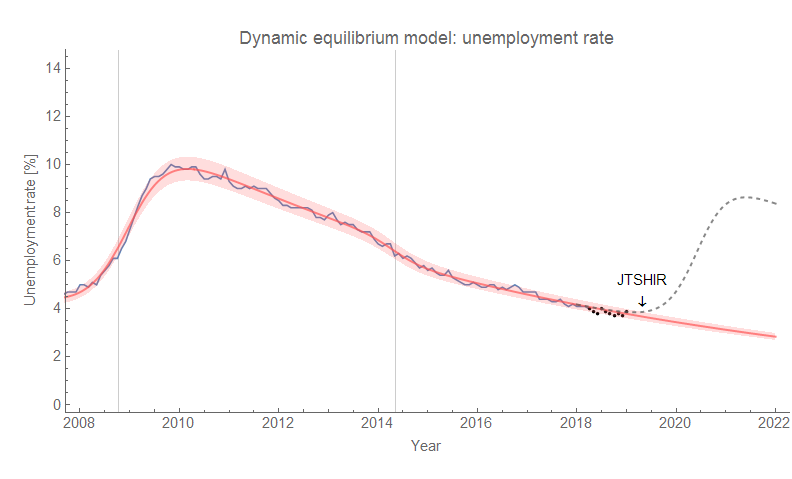

The [JOLTS data](https://fred.stlouisfed.org/release?rid=192) for November 2018 came out this morning, but there isn't much change in the assessment of the possibility of a future recession ([per here](https://informationtransfereconomics.blogspot.com/2018/06/jolts-data-and-2019-recession.html)). The openings data is still showing a negative deviation:

One thing that is a bit more clear is that the log-linear slope (i.e. [the "dynamic equilibrium"](https://papers.ssrn.com/sol3/papers.cfm?abstract_id=3094757)) of the JOLTS openings data for the past 18 24 months is definitely lower:

That's a linear fit to the (log of the) openings data since 2011 up through 18 24 months ago alongside a quadratic fit to the full range.

The [hires data](https://fred.stlouisfed.org/series/JTSHIR) still doesn't show a deviation. [Based on this model which puts hires as a leading indicator](https://informationtransfereconomics.blogspot.com/2018/10/building-models.html), we should continue to see the unemployment rate fall through April of 2019 (5 months from November 2018):

The gray dashed line is a counterfactual recession of average size and width (steepness) that reaches the edge of the confidence band in April of 2019 — it gives a rough estimate of the soonest a typical recession will show up as a rise in the unemployment rate [based on the linked model](https://informationtransfereconomics.blogspot.com/2018/10/building-models.html) that combines several dynamic equilibrium models of different measures into a single system. However, as noted above, openings might well be the leading indicator in the next recession (hires led the 2008 recession and appears to have led the 2014 mini-boom, but that's a very limited number of shocks to work with). The hires measure could also be off by a couple months based on estimated error.

Part of the reason I put these models out there is to make predictions — right or wrong. Being wrong tells us something just as valuable as being right!
