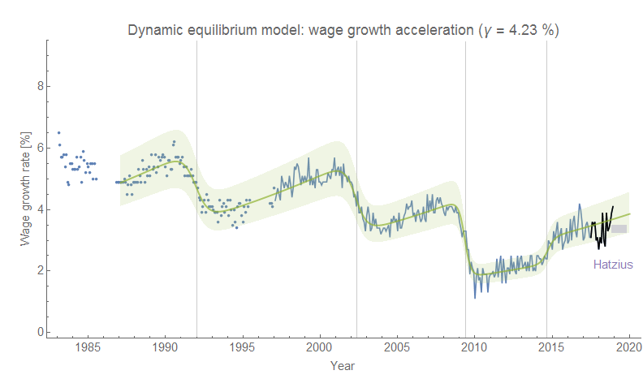
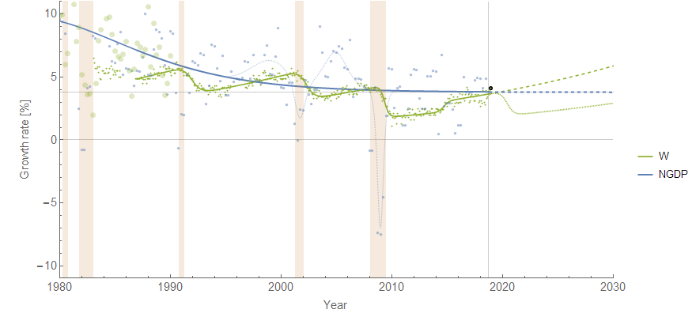

I haven't compared the wage growth forecast to the [Atlanta Fed's wage growth tracker data](https://www.frbatlanta.org/chcs/wage-growth-tracker.aspx?panel=1) in awhile (last time was [here](https://informationtransfereconomics.blogspot.com/2018/10/wage-growth-data-from-atlanta-fed.html)). The recent data remains consistent with the forecast accelerating growth (increase in the growth rate):

(The "Hatzius" marking is from [this post](https://informationtransfereconomics.blogspot.com/2018/11/ill-say-similar-things-for-half-salary.html) comparing the highly paid Goldman Sach's chief economist Jan Hatzius with the dynamic information equilibrium models.)

[This model](https://informationtransfereconomics.blogspot.com/2018/10/building-models.html) comparing various labor market measures estimates that wage growth lags changes in JOLTS hires by 11 months, and changes in the unemployment rate by 6 months — that is to say a recession (defined as a spike in unemployment) precedes a drop in wage growth. An intuitive interpretation is that recessions "cut-off" wage growth.

What is also interesting is that wage growth appears to [experience a negative shock when it reaches NGDP growth](https://informationtransfereconomics.blogspot.com/2018/10/limits-to-wage-growth.html), and the latest data is beginning to rise above the NGDP model:

There is an intuitive explanation behind this effect: if average wages are growing faster than average growth, eventually it should start to degrade firm profitability. Over the next year we should get a good test of the usefulness of the dynamic information equilibrium framework and this hypothesis.
