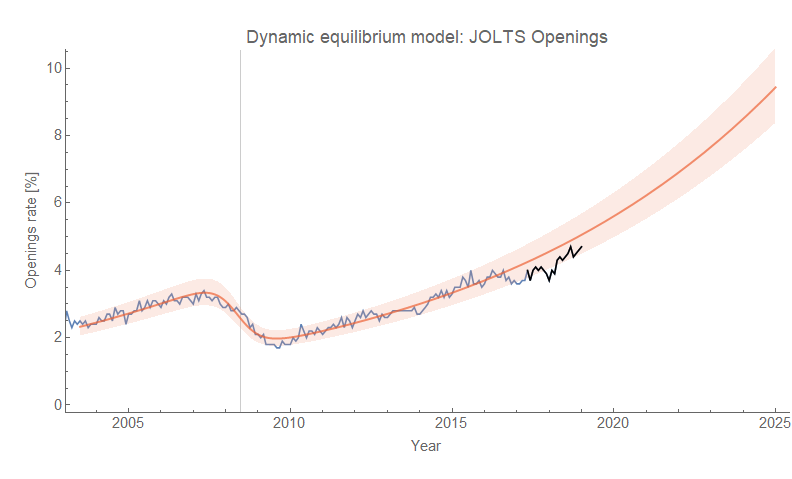
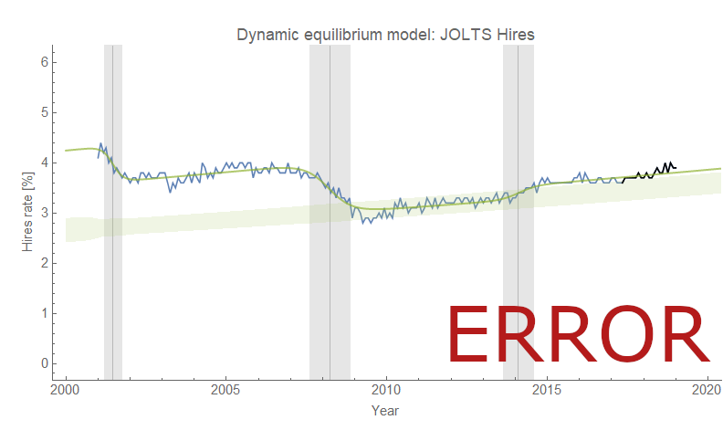
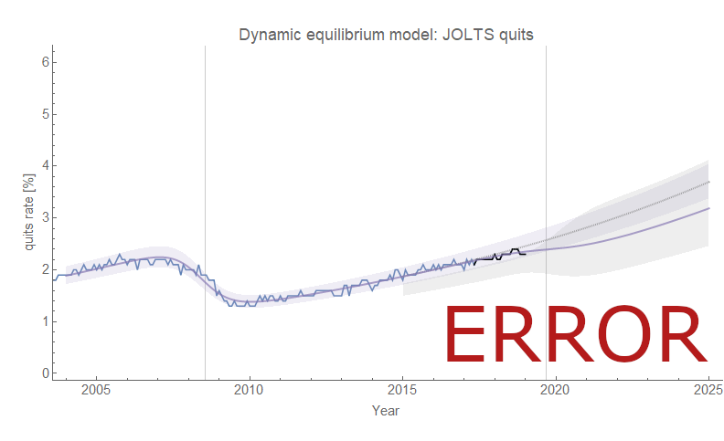

Sorry about the delay in adding the latest data to the forecast plots, but unfortunately something has happened in my upgrade to Mathematica 11.3 that's broken the single prediction errors on some of the JOLTS graphs. I've been trying to figure it out. Overall, it's another "status quo" data release with data basically in line with the models. The openings turned out fine, but the errors for the projection for the recession counterfactual broke — I left it off:

As a side note — if there's another major data revision in the same direction as [the data release around the Fed's March meeting in 2018](https://informationtransfereconomics.blogspot.com/2018/03/jolts-data-day.html), the negative deviation could largely go away.

My guess for the source of the problem is that the treatment numerical precision was updated such that the silly coefficients in the single prediction errors started being treated properly in terms of precision instead of being cancelled algebraically. Silly coefficients? Yes — how's 7.306167312812677×101813 for you? I think the source is the years — 2016 is unnatural in many senses. Yes, I know, I should have subtracted out 2000 before putting them through the fitting algorithms. But it worked fine up until this week. I guess my hard drive has worked fine up until this week, too ...

In case you're interested, here's how some of the other graphs turned out:

The Mathematica 11.3 upgrade came along with a transition to Windows 10, so I can't just revert back to 11.2. I may have to move these to my old computer with Mathematica 10 point something.

...

**Update 15 February 2019**

Back to Mathematica 10.3, and we're up and running again (click to enlarge):

And here's the alternative Hires model based on this collection of dynamic equilibrium relationships:

The [hires data](https://fred.stlouisfed.org/series/JTSHIR) still doesn't show a deviation. [Based on this model which puts hires as a leading indicator](https://informationtransfereconomics.blogspot.com/2018/10/building-models.html), we should continue to see the unemployment rate fall through May of 2019 (5 months from December 2018, which is the data that was released this week).
