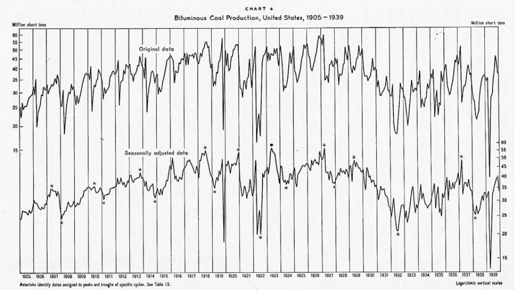
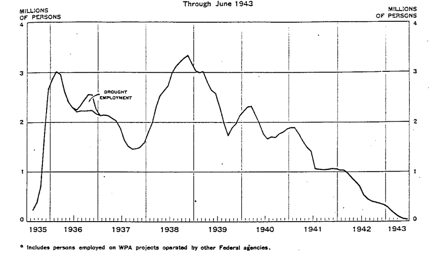

I saw [this tweet from Beatrice Cherrier](https://twitter.com/Undercoverhist/status/1105857613831524352) that contained an interesting example of NBER data from the 1940s — a time series of coal production in tons:

Whereas the original graph sees 9 business cycles (which corresponds to the NBER recession bands in light orange), the DIEM only sees about 4 (the first one could be two that are unresolved) given the noise in the data. There is the recession associated with WWI (the "[post WWI recession](https://en.wikipedia.org/wiki/Post%E2%80%93World_War_I_recession)" and the [depression of 1920](https://en.wikipedia.org/wiki/Depression_of_1920%E2%80%9321)) — this is the one that isn't resolved. There's a shock in 1926 which is followed by the shock in 1929 and the Great Depression. Finally, there's the [1937 recession](https://en.wikipedia.org/wiki/Recession_of_1937%E2%80%9338). Often, that last one is blamed on monetary policy or fiscal policy, but the [monetary shocks](https://voxeu.org/article/what-caused-recession-1937-38-new-lesson-today-s-policymakers) and fiscal shocks both come after this shock to coal production in late 1936/early 1937. The cuts in government spending impact WPA employment in mid-to-late 1937:

[unemployment rate shock is centered in 1938](https://informationtransfereconomics.blogspot.com/2017/07/unemployment-1929-1968-dynamic.html)

The 1937 shock also appears to his several countries (e.g. [France](https://en.wikipedia.org/wiki/Great_Depression_in_France)), making it unlikely that it was some US-specific policy.

Also as a side note the WPA expansion in 1935 doesn't seem to have a visible impact on the unemployment rate in 1935. Another thing to note is that the market crash in 1929 comes much closer to the middle of the Great Depression shock — coal production was already falling so the market crash can't really be considered a cause. Note also that the unemployment shock comes in 1930 (per the graph above).

Maybe I'll have to [do this](https://informationtransfereconomics.blogspot.com/2018/11/an-information-equilibrium-history-of.html) for the Great Depression!
