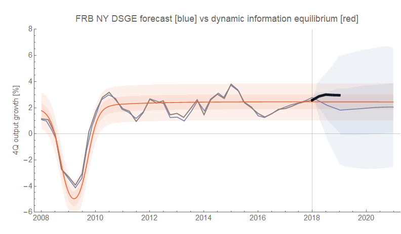
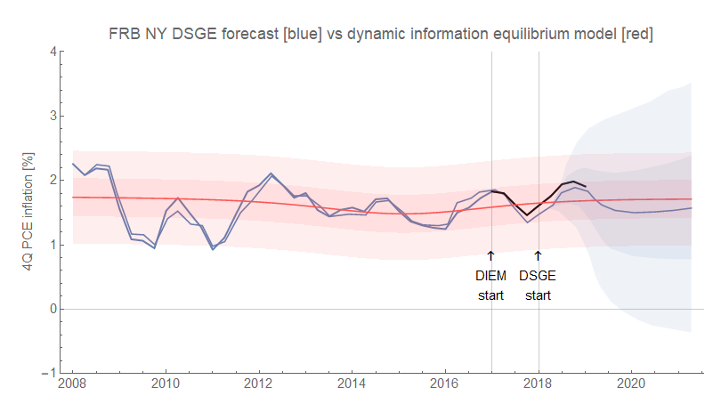
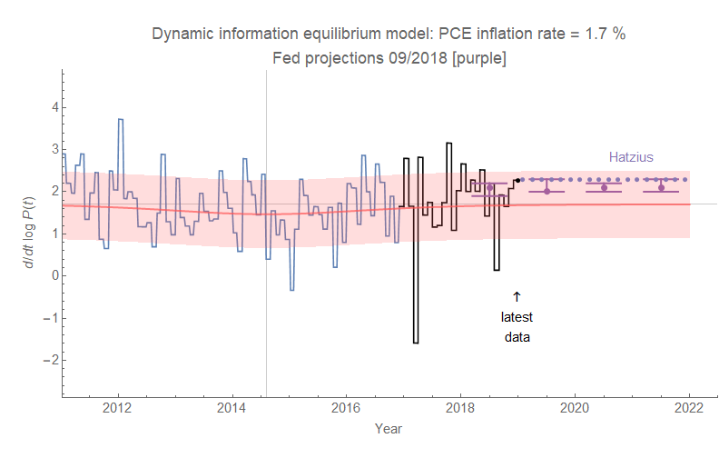

Revised real GDP and quarterly PCE inflation data came out today, so here are how the dynamic information equilibrium model (DIEM) forecasts are doing (versus the FRB NY DSGE model forecast):

The PCE inflation forecast from the FRB NY is doing remarkably well — if not for those almost 300 basis point error bands (compared to half the size for the DIEM).

Here's the monthly PCE forecast compared to a Fed forecast and [one from Jan Hatzius](https://informationtransfereconomics.blogspot.com/2018/11/ill-say-similar-things-for-half-salary.html):

