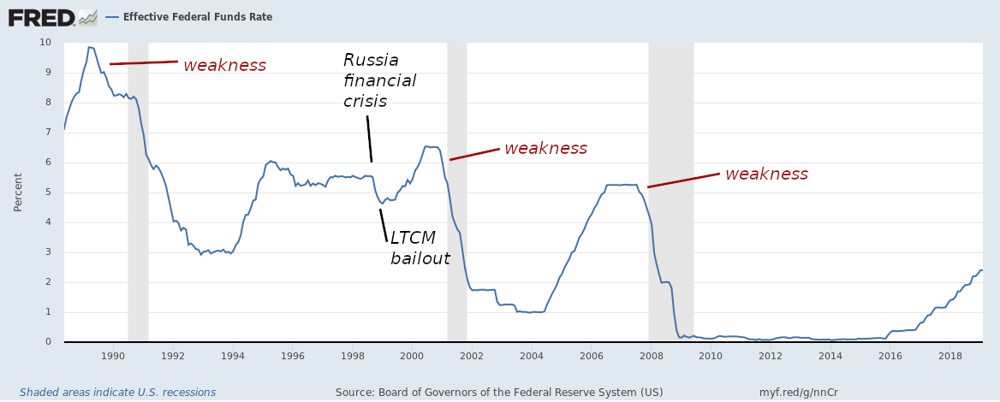
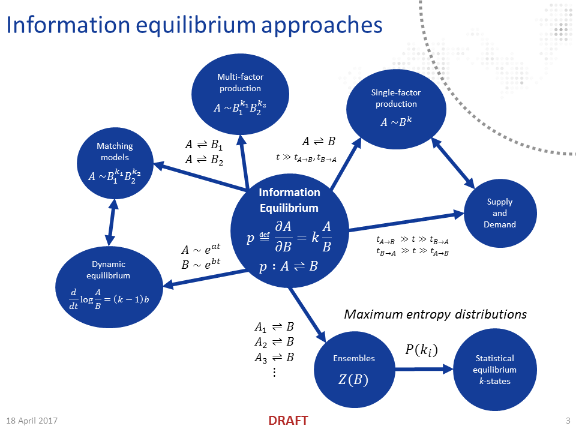

Well, first, [the 3-sigma deviation](https://informationtransfereconomics.blogspot.com/2018/05/three-sigma-deviation-in-10-year-rate.html) in the interest rate model is apparently over (for now), meaning that the 10-year interest rate is back to where information equilibrium predicted it would be [in August of 2015](https://informationtransfereconomics.blogspot.com/2015/08/comparison-of-interest-rate-predictions.html) (almost 4 years ago):

That model is an information equilibrium model in the more traditional sense on this blog where \[1\] we have _p_ : _[NGDP](https://fred.stlouisfed.org/series/GDP)_ ⇄ _[M0](https://fred.stlouisfed.org/series/MBCURRCIR)_ and _[r](https://fred.stlouisfed.org/series/GS10)_ ⇄ _p_ in [the shorthand notation](https://informationtransfereconomics.blogspot.com/2016/09/basic-definitions-in-information.html) which tells us that

log _r_ = _k_₁ log(_NGDP_/_M0_) - _k_₂

with

_k_₁ = 2.8

_k_₂ = 6.4

once we [solve the differential equations](https://informationtransfereconomics.blogspot.com/2013/04/supply-and-demand-from-information.html) and fit the parameters (_k_₁ and _k_₂ were estimated in August 2015). The projection was based on log-linear extrapolation of _NGDP_ and _M0_ and an AR process. The second piece of the model tells us that the exchange rate for a bit of GDP and a dollar of physical currency (i.e. _dNGDP/dM0_, which you can call "the price of money") is in information equilibrium with the 10-year interest rate. Note that this model also yields a kind of "quantity theory of money" where _NGDP_ ~ _M0__β_ where but really the "quantity theory of labor" _q_ : _[NGDP](https://fred.stlouisfed.org/series/GDP)_ ⇄ _[L](https://fred.stlouisfed.org/series/PAYEMS)_ with _[PCE](https://fred.stlouisfed.org/series/PCEPILFE)_ ⇄ _q_ is [a much better model](https://informationtransfereconomics.blogspot.com/2017/03/the-quantity-theory-of-labor-and.html) of inflation than the quantity theory of money.

The latest data for [the dynamic equilibrium version](https://informationtransfereconomics.blogspot.com/2018/06/rethinking-interest-rates.html) (based on Moody's corporate [AAA rate](https://fred.stlouisfed.org/series/AAA)) is also in line with the forecast:

The relationship between a [dynamic information equilibrium model](https://papers.ssrn.com/sol3/papers.cfm?abstract_id=3094757) and plain information equilibrium (IE) is that the DIEM is agnostic about the information transfer and we have something like _p_ : _A_ ⇄ _B_ (which is IE) but we don't know/care what _A_ or _B_ is (or we only look at _A_/_B_) but rather assume _A_ ~ exp(_a t_) and _B_ ~ exp(_b t_) so that (_d/dt_) log _p_ ~ _a_ − _b + Σᵢ σ__ᵢ_ which is a constant (the "dynamic equilibrium") plus shocks (_σᵢ_). These different models all derive from the same central relationship \[2\].

That gray band is where the interest rate spread indicator points to a recession based on a simple linear extrapolation (blue)/AR process (red) based on median (which in this case is basically [equal to the principal component](https://informationtransfereconomics.blogspot.com/2018/06/yield-curve-inversion-and-future.html)) of [multiple spreads](https://fred.stlouisfed.org/graph/?graph_id=482141&rn=775):

And finally, here's the dynamic equilibrium S&P 500 forecast that's been ongoing [since January of 2017](https://informationtransfereconomics.blogspot.com/2017/01/what-about-s-500.html) (two years now):

I show a counterfactual recession with the parameters of the 2001 recession shifted over to the 2020 time frame.

...

**Update 23 March 2019**

I have been so focused on my own median spread metric that I failed to note that the yield curve [actually inverted yesterday](http://econbrowser.com/archives/2019/03/inversion) for the 3m-10y spread. Lots of people (e.g. [here](https://www.themoneyillusion.com/the-yield-curve-inverted/)) have brought up the fact that yield curve inversion is not a panacea in terms of leading indicators. And it's not — there was a false positive as recently as the late 90s. But according to the median metric (which still hasn't inverted), not only is actual inversion unnecessary, but the hazard function shows a wide spread for the probability of observing inversion in the median spread:

Additionally, we can see in the median rate spread data above, for the previous three recessions the median spread **_started to increase_** just before the recession onset in the final quarter before an NBER recession would be determined to begin. This can be viewed as the Fed beginning to notice signs of weakness and lowering rates (thereby increasing the spread) in that final quarter:

We can also see that late 90s inversion false positive being undone by the Fed lowering rates in the midst of a series of financial crises around the world (Asia, Russia) and the bailout of LTCM.

...

**Footnotes:**

\[1\] This is for IE noobs who have only seen the blog after [I pieced together the DIEM model](https://informationtransfereconomics.blogspot.com/2017/01/a-dynamic-equilibrium-in-jolts-data.html) and this blog became [in John Handley's words](https://twitter.com/jwhandley17/status/1060897820645965825) "all dynamic equilibrium".

\[2\] Here's a kind of mental map relating the various pieces (from my [tour of information equilibrium presentation](https://informationtransfereconomics.blogspot.com/2017/04/a-tour-of-information-equilibrium.html)):

