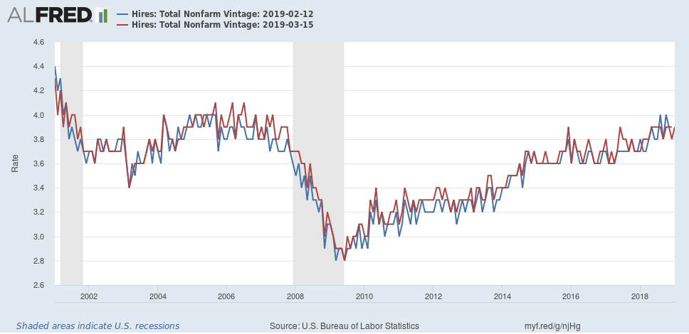

There were massive revisions to the Job Openings and Labor Turnover Survey time series in the last release — going all the way back to the start in December of 2000. These were more extensive than [the revisions last year](https://informationtransfereconomics.blogspot.com/2018/03/jolts-data-day.html). However, the old model fit is consistent with the new data, and the forecasts are pretty much unchanged (this is actually pretty astounding). Here is the data release from February (blue) and the new one from March (red) for hires and job openings:

And here are the models (JOLTS openings continues to fall a bit below the expected trend):

Actually, the revision made the hires model slightly _better_. If you look back [to the previous post](https://informationtransfereconomics.blogspot.com/2019/02/jolts-february-2019-dec-2018-data.html) on JOLTS data, you can see the latest points are now completely in line with the forecast compared to being a bit above.

**Update**

Per anonymous comment below, the counterfactual has gotten a bit smaller over the past several months because the counterfactual recession date was fixed to 2019.7 based on the yield curve data. If we push the date out further — say, to 2022 — the counterfactual shock size gets bigger (and more uncertain):

