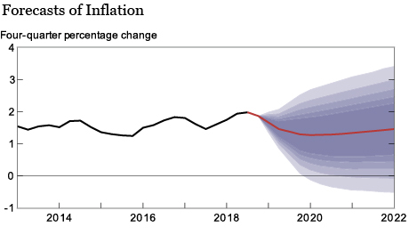

Over the weekend, [I wrote up a bit on my views of MMT including my critiques of it](https://informationtransfereconomics.blogspot.com/2019/03/mmt-keynes-monetary-kookiness.html). I got some comments that it was too long or that it wasn't clear what my critique was. Let me try again with a different — and more practical — take.

Modern Monetary Theory (MMT) cannot produce forecasts nor accurately fit data and is therefore far inferior to even the most objectively inaccurate Dynamic Stochastic General Equilibrium (DSGE) model.
