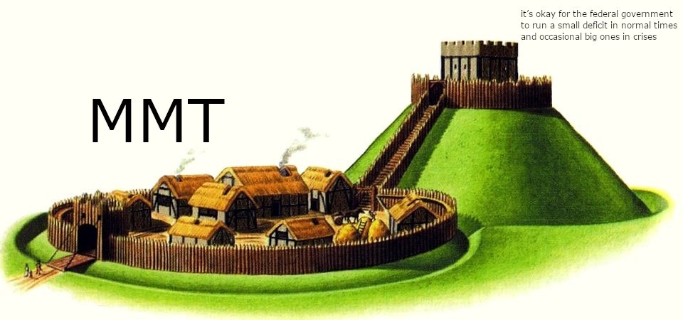
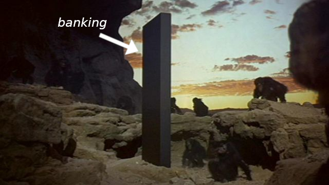
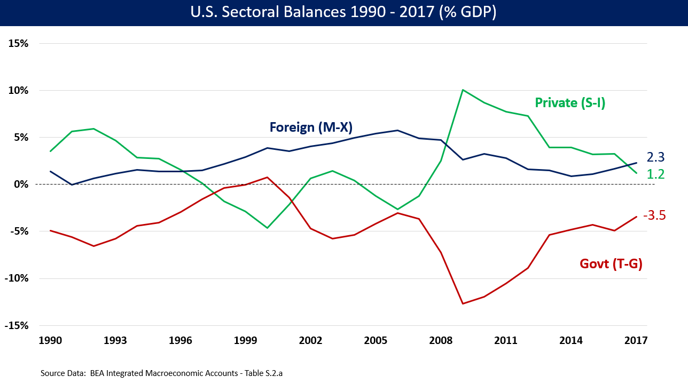
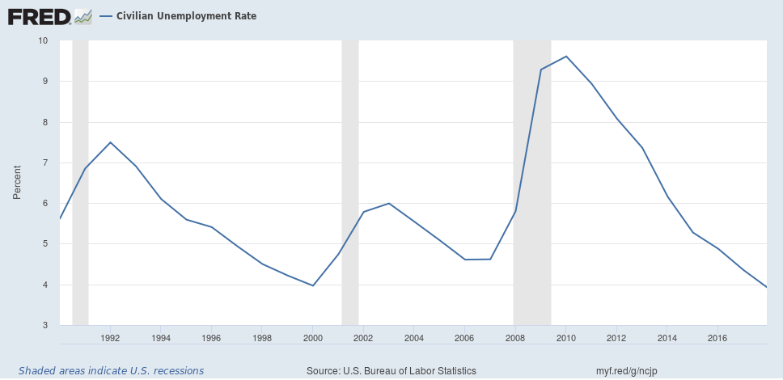

I'm [in the middle of writing a book](http://www.arandomphysicist.com/2019/02/a-workers-history-update-february-2019.html) that aims to obviate all talk of money and monetary policy in macroeconomics, framing everything in terms of workers and social forces. Instead of an empirically useless quantity theory of money, there's an empirically valid [quantity theory of labor](https://informationtransfereconomics.blogspot.com/2017/03/the-quantity-theory-of-labor-and.html). And it's through looking at the data that I've become more and more convinced that there must be something besides science that attracts people to "monetary" theories from classical monetarism to the modern consensus assignment view ([per Simon Wren Lewis](https://mainlymacro.blogspot.com/2017/10/why-is-mmt-so-popular.html)) that central banks stabilize the economy through monetary policy while reacting to fiscal policy.

I'm not entirely sure what it is that people see in various "money" theories — crackpot or not. Did you know that [when people think about money, it makes them more selfish](https://www.livescience.com/1128-mere-thought-money-people-selfish.html)? As a person who once did trust that consensus assignment, I think I just went along with the fact that it seemed like macroeconomists from Milton Friedman to Paul Krugman generally agreed on some basic principles. I was well aware that there were "Austrian school" oddballs out there along with gold bugs of various sorts, but by and large I felt that a monetary policy view of macro was pretty sensible. I mean, Volcker ended 70s inflation, [right](https://informationtransfereconomics.blogspot.com/2016/09/paul-romer-on-volcker-disinflation.html)? [Right](https://informationtransfereconomics.blogspot.com/2018/10/new-zealands-2-inflation-target.html)? _[Right](https://informationtransfereconomics.blogspot.com/2018/03/its-80s.html)?!!_

However — as I looked into it a bit more than not at all — I began to notice that none of these theories and models seemed to capture the empirical data very well. I started questioning the received wisdom, and looking for better explanations. Sure, I had written down my own "quantity theory of money" at one point ([or at least a theory that reduced to that in the limit of high inflation](https://informationtransfereconomics.blogspot.com/2016/02/the-is-lm-model-as-effective-theory-at.html)), but as my training is in science and my interest is in theories that actually work I had no qualms about abandoning "money" as an explanatory variable [when I found a better one](https://informationtransfereconomics.blogspot.com/2016/01/is-cpi-information-theoretic-measure-of.html).

To me, money as an explanation of macroeconomics seems to be a shibboleth in the classic sense, and the class it distinguishes is a certain kind of (typically white and male) person with an interest in accounting, stocks, engineering, math and/or science who views people as a kind of _Homo economicus_. Not necessarily the rational expectations subspecies _H. economicus rationalis_, but one who's just an undifferentiated cog in a national accounting identity — _H. economicus operarius_? It's harmless, but it's still monetary kookiness.

And that's why my eye starts twitching when I hear the words "Modern Monetary Theory". By rights, MMT should really be called "Modern Fiscal Theory", but the fervent devotion it inspires seems directly connected to the second shibboleth "M" as well as its disturbing obsession with arcane accounting and definitions of money. I've talked about MMT and some related topics in terms of math many times before. The common thesis in several of those posts ([here](https://informationtransfereconomics.blogspot.com/2017/05/mathiness-in-modern-monetary-theory.html), [here](https://informationtransfereconomics.blogspot.com/2016/12/stock-flow-consistency-is-tangential-to.html), and [here](https://informationtransfereconomics.blogspot.com/2018/09/what-do-equations-mean.html)) is limited to the obfuscating but basically trivial mathematical content that often claims profundity while usually being [question begging](https://en.wikipedia.org/wiki/Begging_the_question). There's one post where I expressed my view of ["money" as the aether of macroeconomics](https://informationtransfereconomics.blogspot.com/2018/01/money-is-aether-of-macroeconomics.html) while showing the commonality between MMT and Austrian school thinking.

However, I've never really sat down and expressed my views of the tenets of MMT itself except through asides or outsourcing to Eric Lonergan ([here](https://www.philosophyofmoney.net/mmt-school-thought-set-personalities/)) or Simon Wren-Lewis ([here](https://mainlymacro.blogspot.com/2017/10/why-is-mmt-so-popular.html), [here](https://mainlymacro.blogspot.com/2016/03/mmt-not-so-modern.html)). [Doug Henwood's recent piece](https://www.jacobinmag.com/2019/02/modern-monetary-theory-isnt-helping) in Jacobin pleased my Marxist leanings, but I hadn't found a good way to structure my view of MMT (to which I am partially sympathetic to some of the policy prescriptions). To be honest, I've considered _[The Paranoid Style in American Politics](https://en.wikipedia.org/wiki/The_Paranoid_Style_in_American_Politics)_ to be the true prerequisite reading before delving into MMT. [This piece by Britonomist](https://medium.com/@Britonomist/whats-wrong-with-mmt-a41e10c7203b) gets into some of the details of what he calls "monetary crankery" — which is quite similar to the way I see it. Whereas he said MMT's crankier monetary ideas were misleading at best, I'm going to use a different descriptor, "monetary kookiness", to emphasize the plain — and mostly _unnecessary_ — weirdness. Cranks in my view at least focus on things that are critical to their obsessions, kooks on the other hand have no particular logic to their eccentricities.

Since everyone is now talking about MMT, I luckily have a plethora of templates for my thoughts and I found an excellent one via [Matthew Klein](https://twitter.com/M_C_Klein/status/1101549524659523584) on Twitter titled "[MMT for Dummies](https://www.creditwritedowns.com/p/mmt-for-dummies)" who structured his piece in terms of a list of influences written by MMT high priest Randall Wray \[[pdf](http://www.levyinstitute.org/pubs/wp_900.pdf)\]:

> _MMT draws heavily on the work of Georg Friedrich Knapp, A. Mitchell Innes, John Maynard Keynes, Abba Lerner, Hyman Minsky, and Wynne Godley ..._

Wray's following sentence has a list of concepts that are mapped to the names for us in the "MMT for Dummies" piece:

> _Knapp for "State money" or "Chartalism" ... Innes for "The credit theory of money"... Keynes for macro ... Lerner for "Functional finance" ... Minsky for private credit ... Godley to describe how the sectors of the economy interact_

That piece then goes on to describe the work of each of these people and connects it to MMT in a useful and thoughtful way.  I'm going to do the same, but instead of considering the "ideas", I'm going to point out the tell-tale signs of monetary kookiness and the hive mind shibboleths similar to the ones that [Noah Smith documents among finance types](http://noahpinionblog.blogspot.com/2014/03/the-finance-macro-canon.html) (incidentally, Noah notes that finance types are susceptible to MMT). Since everyone else is writing about MMT and we haven't had a good econoblogosphere-wide discussion in a long while, why don't I barge in completely uninvited? I tried to inject this with a bit of humor, because at the end of the day we're just a bunch of adults arguing about things on the internet. Let's begin!

**Knapp — "State money" or "Chartalism"**

Knapp is one of a number of people who tried to figure out why money has value the easy way — by simply asserting the reason it has value. This is not too different from how macroeconomics, the study of recessions and the business cycle, often proceeds [by defining what a recession is](https://informationtransfereconomics.blogspot.com/2015/11/frameworks.html). I think humans are just uncomfortable with uncertainty and often make up a story to answer questions that bother them from "Why are we here?" to "Why does money have value?"

Knapp's version — one he might have been the first to espouse but that I care so little about that I don't care to look it up — is that "The State" (nation-state, not [the comedy series](https://en.wikipedia.org/wiki/The_State_\(1993_TV_series\))) forces you to pay taxes in their money which forces you to value it. Despite this being neither consistent with the various (and **_varying_**) historical accounts of how "money" actually arose nor consistent with the value of things like Bitcoin, it's also largely irrelevant to the rest of MMT. We could just assume money has value and it changes exactly _nothing_ about MMT. If fact, just assuming money has value in MMT actually clears up a mathematical inconsistency at zero tax rates — if the tax rate is zero, billions of dollars of currency has no value but if it is 0.0001%, then suddenly it has billions of dollars of value (depending on real resource constraints). You can read another [another piece by Eric Lonergan](https://www.philosophyofmoney.net/accounting-as-religion-buffett-derrida-and-mmt/) for more on the zero tax limit and MMT, but the typical way out of this appears to be to just stop talking about it and assume money has value.

This is all to say that MMT is (unnecessarily) catering to monetary kookiness — the second "M" and now the Chartalism. Plus Knapp is **_first_** on Wray's list. The author of "MMT for Dummies" at least had the decency to re-order the list to talk about Keynes first. Most of macro proceeds without even addressing why money has value in the first place — dealing only with changes in value through inflation. Both the reason money has value and what causes inflation are considered open questions in economics, and this kind of all-encompassing theory is more suited to the realm of religion, [sci-fi fandoms](https://starwars.fandom.com/wiki/Main_Page), and conspiracy theories. The hows and whys of money are really only of interest to historians, anthropologists, archaeologists ... and monetary kooks. As an aside, I think "money" [is basically a unit of information](https://informationtransfereconomics.blogspot.com/2015/06/the-definition-origin-and-purpose-of.html) and [derives its value](https://informationtransfereconomics.blogspot.com/2015/12/money-is-that-which-is-conserved-via.html) from being able to convey information [based on its historical development](https://informationtransfereconomics.blogspot.com/2017/09/my-introductory-chapter-on-economics.html), but I also think that [money is largely irrelevant to macroeconomics](https://informationtransfereconomics.blogspot.com/2018/01/money-is-aether-of-macroeconomics.html) and I recognize that any description of the hows and whys of money in terms of economic theory are basically pure speculation since economic theory simply isn't that good. It's like trying to explain why the universe exists when you haven't even gotten to Newton's laws.

**Innes — "The credit theory of money"**

Second on the list is another person who wrote about money, defining it by asserting a definition. True, definitions are usually simply assertions. Newton asserted some relationships between quantities of motion that turned out to be incredibly useful because there is a physical quantity called momentum (Law #1 and #2) that is conserved (Law #3). That is to say the usefulness of asserting definitions is entirely due to the products of those definitions, but the operational usefulness of Innes claiming the equivalence of "you gave me money I have to pay back" and "you gave me debt I have to pay back" when they're already equivalent is pretty picayune. Fractional reserve banking matters a bit in terms of [bank runs](https://en.wikipedia.org/wiki/Diamond%E2%80%93Dybvig_model), but runs are typically _set off_ by worsening economic conditions rather than the other way around (more on that later).

However, this massively matters to monetary kooks. Ever since Italians set up _banche_ from which to lend long after borrowing short, European monetary kooks viewed those green-draped benches and their evolutions the same way the hominids viewed the monolith in _2001: A Space Odyssey_. The words "fractional reserve banking" pierce their ears like the high pitched tone emitted by the monolith on the moon in the same movie. Their minds spin in circles — _Where did the money in my account come from when I take out a loan!?_ To them, [George Bailey's speech](http://www.seattleforgrowth.org/wonderful-fractional-reserve-economy/) in _It's a Wonderful Life_ isn't some commonsense folk wisdom, but rather describes an arcane and mystical power controlling the entire economy.

_Relax_, Innes tells us, _money and debt are the same thing_. _Banks create money by issuing debt_. Mixing my sci-fi metaphors: _[Debt is money. Money is debt.](https://en.wikipedia.org/wiki/Dune_\(film\))_ Our hominid minds are blown. Or something.

**Keynes — macro**

During the Great Depression, John Maynard Keynes had a look around and said "This sucks. Maybe the government can help people a bit?" Keynes wrote his thoughts down in a book that set up the framework that's organized macroeconomics for nearly 100 years. But I think Wray only includes him in the list as a bait and switch — _Yes, we're basically Keynesians. Now here's all this monetary kookiness._ After all, modern Keynesian economics is really based on Lerner ... \[1\]

**Lerner — "Functional finance"**

There's really not much to "functional finance" besides re-iterating two of the age-old ways of getting the money to do things as a nation-state (emperor, god-king, or whatever): borrowing the money or creating the money. There's of course a third age-old way — by force. The "functional finance" part is that you should use either of the less stabby methods depending on what you want to accomplish and what effects it has while examining the trade offs involved if they exist. As the "creating the money" option has had lots of bad historical examples in the form of hyperinflation, people are understandably cautious.

I don't really have a problem with this except for the fact that, empirically, high inflation is an observable phenomenon with a direct relationship to creating money [at scales above about 10% per year](https://informationtransfereconomics.blogspot.com/2017/03/belarus-and-effective-theories.html) (i.e. an _e_\-folding time scale of 10 years which is on the order of a business cycle). You could conceivably print money at a rate of a few percent per year and use it to finance spending. But we already print money at a few percent per year just to keep the ATMs working, so there's not a lot of headroom there. Plus it wouldn't even produce a lot of money. If the US brought M2 growth up to 10% per year in January of 2012 (an extra 420 basis points) by January 2019 we would have had an additional 5 trillion dollars today. However, over the same period the federal debt went up by 6 trillion dollars without the inflation risk. So is it 5 trillion dollars of spending with 10% inflation (with 10%+ nominal interest rates) or 6 trillion with only 2% inflation and stable interest rates at a few percent? Not a tough choice.

That said, what's really hidden in here is some more of that monetary kookiness. Here's Stephanie Kelton \[[pdf](https://econwpa.ub.uni-muenchen.de/econ-wp/mac/papers/0004/0004031.pdf)\] on Lerner:

> _The first law of Functional Finance is designed to eliminate a shortfall in total spending, while the second decrees the specific manner in which the deficiency is to be funded. Specifically, the second law calls for the sale of interest-bearing government debt only in the event that private spending would otherwise generate excessive aggregate demand._ 

Um, first law? Second law? What is this, physics? Lerner's "laws" are not empirically observed relationships, so at least they have that in common with Newton's laws which are really just definitions. Lerner's "laws" are actually just rules that are based on Lerner's cursory examination of a three year period in the 1950s. The first "law" asks for the government to spend until unemployment and inflation are both nonexistent. However, inflation and unemployment both have little to do with government spending — [unemployment appears to have almost no policy signals whatsoever](https://informationtransfereconomics.blogspot.com/2014/07/remarkable-recovery-regularity-and.html) (only recessions), and inflation is driven by increases in the labor force (i.e. labor force increase precedes inflation e.g. [US](https://informationtransfereconomics.blogspot.com/2018/03/trends-in-macro-observables-twitter.html), [Japan](https://informationtransfereconomics.blogspot.com/2018/05/inflation-and-labor-force-in-japan.html)) ... at least below that 10% money growth scale.

The second "law" is about interest rates, but again [these show little relationship to fiscal policy](https://informationtransfereconomics.blogspot.com/2018/06/rethinking-interest-rates.html) and mostly look just like the labor force increase (women entering the workforce) and the subsequent inflation surge through the 60s, 70s, and 80s. The shorter term rates basically follow the same path, except they have additional dips based on the Fed's lower targets after recessions hit. Clearly, the Fed can affect the short term interest rates, but it is not clear that this does anything besides send signals to the stock market. That is to say these "laws of functional finance" are really just assertions about the way things work based on assuming certain factors (government spending, money creation) affect certain observables (inflation, unemployment) in ways that they don't, empirically.

Of course, the [post-war expansion](https://en.wikipedia.org/wiki/Post%E2%80%93World_War_II_economic_expansion) Lerner was using as a model for fiscal policy was more likely driven by women entering the workforce (see [here](https://informationtransfereconomics.blogspot.com/2018/03/trends-in-macro-observables-twitter.html) or [here](https://informationtransfereconomics.blogspot.com/2018/02/women-in-workforce-and-solow-paradox.html)), not fiscal or monetary policy (in fact, [money growth lags both the labor force increase and inflation](https://informationtransfereconomics.blogspot.com/2017/07/causality-in-money-and-inflation-plus.html)). Lerner's purported model on which functional finance is based is **_empirically_** unfounded. However, the primary purpose of Lerner's "functional finance" in MMT beyond combining fiscal policy with monetary policy — which for some reason (well, monetary kookiness) combine to form the word "monetary" as the second "M" in MMT — isn't to get data right. It's to provide a just-so story behind tolerating higher deficit spending, which is of course the position most MMT fans retreat to when questioned (the motte to the full MMT monetary kookiness bailey in the picture at the top of this post).

As a side note, it's pretty funny to check out Lerner's wikipedia page:

> _Although Lerner never received the Sveriges Riksbank's Nobel Memorial Prize in Economic Sciences, he has been recognized as one of the greatest economists of his era. Fundamental economic "concepts, theorems and rules" were derived and/or furthered by Lerner's work throughout his academic career._

Aww. Sad. The first listed contribution —  the "Lange–Lerner–Taylor theorem" — just links to what is known everywhere else as the Lange model. Also, I especially like the footnote that says that what we think of as Keynesianism is really due to Lerner. I imagine this page is most often edited by MMT fanboys.

**Minsky — private credit**

Since this "theory" aims to be all-encompassing, it needs to have answers for the business cycle. And like most of macroeconomics — instead of researching the phenomenon — it just asserts what the business cycle is. This time, it's [Minsky's credit cycles](https://en.wikipedia.org/wiki/Minsky_moment). Of course, Minsky's speculative theory is essentially a just-so story without any detailed empirical analysis to back it up. For example, [debt growth appears to have collapsed **_after_** the 2008 recession](https://informationtransfereconomics.blogspot.com/2018/07/does-accelerating-debt-growth-cause.html) — contrary to the theory. Additionally, the fraction of "ponzi" class-firms (a type defined by Minsky as the last part of the cycle) appears to only collapse **_after_** a recession hits (Figure 2b [here](https://scholarworks.umass.edu/cgi/viewcontent.cgi?article=1225&context=econ_workingpaper) \[pdf\]) meaning the most reasonable interpretation is that recessions cause the private credit crises, not the other way around.

Looking into the data more than not at all, it is possible [that the past two recessions in the US were Minsky moments](https://informationtransfereconomics.blogspot.com/2018/01/24-growth-forever.html) — asset "bubbles" that collapse. However, most of the previous recessions in the post-war era happened with [an inflation surge being cut-off by high unemployment](https://informationtransfereconomics.blogspot.com/2018/03/trends-in-macro-observables-twitter.html) indicating at least under some conditions low inflation and low unemployment might not be simultaneously realizable. Add to that the Marxist view — investment declines as growing wages eat into profits — [is also supported by the data](https://informationtransfereconomics.blogspot.com/2018/10/limits-to-wage-growth.html).

The cause of recessions is an open question in macroeconomics, and it's possible they have multiple causes. Scientists and academics in general live with uncertainty and unanswered questions all the time. Physics has '[dark energy](https://en.wikipedia.org/wiki/Dark_energy)'. What is it? No idea. _That's what makes the fields we research interesting to us!_ But monetary kooks need answers, and they need answers that depend on money. They're nervously twitching their legs in their seats during Wray's sales pitch. Helpfully, Wray reminds them that Innes defines debt as money, which turns Minsky's credit cycles into money cycles. "Phew, I almost thought we might have to consider _H. economicus operarius_' emotional states," one kook says. "Thank goodness recessions are just accounting devices for speculative losses," another says.

**Godley — "sectoral balance"**

If I had to pick the economist that was most maligned by the people who cite that person with the intention of citing them favorably by their own opinion, I would pick Wynne Godley. I wrote about this a bit [here](https://informationtransfereconomics.blogspot.com/2018/01/qualitative-economics-done-right-part-3.html). Godley is put on a pedestal as an economist who predicted the global financial crisis based on what I gather is [a single unreliable source who fabricated quotes](https://informationtransfereconomics.blogspot.com/2018/05/no-one-saw-this-coming-bezemers.html). Godley also changed his views of what was driving the economy over the years from 1999 to the mid-2000s, from government surpluses (1999) or deficits (2005) to low interest rates (2003) and housing debt (2006). [In every strategic analysis](http://www.levyinstitute.org/publications/wynne-godley) at Levy, the economy was always having some problem (the first line of the [Wikipedia page on him](https://en.wikipedia.org/wiki/Wynne_Godley) says he was famous for his pessimism about the UK economy). Regarding the global financial crisis, Godley basically said the collapsing housing bubble (that was already underway) _in the US_ would be a drag on _US growth_ around the same time (2005-2006) [Paul Krugman was saying the same thing](https://www.nytimes.com/2005/08/08/opinion/that-hissing-sound.html) — both well after Dean Baker called it a bubble in 2002 based on entirely different methods (the growing price difference between housing rents and purchase prices). 

Speaking of methods, Godley himself seems like a practical economist who looked at patterns in GDP components and combined them with prose discussion of macroeconomic and relevant monetary or fiscal policy events (much like Brad DeLong does [here](https://www.bradford-delong.com/2011/10/a-note-components-of-autonomous-spending.html)). This heuristic approach has been transformed by MMT acolytes (and some other Post Keynesians) into a "[sectoral balance framework](https://en.wikipedia.org/wiki/Sectoral_balances)" based on the BEA's NIPA accounting tables beloved by monetary kooks. [You get graphs that look like this](https://www.youtube.com/watch?v=sIlNIVXpIns):

It basically contains the same information as [the unemployment rate](https://fred.stlouisfed.org/series/UNRATE) based on BLS data that is a) more frequently updated, b) lower noise, and c) reported sooner:

It's also worth noting that inasmuch as the unemployment rate is a good proxy for the sectoral balance approach, it does not appear to contain any information about future recession events [until only a couple quarters before they happen](https://informationtransfereconomics.blogspot.com/2017/04/determining-recessions-with-algorithm.html) (which puts an additional damper on claims that Godley foresaw the Great Recession any time before early 2008 using sectoral balances). Additionally, other data such as [JOLTS labor market measures](https://informationtransfereconomics.blogspot.com/2017/07/jolts-leading-indicators.html) or [even hospital fertility data](https://informationtransfereconomics.blogspot.com/2016/12/stock-flow-consistency-is-tangential-to.html) — not included in the NIPA accounts — give even earlier warnings than the unemployment rate.

The "MMT for Dummies" piece also points out a critical point in a quote from a (now deleted) blog post from Martin Wolf at the FT talking about Godley's approach:

> _The crucial point is that, since sectoral balances must sum to zero, a rise in the deficit of one sector must be matched by an offsetting change in the others._

Note that since this is an accounting approach, a rising deficit in one sector implies a rising surplus in one or more other sectors _at the same time_. It's accounting: the deficit doesn't start rising in one sector only later to be offset by a surplus somewhere else — they're simultaneous. There's no causality information. A sector change at time _t_ \= _t₀_ − 1 does not impact another sector at time  _t_ = _t₀_ — it's all series of _t₀_'s. 

I think it's this idea of using mathematical identities to derive conclusions about the economy is what appeals to the monetary kooks. But accounting identities don't actually specify what happens between variables. If I have _G_ = _B_ + _R_, if there's a change in one of the variables it does not imply any specific change in the others. If _R_ goes up by a smidge _δR_, then _B_ could go up down or stay the same. [I made a helpful chart in a post on MMT mathiness](https://informationtransfereconomics.blogspot.com/2017/05/mathiness-in-modern-monetary-theory.html):

Additionally, this picture of a series of instants in time is deeply connected to a problem at the center of "stock-flow consistent" approaches like Godley's sectoral balances or his later work on more general applications with Mark Lavoie. Or rather it's a problem with how the monetary kooks employ them. Much like how Kirchhoff's laws don't tell you much about how a circuit will behave (and really, [that's an almost perfect analogy](https://informationtransfereconomics.blogspot.com/2016/12/stock-flow-consistency-is-tangential-to.html) where we think of voltages as stocks of electrons and currents as flows of electrons), NIPA accounting doesn't really tell you how an economy will behave. There are not only a great deal of free parameters introduced that should be empirically measured (and which [get you over 200 comments from monetary kooks](https://informationtransfereconomics.blogspot.com/2016/03/more-like-stock-flow-in-consistent.html) who don't understand math), but also entire "free models" introduced — analogous to models of how transistors, inductors, and capacitors work (or even more complex combinations of circuit elements). In the stock-flow consistent approaches as employed by monetary kooks, these models are simplified to simple linear relationships like _V_ \= _I R_ with _R_ constant and then further simplified by taking _R_ \= 1.

This isn't to say that Godley didn't have insights into the way economies work or useful advice. It's that the insights required a lot more information besides the sectoral balances. If you read through [Godley's writing published at the Levy Institute](http://www.levyinstitute.org/publications/wynne-godley), most of it is prose discussion of macroeconomic conditions. It's all analysis that goes beyond the simple NIPA tables — introducing human behavior including politics and institutions behind the accounting.

**Conclusions**

There's a lot of ways MMT is portrayed in the broader discussion: as an entirely new way of thinking about the economy, [as strategic messaging for the left to get new spending](https://crooked.com/articles/whats-missing-from-the-most-important-debate-on-the-left/) (the practical recognition that Republicans don't care about deficits for their tax cuts so why should Democrats), or as basic macro a different set of wrong assumptions. [As Thomas Palley put it](http://thomaspalley.com/?p=1145):

> _I like to say that MMT is a mix of “old” and “new” ideas. The old ideas are well known among Keynesian economists and are correct, but the new ideas are either misleading or wrong._

I'd personally take a step further back from this and say that it's not entirely certain that the Keynesian claims about the relationships between inflation, employment, and government policy (fiscal or monetary) are correct. As previously noted, inflation is driven by the size of the labor force, and very few policy interventions appear to have had any effect on the unemployment rate unless they directly employed people (think WPA, or the infrastructure parts of the ARRA [which you can literally see in the JOLTS data](https://informationtransfereconomics.blogspot.com/2018/11/construction-hiring-great-recession-and.html)) or directly required specific jobs to expand by requiring demand for them ([Obamacare](https://informationtransfereconomics.blogspot.com/2016/08/did-aca-decrease-unemployment.html)). The only time in post-war economic history of the US where inflation and unemployment have a relationship [is during the period women were entering the workforce](https://informationtransfereconomics.blogspot.com/2018/03/trends-in-macro-observables-twitter.html) (see also [here](https://informationtransfereconomics.blogspot.com/2017/09/was-phillips-curve-due-to-women.html)) — basically recessions modulated the flow of women into the labor force which [modulated inflation](https://informationtransfereconomics.blogspot.com/2018/05/labor-force-participation-and-gravity.html) (n.b. you can be in the labor force but unemployed, and it's the former measure that is closely related to inflation).

Using government deficit spending to help an economy grow is not unique to MMT. Keynes said it in the 1930s. George W. Bush was in favor of it with the tax cuts in his first term. Not worrying about deficits is not unique MMT. Republican's don't worry about deficits, and they don't subscribe to MMT. Dick Cheney famously said that Reagan proved deficits don't matter

The real issue here is that Cheney was right: American's don't care about deficits. Or really, Democrats care about deficits when Republicans are in power and Republicans care about deficits when Democrats are in power. Nobody thinks the deficit is bad when their own party is in power. I imagine that's one source of backlash against MMT — Republicans are in power so deficits are bad, and it's the the Republican tax cuts for rich people an corporations (i.e. deficit spending) that caused them. Don't say deficits are great until we have a Democrat in office, or the left will think you're shilling for the right.

Another source of backlash is that MMT's contention that taxes are only needed to control inflation, not pay for spending, leaves out the fact that taxes have (at least) _two other purposes_: high marginal tax rates on top incomes address inequality, and taxes represent our collective social responsibility. High taxes in the mid-20th century were deeply connected to social solidarity (well, actually, white ethnocentrism) and low income inequality. We don't know if high taxes cause social solidarity ([causality appears to go the other way](https://thinkprogress.org/ethnocentrism-and-small-government-hypocrisy-760d3e8528f/)), but squashing two leftist aims because of a bunch of monetary kookiness is bound to get the socialists riled up. This is also where [the weird relationship of MMT](https://www.thenation.com/article/the-rock-star-appeal-of-modern-monetary-theory/) to Arthur Laffer and a rich hedge fund manager (Warren Mosler) — and recent comments from Stephanie Kelton that we don't have to tax the rich — trigger my grifter spidey senses. This is also where I think the MMT view of humans as _H. economicus operarius_ conflicts with the broader left that sees humans as social beings with needs. Specifically, I don't think MMT acolytes understand the **_social_** importance of taxes.

My own personal view is that it's just a lot of assumptions about relationships between variables — some empirically false — coupled with a lot of monetary kookiness that's completely irrelevant. It's not just irrelevant to the policy conclusions, but is largely irrelevant to even the substance of the "theory" itself. You don't need to know what money is or why it has value or to make a big point about government debt being money in order to say that the real resource constraint is determined by inflation. That's just Austrian school economics with a higher inflation target. And even that doesn't seem to be true as high inflation in the 1970s was at a time when we were obviously operating far below the real resource constraint — half the workforce was stuck at home for reasons imposed by society. If MMT wants to just retreat to the deficit dovery motte as it often does, then I'm game. However, I think that will cause it to lose the monetary kooks that fill the bailey.

...

**TL;DR**

To return to that list of influences, MMT appears to me to be:

> _**Knapp** for monetary kookiness about why money has value which is actually an open question and is in fact irrelevant to the rest of MMT_ 

> _**Innes** for more monetary kookiness about what money is which is mostly relabeling and so is irrelevant to the rest of MMT_ 

> _**Keynes** so it's not all monetary kookiness_ 

> _**Lerner** for what monetary kooks really think about Keynes, but which is redundant if we have Keynes and irrelevant if we drop Innes_ 

> _**Minsky** for monetary kookiness about money cycles that is at best an open question and at worst empirically unfounded_

> _**Godley** for monetary kookiness about accounting that is also irrelevant since Godley was basically a Keynesian_

...

**PS**

I tried to find a good word that is both somewhat harmless and not some kind of slur (ableist or otherwise) and settled on kook which appears to be derived from cuckoo (the bird). If it does turn out to be offensive in some way, I apologize. I mean, it is probably going to be offensive to MMT acolytes but that's not really an oppressed group (inasmuch as they consider themselves persecuted).

...

**Update + 3 hours**

I wanted to note that Godley actually used the "something that cannot go on forever must stop" heuristic (not sectoral balances) in his discussion of the piles of growing mortgage (household) debt that would become a drag on the economy when it did come to that stop.

I also wanted to add that if MMT acolytes seem to think that all of the unnecessary stuff is actually necessary, it doesn't inspire confidence in their theoretical skills.

...

**Footnotes**

\[1\] This is sarcasm. See the next section.
