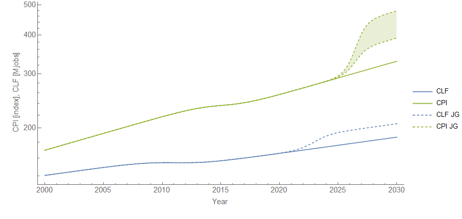
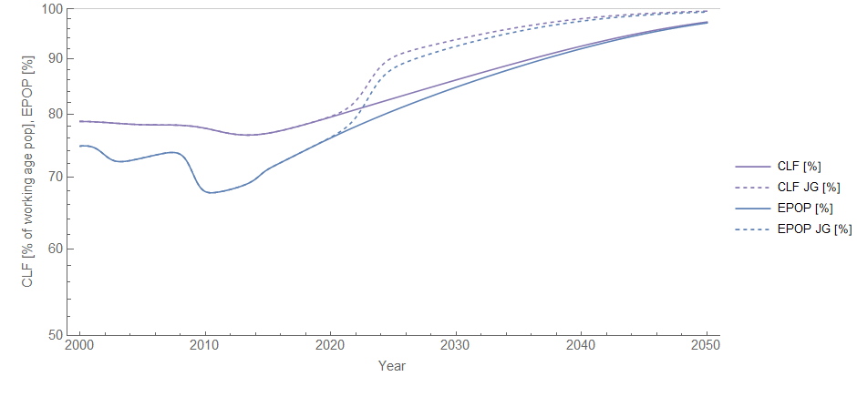
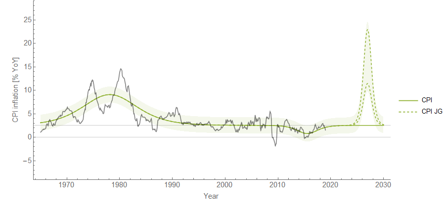
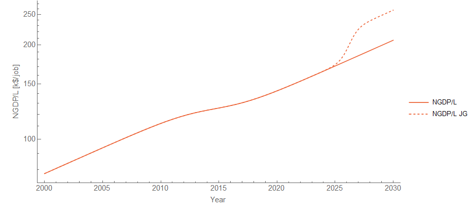
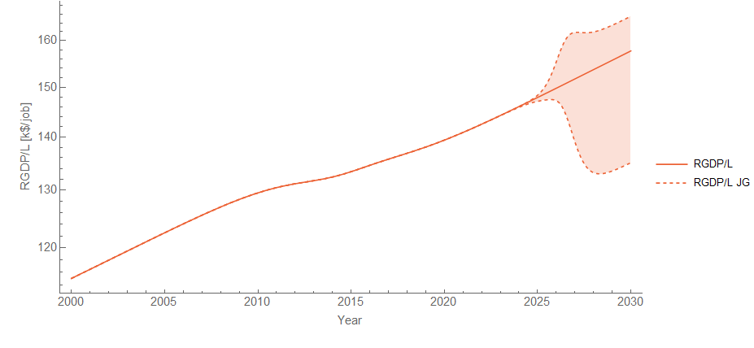

One of the things I've found about the information equilibrium approach is that the results are remarkably stubborn in showing any effect of any government policy whatsoever on things like inflation, unemployment, or output. However, there is one kind of policy that does seem like it would have an effect: a job guarantee or some [WPA](https://en.wikipedia.org/wiki/Works_Progress_Administration)\-style government employment scheme. That's because the size of the labor force directly impacts inflation and output ([here](https://informationtransfereconomics.blogspot.com/2016/01/its-people-economy-is-made-out-of-people.html), or [here](https://informationtransfereconomics.blogspot.com/2017/03/the-quantity-theory-of-labor-and.html), with [shocks to labor happening before changes to inflation and output](https://informationtransfereconomics.blogspot.com/2018/03/trends-in-macro-observables-twitter.html)). To that end, I assembled a model like this one where the relevant variables are the labor force size ([CLF16OV](https://fred.stlouisfed.org/series/CLF16OV)), GDP per employed person ([GDP](https://fred.stlouisfed.org/series/GDP)/[PAYEMS](https://fred.stlouisfed.org/series/PAYEMS)), headline CPI inflation ([CPIAUCSL](https://fred.stlouisfed.org/series/CPIAUCSL)). I also included [working age population](https://fred.stlouisfed.org/series/LFWA64TTUSM647S) and the [unemployment rate](https://fred.stlouisfed.org/series/UNRATE) to look at labor force participation rates (it's not exactly the traditional EPOP measures, but it gives an idea).

Now there are far fewer shocks than in that model, so the relationships are somewhat uncertain (the most uncertain is the relationship between inflation and labor force because the Great Recession shock [is buried in the noise of the inflation rate](https://informationtransfereconomics.blogspot.com/2018/03/cpi-data-and-end-of-lowflation.html), effectively leaving only one shock to estimate the relative sizes). But overall, it gives us a way to estimate the effects of a policy like the Job Guarantee.

First, we assume the policy is implemented in the next administration and employs about 20 million more people than otherwise (without the policy) in 2030. That (along with normal growth) brings us up to something over 90% labor force participation. Most of the effect takes place during the next administration (2021-2025) but it's a logistic function that's asymptotic so effects continue for a few years after. We also assume there aren't any recessions between now and 2030. (Ha! I mean, I could add one, [which would create a Phillips curve like fluctuation in inflation](https://informationtransfereconomics.blogspot.com/2018/05/labor-force-participation-and-gravity.html) but that's for another time.)

The dynamic information equilibrium model (DIEM) seems to say that CPI lags CLF increases by about 3.5 years and are a bit narrower, and somewhat larger. GDP/PAYEMS also lags CLF increases (by roughly the same length of time) and are about the same width as the CLF change but are bigger in magnitude. In [this logistic function page on Wikipedia](https://en.wikipedia.org/wiki/Logistic_function), the magnitude is _L_, the width is 1/_k_, and the delay goes into _x₀_. For more on the DIEM, [see my paper](https://papers.ssrn.com/sol3/papers.cfm?abstract_id=3094757). This means if we know what the shock looks like to CLF, then we know what it looks like to CPI and GDP/PAYEMS. Here's the forecast with and without the JG policy:

Since the inflation effect was a bit more uncertain, I included both the average and worst case effect. Here's the effect on labor force participation (note the lack of recessions, one — implausible —assumption):

The purple curves are the size of the labor force as a fraction of the working age population. Note that 100% of the working age population in the labor force is not necessarily a successful policy since it means e.g. students working.

Now for the funny bit: here's the effect on (year over year, or YoY) inflation (I went back to the 1960s just to give you a flavor):

I cracked a smile when that came out of the models. We'd be looking at 70s-style inflation which people were **_not_** happy about at the time. What about growth? Here's the effect on nominal GDP per employed person:

Unfortunately, the CPI-deflated real GDP per employee in 2019 dollars is uncertain precisely because the inflation effect is uncertain (in general RGDP is a much more uncertain measure because it combines errors in NGDP and in CPI or other price level measurement):

So there you have it: the effects of a Job Guarantee. It definitely seems more like a policy you'd want to implement during a recession (a la WPA) rather than one that's permanent.

[Second Bill of Rights](https://en.wikipedia.org/wiki/Second_Bill_of_Rights)
