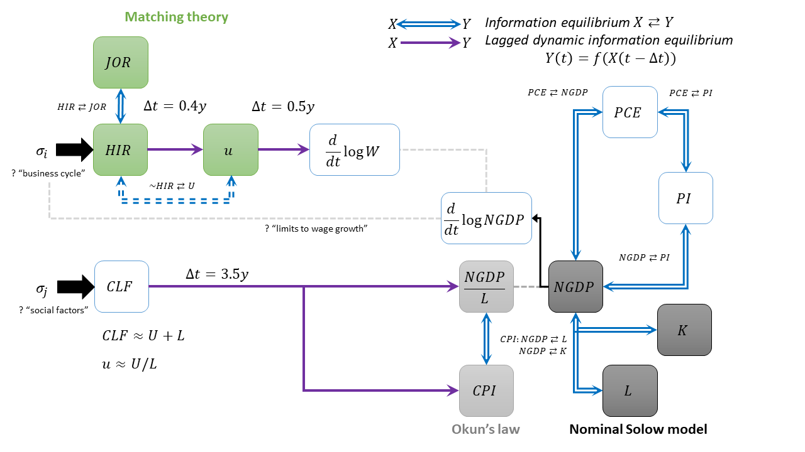
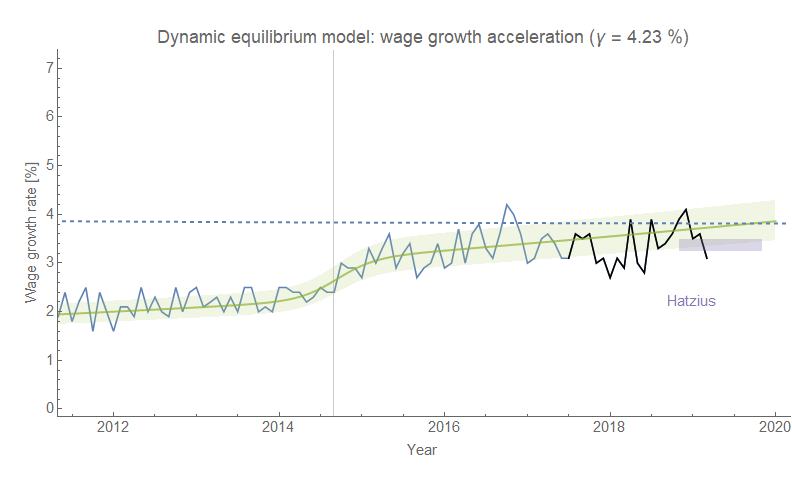

I've been trying to put together a summary of the information equilibrium/dynamic information equilibrium models that comprise a single (still preliminary) macro model. It's mostly for my own notes. At the top of this post is a graphical representation (click the graphic enlarge) of several posts. [This recent post](https://informationtransfereconomics.blogspot.com/2019/03/market-updates-2k19-and-old-forecast.html) explains the relationship between information equilibrium and dynamic information equilibrium (there is also this "[tour of information equilibrium](https://informationtransfereconomics.blogspot.com/2017/04/a-tour-of-information-equilibrium.html)" presentation) — these are represented by blue double arrows and purple single arrows, respectively. The gray dashed lines represent vague "links" (obviously NGDP is related to NGDP/L, it being in the numerator, but the "limits to wage growth" connection is more speculative). The black line relates NGDP with its growth rate by a mathematical operation (log-derivative a.k.a. the continuously compounded annual rate of change). There are two "exogenous shock" inputs — one is the business cycle (which is behind recessions, possibly based on the "limits to wage growth"), and the other are social factors (women entering the workforce, Baby Boomers retiring after the Great Recession).

-   [Matching theory and dynamic equilibrium](https://informationtransfereconomics.blogspot.com/2017/01/matching-theory-and-employment-in.html) (relating _JOR_, _HIR_, and _u_)
-   [Okun's law (quantity theory of labor)](https://informationtransfereconomics.blogspot.com/2017/03/the-quantity-theory-of-labor-and.html)
-   [Nominal Solow model](https://informationtransfereconomics.blogspot.com/2016/09/the-kaldor-facts.html) (part of this is related to Okun's law)
-   [Labor shocks and the business cycle](https://informationtransfereconomics.blogspot.com/2018/10/building-models.html) (_HIR_ leads _u_ and wage growth shocks)
-   [Demographic shocks and trend growth](https://informationtransfereconomics.blogspot.com/2019/03/policy-in-information-equilibrium-job.html) (_CLF_, _CPI_, and _NGDP/L_)
-   [Limits to wage growth](https://informationtransfereconomics.blogspot.com/2018/10/limits-to-wage-growth.html) (speculative explanation of when business cycle shocks occur)
-   [Labor share](https://informationtransfereconomics.blogspot.com/2018/06/women-in-workforce-and-labor-share.html) (relating _W_ and _NGDP_)
-   [Equivalence of _PCE_, _PI_, and _NGDP_](https://informationtransfereconomics.blogspot.com/2018/10/are-consumption-income-and-gdp.html)

I left out the [interest rate models](https://informationtransfereconomics.blogspot.com/2015/08/comparison-of-interest-rate-predictions.html) because they're not terribly relevant at this level. Not that interest rate signals are irrelevant — it's entirely possible the limit to wage growth mechanism functions because the Fed raises rates until wage growth stagnates at a level at or below NGDP growth, so then starts to lower rates which sends a signal to markets that a bear market is approaching creating a self-fulfilling prophesy. I'm still agnostic on that.

However, all the IE and DIEM  relationships (blue double and purple single lines) above are _empirically_ valid. It's essentially the connection between the top half and the bottom half of the graphic that is speculative.

...

**Update 27 March 2019**

If you were wondering where we are regarding that "limits to wage growth" picture:

The Hatzius band is from [this post](https://informationtransfereconomics.blogspot.com/2018/11/ill-say-similar-things-for-half-salary.html). The dashed line is the mean NGDP growth rate from a dynamic information equilibrium model.

...

_HIR_
_JOR_
_u_
_U_
_L_
_NGDP_
_K_ [capital](https://fred.stlouisfed.org/series/RKNANPUSA666NRUG)
_PCE_
_PI_
_CLF_
_W_ [wages](https://fred.stlouisfed.org/series/A4102C1Q027SBEA)
