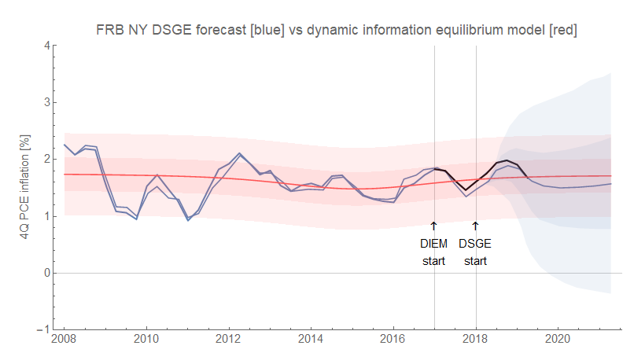
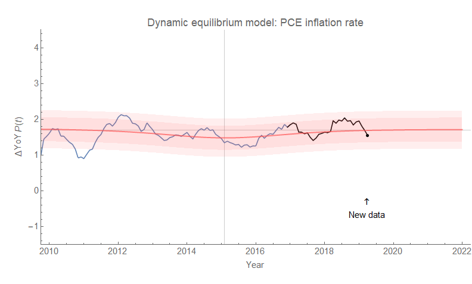
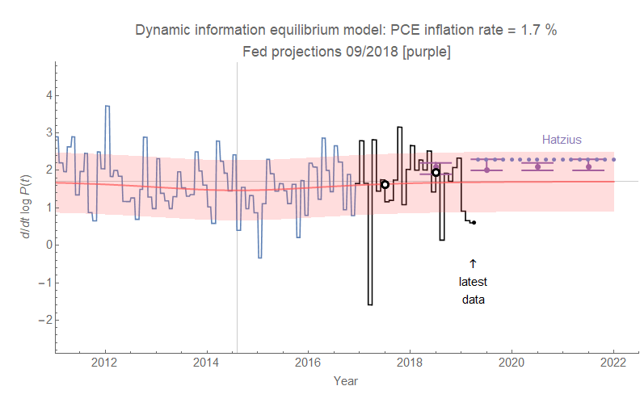
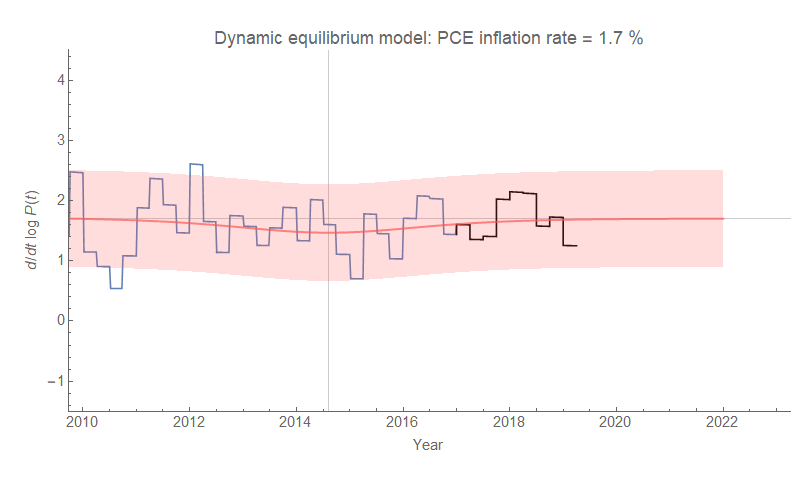

Core PCE inflation data — the measure commonly believed to be the most closely watched by the Fed — was released today. To be a bit of a troll, my Twitter headline for this post is going to be that the NY FRB DSGE model is remarkably accurate (black is post-DIEM forecast data):

... at least in its forecast mean. Given that the error bands are smaller for the dynamic information equilibrium model (DIEM), we'd say it improves our Bayesian prior more than the DSGE model does despite the near zero deviation from the mean forecast. Here's the year-over-year measure for the monthly data:

Of course, I really dislike year-over-year measures. Sure, they help eliminate seasonal variations, but the introduce correlated errors ... i.e. the present value depends on the measured value — including its error — from a year ago. And since there are undoubtedly seasonal/annual/multi-annual fluctuations, year-over-year measures make an implicit assumption that your measurement error has no seasonal variation which is unlikely. This is why lots of year-over-year measures tend to increase the order of the [AR processes](https://en.wikipedia.org/wiki/Autoregressive_model) that can be used to estimate them in the short run. Of course, the benefit is that overall error is usually smaller than when you take derivatives (which only impact the points right next to each other) because much of the uncorrelated error over the course of a year is averaged out.

Note: this should not in any way be read as disparaging the performance of the DSGE model above — it would likely be just as right about other measures. It's mostly about reading anything into the individual time series points (i.e. saying core PCE inflation has fallen over the past couple quarters).

Here's the continuously compounded annual rate of change (aka log-derivative) versions alongside some other forecasts from the FOMC (purple points with error bars representing the "central tendency") and [Jan Hatzius](https://informationtransfereconomics.blogspot.com/2018/11/ill-say-similar-things-for-half-salary.html) (lavender dots):

This white dots with black outlines represent the annual averages. Here's the quarterly version:

Overall, the DIEM forecast is performing well — as well as a fancy DSGE model. However, the path — being relatively constant — isn't very challenging.
