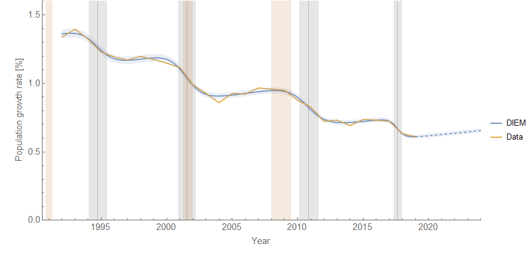

I saw some data from [Brookings](https://www.brookings.edu/blog/the-avenue/2018/12/21/us-population-growth-hits-80-year-low-capping-off-a-year-of-demographic-stagnation/) today ([via Noah Smith](https://twitter.com/Noahpinion/status/1116015558028173312)) about population growth that looked almost exactly like [wage growth data](https://informationtransfereconomics.blogspot.com/2018/02/dynamic-equilibrium-in-wage-growth.html) — and it turns out it is well-described by a [dynamic information equilibrium model](https://papers.ssrn.com/sol3/papers.cfm?abstract_id=3094757) (DIEM):

The 1991 recession and the 2008 recession are both followed (with a lag on the order of years) by a fall in the population growth rate. The 2001 recession basically coincides with the population growth decline. However, there is a drop in population growth not associated with a recession, but rather associated with the end of Obama's term as President and the beginning of the current administration's term:

**Update:** Forgot the labels — they show the shock centers for the unemployment rate (u), wage growth (W), and JOLTS hires (HIR). These labels are actually centered on the shock (including the text) so the actual center is a bit to the left of the arrow.
