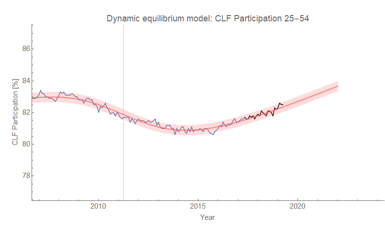
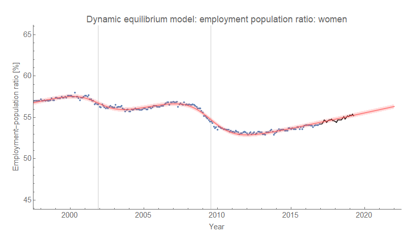
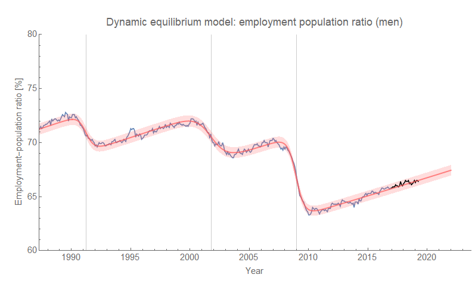
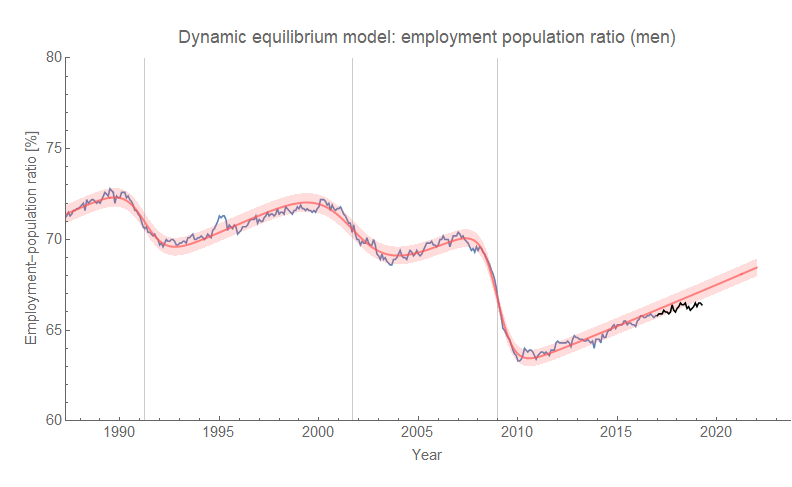
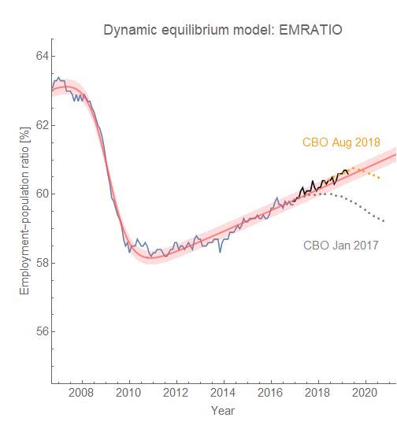
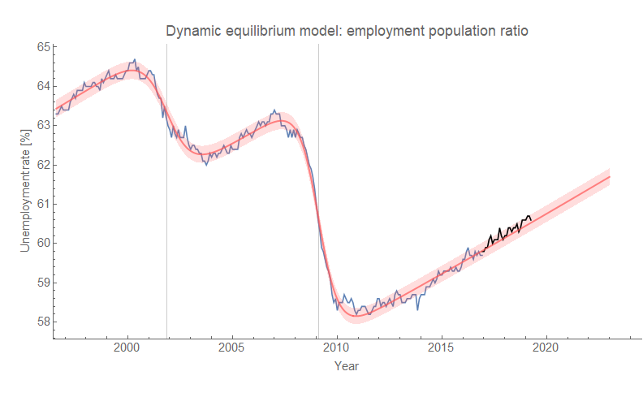

I haven't updated the forecasts of [labor force participation for ages 25-54](https://informationtransfereconomics.blogspot.com/2017/05/civilian-labor-force-participation-and.html) or the employment population ratio by gender in awhile. I was prompted by this [tweet from Ernie Tedeschi](https://twitter.com/ernietedeschi/status/1122925324789067776) about how labor force participation hasn't abated — but it shouldn't show any signs until after a recession has already hit ([here](https://informationtransfereconomics.blogspot.com/2018/02/economic-seismographs-labor-and.html), [here](https://informationtransfereconomics.blogspot.com/2018/02/dynamic-equilibrium-in-wage-growth.html)). Here are the updated models for labor force participation and women's employment-population ratio:

For some reason I don't fully understand, the code for men's employment-population ratio had the dynamic equilibrium hard coded to 0.007/year when the actual solution from the entropy minimization was 0.005/year. It's the latter value that matches the original fit while also fitting the post-forecast data, but I'll present both graphs — the 0.007/year value is the one that shows recent data lagging the forecast. My guess for the reason was that I was comparing the value for the fit for women in the graph above (which **_is_** 0.007/year) and forgot to change it back or document it. Anyway, here's the E-POP ratio for men with both dynamic equilibria:

Last but not least is the employment population ratio for everyone in the labor force — which has a forecast from the CBO to compare to (again, [via Ernie Tedeschi](https://twitter.com/ernietedeschi/status/1029116424839720960)) ...

