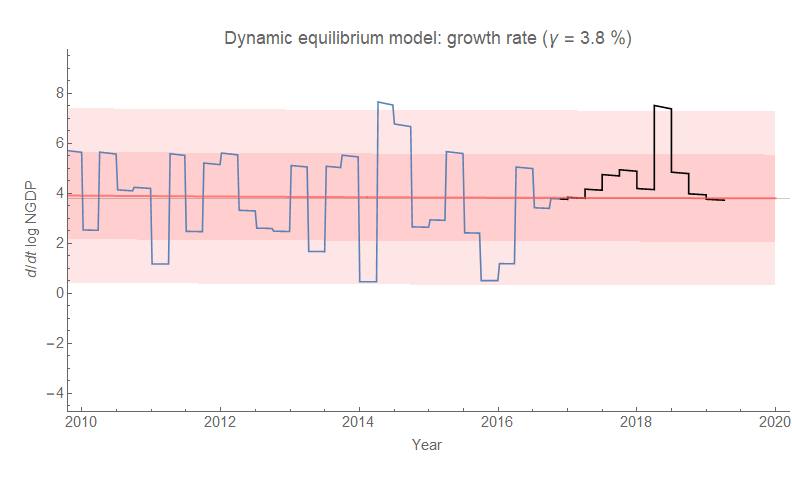
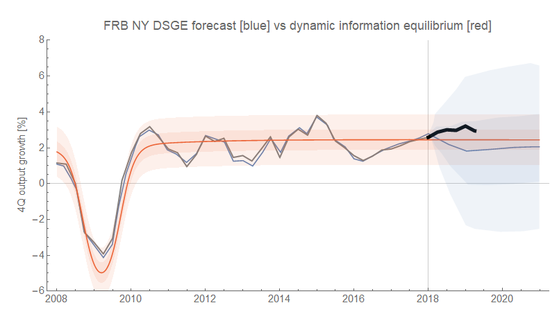
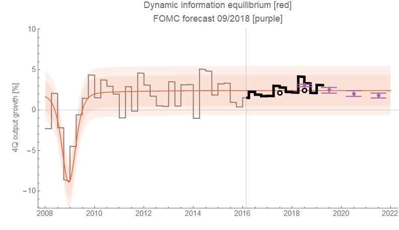

I have some NGDP and RGDP dynamic information equilibrium model forecasts I've been tracking the performance of. These, unfortunately, aren't very exciting because GDP data is (surprise) super noisy. Or at least it's noise in the DIEM view. Some people tend to think of the fluctuations of GDP from one quarter to another as somehow meaningful. I'll probably hear about it on APM/NPR's _Marketplace_ tonight. At least it's working better than the NY Fed's DSGE model which predicts about the same average path but with much larger error bands.

