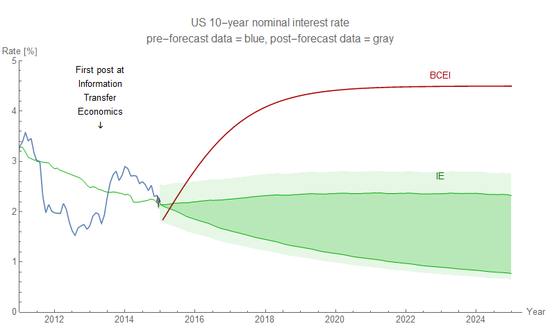

I started this blog [with its first post six years ago today](https://informationtransfereconomics.blogspot.com/2013/04/an-informal-abstract.html). At the time, I had [derived supply and demand diagrams](https://informationtransfereconomics.blogspot.com/2013/04/supply-and-demand-from-information.html) from an information theoretic approach \[1\] that I thought might be publishable if it weren't for the institutional roadblocks. For one, I'm not an economist, and while I love the earnestness of "econophysicists" no one listens to them, [nor do they (in general) provide a good reason for doing so](http://bactra.org/notebooks/517.html). The work is sometimes referred to as "heterodox", a) I don't really think it is because that's its own thing (q.v. [Carolina Alves](https://twitter.com/ImkoTjado/status/1115994603147145217)) and b) I didn't really know about it at the time — therefore that community isn't/wasn't necessarily a viable alternative to mainstream publication.

I decided to just present the results on this blog — the draft paper I had written was presented in the first few posts here. Eventually those results would be incorporated and expanded on in my first econ pre-print, originally on the [arXiv in q-fin.EC](https://arxiv.org/abs/1510.02435) (there's [a re-post of it at SSRN](https://papers.ssrn.com/sol3/papers.cfm?abstract_id=2894072)). That first pre-print contained the model in the forecast above [that's been doing well for almost 4 years](https://informationtransfereconomics.blogspot.com/2015/08/comparison-of-interest-rate-predictions.html). [Another pre-print followed](https://papers.ssrn.com/sol3/papers.cfm?abstract_id=3094757) a couple years later [containing its own forecast (of unemployment and JOLTS data)](https://informationtransfereconomics.blogspot.com/2019/04/unemployment-rate-holds-steady-at-38.html) that's also been doing well.

And here we are — six years later. To celebrate, I made an animation of one of the forecasts that I've been tracking the longest — more than half the time this blog has been in existence. The model itself was first written down in [February of 2014](https://informationtransfereconomics.blogspot.com/2014/02/the-link-between-monetary-base-and.html), less than a year after the blog started — though there general concept was written down in [August of 2013](https://informationtransfereconomics.blogspot.com/2013/08/the-interest-rate-in-information.html).

The interesting thing about this model is that it's a simple idea: the interest rate is the "price of money" and NGDP (~ aggregate demand) is the "demand for money" — with the monetary base being the "supply of money". (It's also a component of [the information equilibrium IS/LM model](https://informationtransfereconomics.blogspot.com/2017/01/the-islm-model-reference-post.html).) It's possible it's not correct (or is only an "[effective theory](https://informationtransfereconomics.blogspot.com/2017/04/lecture-on-effective-field-theory.html)") and [what we really have is a dynamic information equilibrium model](https://informationtransfereconomics.blogspot.com/2018/06/rethinking-interest-rates.html). But it's still working for now!

Thanks everyone for reading! 

**Footnotes:**

[Thomas Mikaelsen](https://twitter.com/tmikaelsen)
