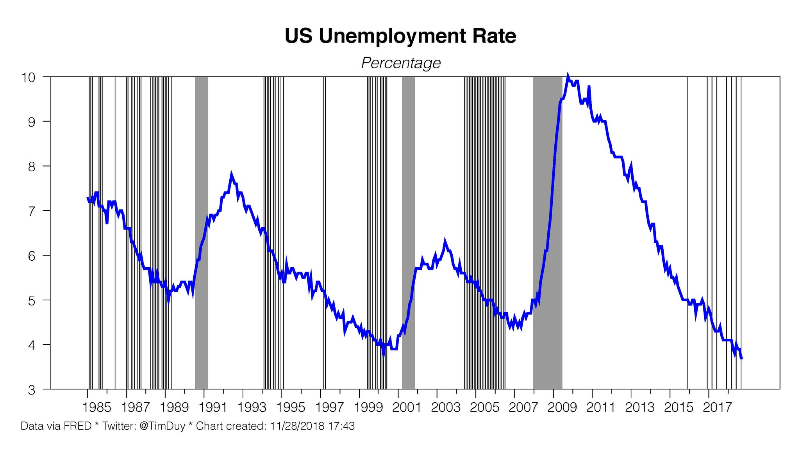

The [unemployment rate reported today](https://fred.stlouisfed.org/series/UNRATE) held steady at 3.8%, which continues to show that the [dynamic information equilibrium model](https://papers.ssrn.com/sol3/papers.cfm?abstract_id=3094757) is better than forecasts from FRBSF, the FOMC, the CBO, [and Paul Romer](https://informationtransfereconomics.blogspot.com/2017/12/another-unemployment-rate-forecast.html) (click to enlarge):

I would like to give plaudits [to Tim Duy and his observation](https://twitter.com/TimDuy/status/1067959127198990336) about the Fed's reaction function:

> _It’s something I have been blind to - as long as inflation is not a problem, the Fed doesn’t hike rates when unemployment is flat (which is their forecast). This even held as recently as 2016._

As a side note, it was probably a bit brash to put a forecast [in my paper](https://papers.ssrn.com/sol3/papers.cfm?abstract_id=3094757) — but it has turned out pretty well (click to enlarge):

