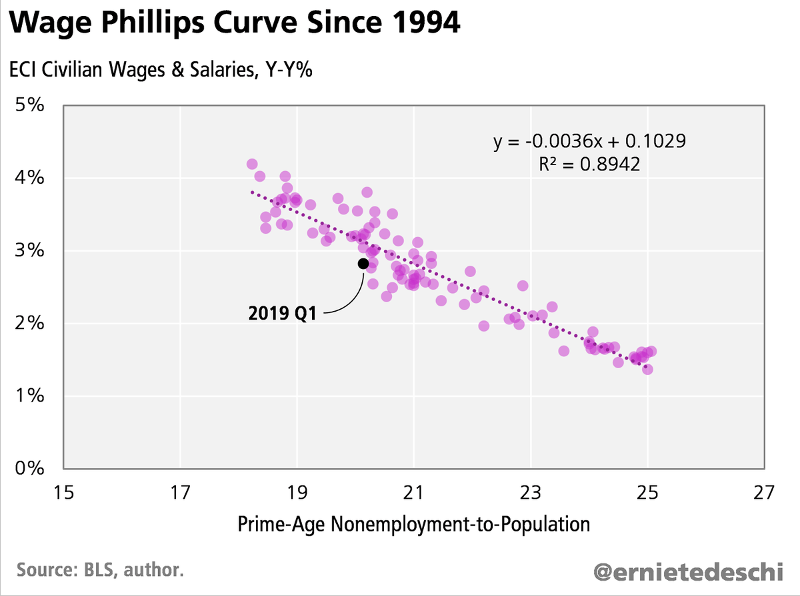
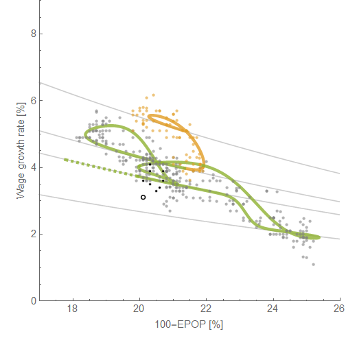

Ernie Tedeschi [put up a version of a chart today](https://twitter.com/ernietedeschi/status/1123221483403214848) I think I saw [from Adam Ozimek](https://twitter.com/ModeledBehavior/status/1024280989156159489) about a year ago showing a linear relationship between 25-54 year-old employment population ratio ([which I updated yesterday](https://informationtransfereconomics.blogspot.com/2019/04/employment-population-ratio-and-labor.html)) and the employer cost index that's a measure of wage growth:

I have some issues with this being called a "wage Phillips curve" because what this really shows is just economic growth: as the economy grows, employment grows as well as wages. It's kind of just supply and demand here. As non-engaged labor becomes scarce, wage growth go up. The Phillips curve is a relationship between prices of goods and employment — lower unemployment causes some measure of the price of goods to increase. This requires an additional step beyond the labor market picture where e.g. higher wages chase scarce goods causing their prices to increase — the wage-price spiral.

[But as I talked about last year](https://informationtransfereconomics.blogspot.com/2018/07/wage-growth-versus-employment.html), I don't think this simple linear relationship is the true relationship between these variables — it's actually somewhat spurious. Back then, I projected ([based on the DIEM](https://papers.ssrn.com/sol3/papers.cfm?abstract_id=3094757) \[1\]) what continued economic growth would look like on this graph and the data would follow a line of much lower slope. And sure enough (click to enlarge) —

I used different data for wages ([Atlanta Fed's Wage Growth Tracker](https://www.frbatlanta.org/chcs/wage-growth-tracker.aspx?panel=1)) because it has a longer time series and is reported monthly (like EPOP) instead of ECI's quarterly frequency. The addition of the data from before 1994 (yellow) also helps show that this isn't just a simple line. The data since last year (black) have followed the expected non-recession trendline (gray). In fact, if you look at the last 3 years of data, it's even more clear that the lower slope from the dynamic equilibrium is correct, not the linear fit:

This supports the conclusion that what's being seen here is just a consequence of economic growth. Wages tend to grow and employment rate tends to rise ([and unemployment tends to fall](https://informationtransfereconomics.blogspot.com/2018/10/unemployment-continues-to-decline-why.html)) between recessions \[2\]. 

**Footnotes:**

\[1\] The graph is made from a parametric plot of the [wage growth DIEM](https://informationtransfereconomics.blogspot.com/2019/04/wage-growth-forecast-continues-to-do.html) and the [EPOP DIEM](https://informationtransfereconomics.blogspot.com/2019/04/employment-population-ratio-and-labor.html):

\[2\] The rates these change at are different — their units are different, so they're not really even commensurate! Wage growth (or ECI growth) is % change per year (therefore changes if you change the time scale) while EPOP or unemployment are just fractions (%, or pure numbers).
