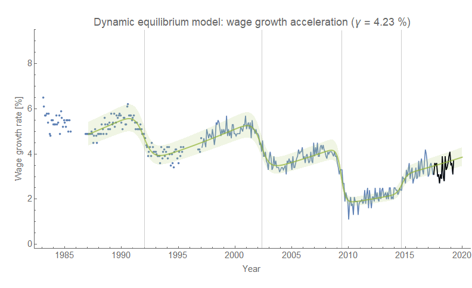
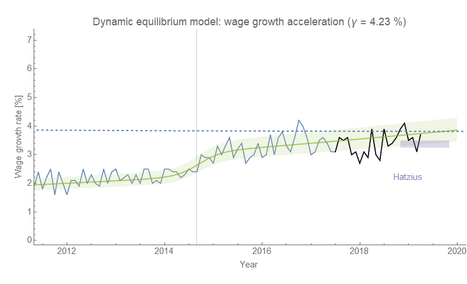

The Atlanta Fed updated their wage growth tracker a few days ago while I was at Coachella, so I didn't have a chance to update it at the time. The post-forecast data continues to be pretty much in line with [the original forecast](https://informationtransfereconomics.blogspot.com/2018/02/dynamic-equilibrium-in-wage-growth.html) from February 2018 (as always, click to enlarge):

Plus, despite being paid a fraction of what Jan Hatzius of Goldman Sachs is paid, [my forecast](https://informationtransfereconomics.blogspot.com/2018/11/ill-say-similar-things-for-half-salary.html) for the same set of variables is looking a bit more informative than his:

That blue dashed line is the nominal GDP dynamic equilibrium and is part of my "[limits to wage growth](https://informationtransfereconomics.blogspot.com/2018/10/limits-to-wage-growth.html)" hypothesis where nominal wage growth is halted by a recession if it starts to exceed nominal economic growth (and therefore eats into profits on average/in the aggregate). It's a speculative part of the [information equilibrium "macro model"](https://informationtransfereconomics.blogspot.com/2019/03/the-beginnings-of-information.html). We did appear to skirt the edge of it towards the end of 2016 before the data dipped a bit. Given the noise in the data, it is difficult to tell if that was the fading "[mini-boom](https://informationtransfereconomics.blogspot.com/2018/10/extended-jolts-hires-series-and-2014.html)" of 2014 or the beginnings of a genuine downturn that was averted. Job openings was showing [a similar downturn at the time](https://informationtransfereconomics.blogspot.com/2018/06/jolts-data-and-2019-recession.html) that was significant enough (alongside yield curve flattening) for me to posit a coming recession in late 2019 to early 2020 — but [might have faded away in subsequent job openings data and revisions](https://informationtransfereconomics.blogspot.com/2019/04/jolts-day.html). However, the downturn is still present in quits and separations so basically we're still in a situation where only time will tell.
