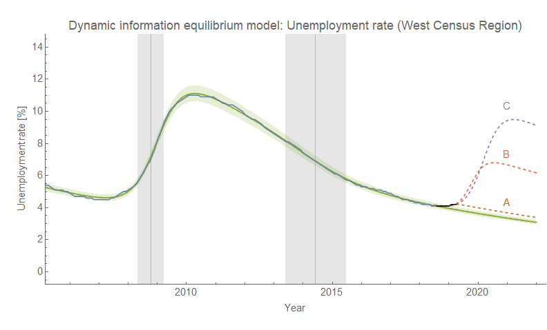
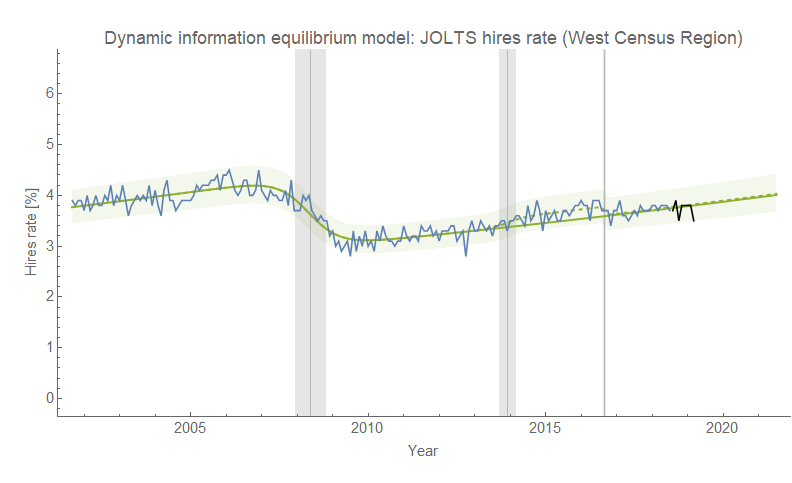

I noticed that the unemployment rates for two west coast states — [Washington state](https://fred.stlouisfed.org/series/WAUR) (where I live) and [California](https://fred.stlouisfed.org/series/CAUR) (the largest state by population) — have shown a noticeable uptick recently. Now state level unemployment rates have large fluctuations. However, the unemployment rate for the [West Census Region](https://fred.stlouisfed.org/series/CWSTUR) (defined [here](https://en.wikipedia.org/wiki/List_of_regions_of_the_United_States#Census_Bureau-designated_regions_and_divisions)) is a bit smoother and is also showing that same turnaround. So I decided to try the [dynamic information equilibrium model](https://papers.ssrn.com/sol3/papers.cfm?abstract_id=3094757) (DIEM) on it:

This shows the last few months of data rising up a bit over the expected non-recession (dynamic equilibrium) path. I tried a few counterfactual estimates: a free parameter shock (A), a shock with a fixed center date at 2019.7 and other parameters free (B), and a typical magnitude/duration shock with a free center parameter (C).

First, it should be noted that typically [the non-equilibrium shocks are underestimated](https://informationtransfereconomics.blogspot.com/2018/09/forecasting-great-recession.html) in their magnitude during the leading edge, and then overestimated until the shock center has passed. This is probably the reason for scenarios A and B being small relative to the average size of a recession shock.

Scenario A could potentially be showing us the end of [the 2014 mini-boom](https://informationtransfereconomics.blogspot.com/2018/10/extended-jolts-hires-series-and-2014.html) (that end appears clearly in the [WA unemployment rate](https://fred.stlouisfed.org/series/WAUR), but at the end of 2015, not 2019). But the mini-boom shows up clearly in JOLTS hires data (again, [here](https://informationtransfereconomics.blogspot.com/2018/10/extended-jolts-hires-series-and-2014.html)) — which we can look at [for the West region](https://fred.stlouisfed.org/series/JTS00WEJOR#0). In that data (using the DIEM), it appears to end in mid-2016, far earlier than late-2018/early-2019:

It's not implausible that we're just seeing the end of the mini-boom (which does not appear to have ended for the country as a whole).

The latest JOLTS data also appears to be skirting the bottom edge of the hires data. Scenarios B and C both show what a counterfactual recession would look like that's consistent with the deviation from the DIEM since 2018, but — depending on the shock width — shocks to the hires time series precede shocks to the unemployment rate by about 5 months or so. In this case, the hires data is a bit noisy and just might not see the a shock yet.

More data will be coming out in mid-May that might clarify things a little more. It will be interesting to see the unemployment data that comes out on Friday and whether or not this uptick will start to appear nationally.
