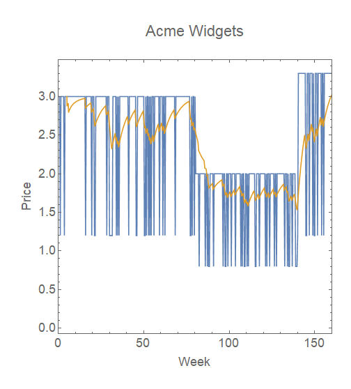
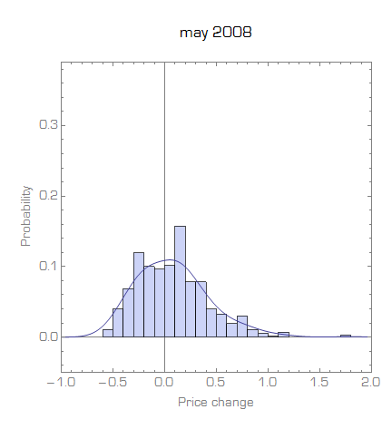

I was reading over the good discussion of Emi Nakamura's interesting work in the wake of her Clark medal over at [A Fine Theorem](https://afinetheorem.wordpress.com/2019/05/01/the-price-of-everything-the-value-of-the-economy-a-nobel-for-emi-nakamura/). One of the areas she's worked on (among _**many**_) is prices, but I personally find it strange how the issues are framed ... 

> _How much do prices actually change – do we want to sweep out short-term sales, for example? ... \[Nakamura's\] “Five Facts” paper uses BLS microdata to show that sales were roughly half of the “price changes” earlier researchers has found, that prices change more rapidly when inflation is higher ... For example, why are prices both sticky and also involve sales?_

Why in any consideration of the question of "nominal rigidities" would you even think to "sweep-out" (i.e. ignore) short term sales? Why would you utter the nonsensical phrase that prices are "both sticky and also involve sales"?

Nakamura does the same thing:

> _The simultaneous existence of rigid regular prices and frequent sales is an important challenge for the theoretical literature on monetary nonneutrality._

Well sure, if you take out the part where prices change, they're going to change a lot less.

In a sense, my thoughts here are the same as [my thoughts on Eichenbaum _et al_'s](https://informationtransfereconomics.blogspot.com/2016/02/flexible-micro-wages-does-not-disprove.html) straining to hold on to sticky prices in the face of **_empirically self-evident flexible prices_**. Going directly to the Eichenbaum _et al_ paper:

> _Instead, nominal rigidities take the form of inertia in reference prices and costs. Weekly prices and costs fluctuate around reference values which tend to remain constant over extended periods of time._

To which I said in response:

> _I'd say that a sudden drop of a price by 30% is not "sticky" in the colloquial sense of the word. The authors of that paper (Martin Eichenbaum, Nir Jaimovich, and Sergio Rebelo) seem to want to hold onto sticky prices, however. ... A reference price with fluctuating sales on and off actually leads to something that looks exactly like a random walk if you average over a moving window._

The example is reproduced at the top of this post. In fact, this is exactly how a lot of systems in my real job work (e.g. satellite thrusters that are on or off, where turning them on an off for discrete periods of time allows you to get any amount of thrust you want).

Don't get me wrong: how prices actually change empirically is useful information — it's the sticky + not-sticky decomposition for macro-scale implications I find odd. My interpretation of the data is that these observations show prices are not sticky at the micro scale. However, that does not preclude macro-scale stickiness that manifests as stable distributions of price changes (e.g. [here](https://informationtransfereconomics.blogspot.com/2016/02/flexible-micro-wages-does-not-disprove.html) or [here](https://informationtransfereconomics.blogspot.com/2015/04/micro-stickiness-versus-macro-stickiness.html), or [as discussed in my first paper](https://papers.ssrn.com/sol3/papers.cfm?abstract_id=2894072) in Section 4.1) — a hypothesis for which [there is stronger evidence](https://informationtransfereconomics.blogspot.com/2016/10/price-growth-ie-inflation-state.html)\*\* ...

\*\*There is an odd blip in this data in April 2010 that I talk about in the linked post.
