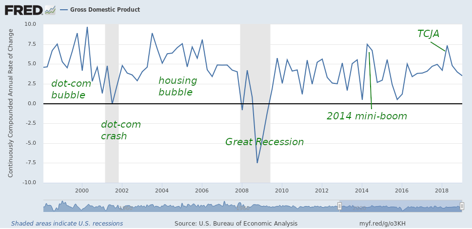

The [Personal Consumption Expenditures](https://fred.stlouisfed.org/series/PCE) (PCE) data came out today, and as this measure is [informationally equivalent to NGDP](https://informationtransfereconomics.blogspot.com/2018/10/are-consumption-income-and-gdp.html) but available more frequently I thought I'd take a look at the dynamic information equilibrium model (DIEM) to see what we should expect for Q2 GDP — I noticed something (click to enlarge and maybe you'll see it better):

The model is really quite accurate, but the latest data appears to fall somewhat above the error band in a correlated and persistent way. Zooming in we can see it does fit the profile of a small non-equilibrium shock in the DIEM:

The big tax cut passed at the end of 2017 may account for it, so I added a counterfactual shock (red). The center is at 2017.98, corresponding to the "Tax Cuts and Jobs Act" (TCJA) of 2017. If the counterfactual shock accounts for it, then it 1) boosted nominal PCE growth from 3.7% to 4.7% at its peak, and 2) added 249 billion dollars (integrated, i.e. total) to PCE level over the past year. This is essentially the same as the 270 billion dollars difference between the forecast CBO tax revenues for 2018 (3.60 trillion) and the actual revenues for 2018 (3.33 trillion). These are all nominal measures. Here's the growth graph:

The effect over the next ten years (absent a recession) would be effectively 3.7% growth of that 249 billion, so in 2028 PCE will be 360 billion dollars higher than it would have been without the TCJA (1.8% higher). Cumulatively over the next 10 years, it will increase PCE by 2.96 trillion dollars. Of course, the budget deficit is estimated to be 2.29 trillion dollars over that period so [reasoning from an accounting identity](https://informationtransfereconomics.blogspot.com/2019/05/accounting-identities-and-conservation.html) here basically works out within a couple percent (i.e. GDP = _C + S + T_ with lower _T_ has increased _C_).

The "active" (i.e. non-equilibrium) effect of the TCJA appears to be over leaving only the "passive" (i.e. equilibrium) effect of compounding growth rates. however the previous two non-equilibrium shocks increasing growth (late 90s, mid-2000s) were followed by negative shocks and recessions (dot-com bust, housing bust/Great Recession) in the "[asset bubble era](https://informationtransfereconomics.blogspot.com/2018/01/24-growth-forever.html)". Even the [2014 mini-boom](https://informationtransfereconomics.blogspot.com/2018/10/extended-jolts-hires-series-and-2014.html) seems to have been followed by a 2016 mini-recession:

But absent a recession (or a mini-recession), we should expect this quarter's nominal GDP growth to come in roughly around the "new normal" (post 2008, after the fading of the demographic shock of the 60s, 70s, and 80s) of 3.8% — similar to the (nominal) PCE measure's new normal of 3.7%.
