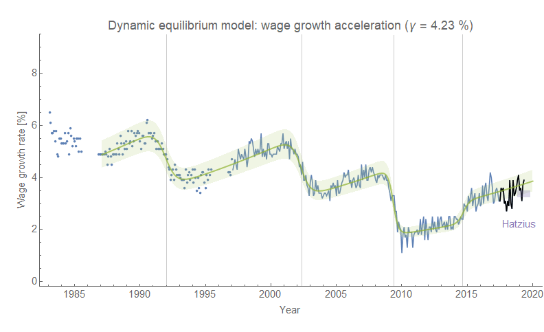
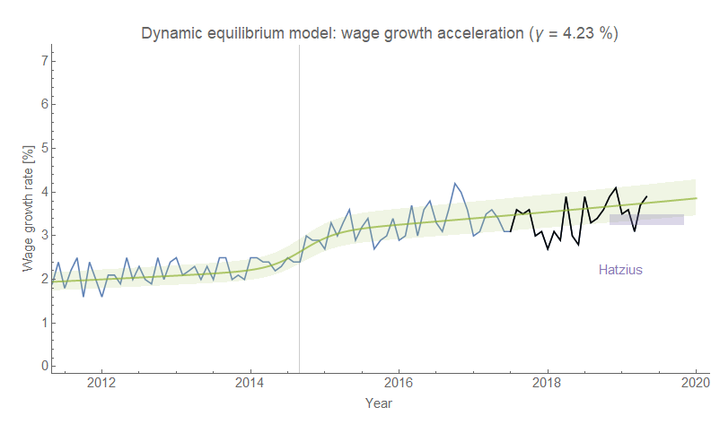
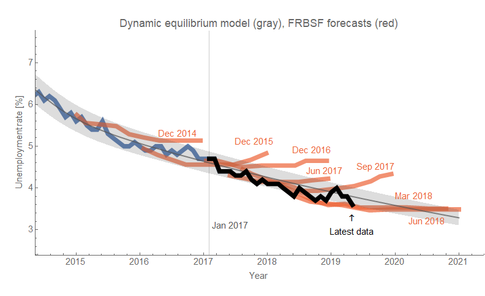
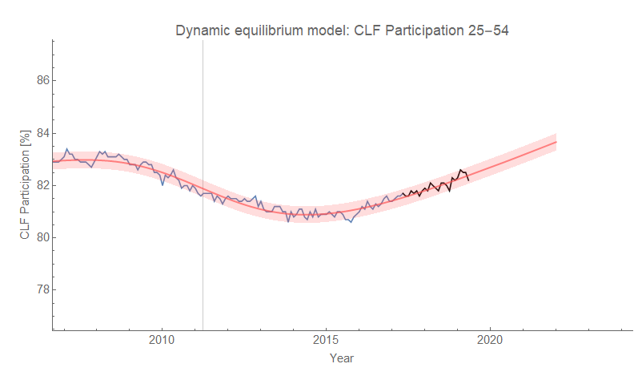

The [dynamic information equilibrium model](https://papers.ssrn.com/sol3/papers.cfm?abstract_id=3094757) (DIEM) wage growth forecast [from over a year ago now](https://informationtransfereconomics.blogspot.com/2018/02/dynamic-equilibrium-in-wage-growth.html) continues to perform a bit better than [Jan Hatzius's forecast from six months ago](https://informationtransfereconomics.blogspot.com/2018/11/ill-say-similar-things-for-half-salary.html):

For some reason, I didn't put the latest unemployment rate report on the blog (and labor force participation) — let me correct that:

