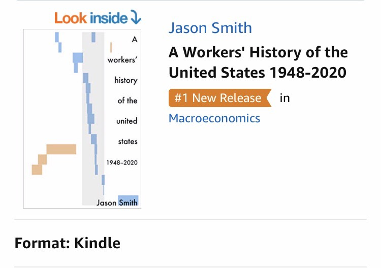

**[Available now! Click here!](https://www.amazon.com/dp/B07T8T9G93/ref=as_li_ss_tl?&linkCode=ll1&tag=arandomphysic-20&linkId=1eb9647354ffde791afaa9392f8dec4d&language=en_US)**

> _After seven years of economic research and developing forecasting models that have outperformed the experts, author, blogger, and physicist Dr. Jason Smith offers his controversial insights about the major driving factors behind the economy derived from the data and it's not economics — it's social changes. These social changes are behind the questions of who gets to work, how those workers organize, and how workers identify politically — and it is through labor markets that these social changes manifest in economic effects. What would otherwise be a disjoint and nonsensical postwar economic history of the United States is made into a cohesive workers' history driven by women entering the workforce and the backlash to the Civil Rights movement — plainly: sexism and racism. This new understanding of historical economic data offers lessons for understanding the political economy of today and insights for policies that might actually work._

> _Dr. Smith is a physicist who began with quarks and nuclei before moving into research and development in signal processing and machine learning in the aerospace industry. During a government fellowship from 2011 to 2012 — and in the aftermath of the global financial crisis — he learned about the potential use of prediction markets in the intelligence community and began to assess their validity using information theoretic approaches. From this spark, Dr. Smith developed the more general information equilibrium approach to economics which has shown to have broader applications to neuroscience and online search trends. He wrote **A Random Physicist Takes on Economics** in 2017 documenting this intellectual journey and the change in perspective towards economic theory and macroeconomics that comes with this framework. This change in perspective to economic theory came with new interpretations of economic data over time that finally came together in this book._

The book I've been working on [for the past year and a half](http://www.arandomphysicist.com/2018/01/hows-this-book-thing-going.html) — A Workers' History of the United States 1948-2020 — is now available [on Amazon as a Kindle e-book or a paperback](https://www.amazon.com/dp/B07T8T9G93/). Get your copy today! Head over [to the book website](http://www.arandomphysicist.com/) for [an open thread](https://www.arandomphysicist.com/2019/06/a-workers-history-of-united-states-1948.html) for your first impressions and comments. And pick up a copy of _A Random Physicist Takes on Economics_ if you haven't already ...

**Update 7am PDT 24 June 2019**

The paperback edition still says "publishing" on KDP, but it should be ready in the next 24-48 hours. However, I did manage to catch what is probably a fleeting moment where the book is #1 in Macroeconomics:

**Update 2pm PDT 24 June 2019**

[Paperback is live!](https://www.amazon.com/dp/1075660432/ref=as_li_ss_tl?ie=UTF8&linkCode=ll1&tag=arandomphysic-20&linkId=532e02893dcecfe980f967ce5861080e&language=en_US)
