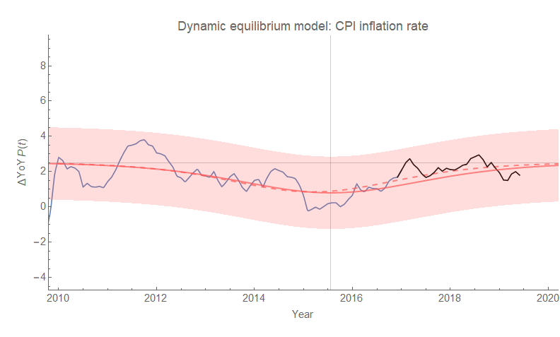
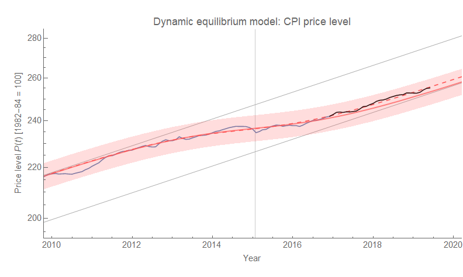
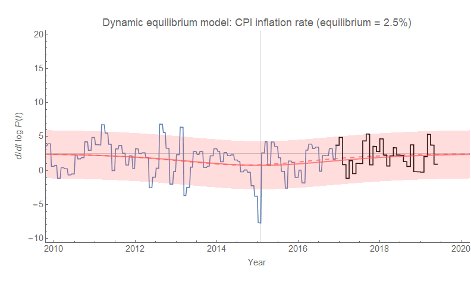

Apropos of getting into an argument about the quantity theory of money on Twitter, the [new CPI data came out today](https://fred.stlouisfed.org/series/CPIAUCSL) — and it continues to be consistent with the Dynamic Information Equilibrium Model (DIEM — [paper](https://papers.ssrn.com/sol3/papers.cfm?abstract_id=3094757), [presentation](https://informationtransfereconomics.blogspot.com/2017/01/dynamic-equilibrium-presentation.html)) forecast [from 2017](https://informationtransfereconomics.blogspot.com/2017/07/dynamic-equilibrium-model-cpi-all-items.html). Here's year-over-year inflation:

The red line is the forecast with 90% error bands (I'll get to the dashed curve in a second). The black line is the post-forecast data. The horizontal gray line is the "dynamic equilibrium", i.e. the equilibrium inflation rate of about 2.5% (this is CPI all items), and the vertical one is the center of [the "lowflation" shock](https://informationtransfereconomics.blogspot.com/2018/01/is-low-inflation-ending.html) associated with the fall in the labor force after the Great Recession. Shocks to CPI follow these demographic [by about 3.5 years](https://informationtransfereconomics.blogspot.com/2019/03/the-beginnings-of-information.html).

Back to that dashed curve — the original model forecast estimated the lowflation shock while it was still ongoing, which ends up being a little off. [I re-estimated the parameters a year later](https://informationtransfereconomics.blogspot.com/2018/03/cpi-data-and-end-of-lowflation.html) and as you can see the result is well within the error bands. The place where it makes more a difference visually (it's still numerically small) is in the CPI level:

Without the revision, the level data would be biased a bit high (i.e. the integrated size of the shock was over-estimated). But again, it's all within the error bands. For reference, here's a look at what would have looked like to estimate a bigger shock in real time — [unemployment during the Great Recession](https://informationtransfereconomics.blogspot.com/2018/09/forecasting-great-recession.html).

...

**PS/Update +10 minutes:** Here's the log-derivative CPI inflation (continuously compounded annual rate of change):

