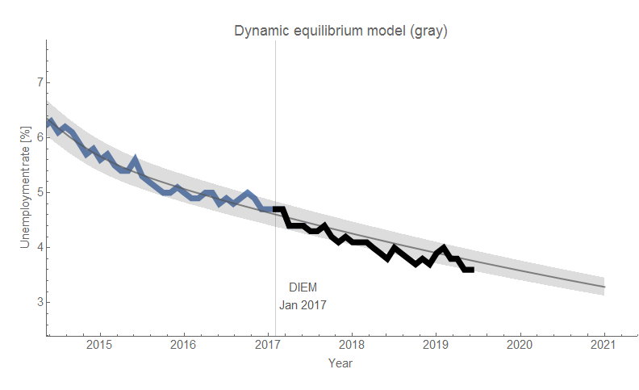
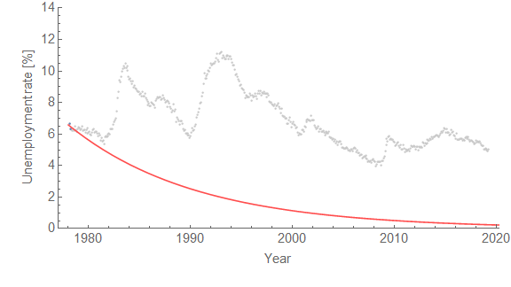

Today, we got another data point that lines up with the [dynamic information equilibrium model](https://papers.ssrn.com/sol3/papers.cfm?abstract_id=3094757) (DIEM) forecast from 2017 (as well as labor force participation):

As a side note, I applied the [recession detection algorithm](https://informationtransfereconomics.blogspot.com/2017/04/determining-recessions-with-algorithm.html) to Australian data after a tweet from Cameron Murray:

The employment situation data flows into GDPnow calculations, and I looked at the performance of those forecasts compared to a constant 2.4% RGDP growth:

It turns out there is some information in the later forecasts from GDPnow with the final update (a day before the BEA releases its initial estimate) having about half the error spread (in terms of standard deviations). However, incorporating [the 2014 mini-boom and the TCJA effect](https://informationtransfereconomics.blogspot.com/2019/05/tcja-and-pce-growth.html) brings the constant model much closer to the GDPnow performance (from 300 down to 200 bp at 95% CL versus 150 bp at 95% CL — with no effect of eliminating the the mini-boom or TCJA bumps).
