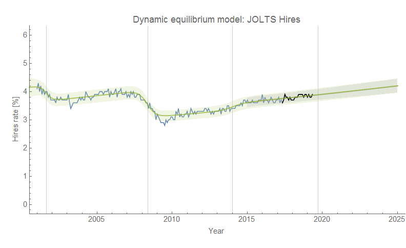
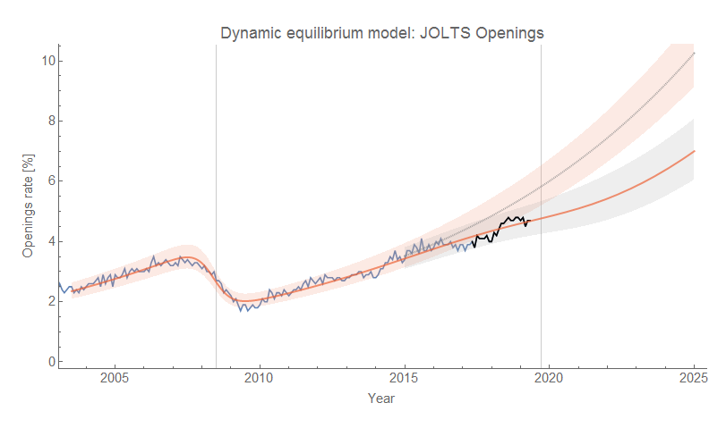
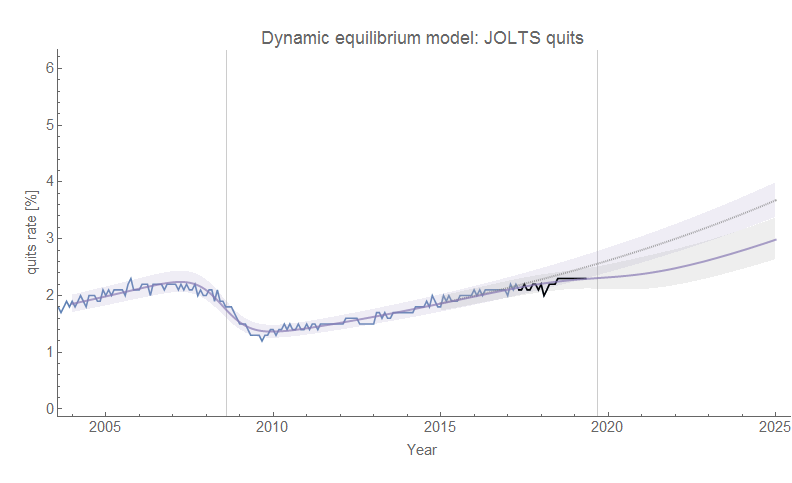
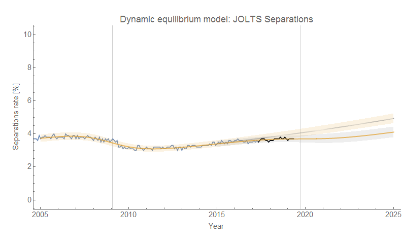

It's [JOLTS day](https://fred.stlouisfed.org/categories/32241) once again (data reported today is for April 2019), and, well, still pretty much status quo (which is how you should view almost any report, really). As always, click to enlarge ...

I've speculated that [these time series are leading indicators](https://informationtransfereconomics.blogspot.com/2017/07/jolts-leading-indicators.html) (even though the data is delayed by over a month, JOLTS hires still leads unemployment by about 5 months on average). There's basically zero sign of any deviation in hires — which according to this means [according to this model](https://informationtransfereconomics.blogspot.com/2018/10/building-models.html) means we should continue to see the unemployment rate fall through September of 2019 (5 months from April 2019). As in the last several reports, we continue to see a flattening in quits, total separations, and job openings (vacancies).
