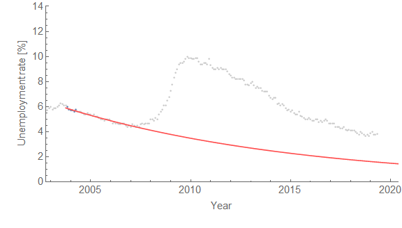

**Fair's Model**

Ray Fair has put up the [past forecasts of the unemployment rate alongside actual data](https://fairmodel.econ.yale.edu/record/index.htm) on his website (which is laudable!), but they're shown as a table which is hard to read. I've put them graphically in context of the [Dynamic Information Equilibrium Model](https://papers.ssrn.com/sol3/papers.cfm?abstract_id=3094757) (DIEM) [forecast from January 2017](https://informationtransfereconomics.blogspot.com/2017/01/dynamic-equilibrium-unemployment-rate.html):

The context of my tweet about it was that I saw several people discussing Ray Fair's election model (which isn't very good), and wanted to add that his macro model wasn't very good either.

**Market Updates**

Also on Twitter (follow me [@infotranecon](https://twitter.com/infotranecon)!), I posted a couple of graphs of the S&P 500 and interest rates spreads yesterday (after the big fall in the market) which I haven't updated in awhile on the blog ([here](https://informationtransfereconomics.blogspot.com/2019/03/market-updates-2k19-and-old-forecast.html), [here](https://informationtransfereconomics.blogspot.com/2019/04/median-interest-rate-spread-inverted.html)) ...

Here's an update of the 10-year rate forecast from 2015 (originally [here](https://informationtransfereconomics.blogspot.com/2015/08/comparison-of-interest-rate-predictions.html)). The BCEI means the Blue Chip Economic Indicators ([wikipedia](https://en.wikipedia.org/wiki/Blue_Chip_Economic_Indicators)) forecast from 2015 which has done considerably worse.

Also, here's a longer run of the S&P 500 showing the previous shocks and overlays the early 2000s recession on the current correlated deviation:

Red bands are the non-equilibrium shocks to the S&P 500. The blue-gray bands are the NBER recessions. The green is the DIEM with in the no-shock counterfactual scenario, while the dashed lines show a counterfactual shock of equivalent size to the early 2000s recession. The blue band shows the AR process error band used to project from the projection data point — which by now matches up with the green model error band ([see the discussion in the footnote here for more about this](https://informationtransfereconomics.blogspot.com/2018/04/comparing-my-forecasts-to-vars.html)).

**Sahm's Rule**

[Also on Twitter](https://twitter.com/infotranecon/status/1129204918433148928), I found out economist Claudia Sahm had been looking at the unemployment rate as a good indicator of recession for automatic stabilizers and had set up a threshold of about δu ~ 0.5 percentage point. I had put together a "[recession detection algorithm](https://informationtransfereconomics.blogspot.com/2017/04/determining-recessions-with-algorithm.html)" two years ago that used a threshold of δlog u ~ 0.17 (because the DIEM works in log space). Here's what those two thresholds look like on the unemployment rate forecast at the top of this post:

Sahm's rule is the green dashed curve, while the threshold I used is the gray dashed curve. Sahm's rule is closer to δlog u ~ 0.1, but the log difference gets smaller as the unemployment rate gets lower, so it's not exactly commensurate. But here's the threshold at work on the 2008 recession and [2014 mini-boom](https://informationtransfereconomics.blogspot.com/2018/10/extended-jolts-hires-series-and-2014.html):

