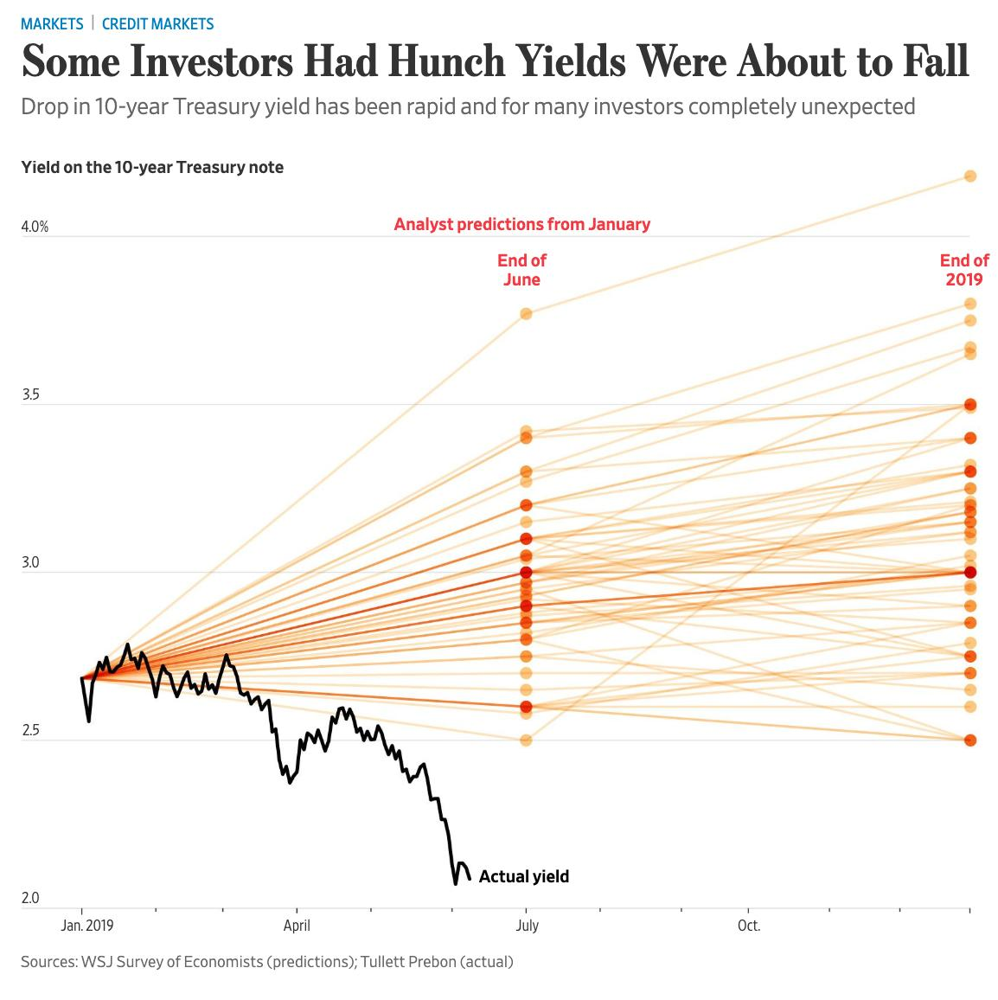

Data for the median sales price (MSP) of new houses was released this past week [on FRED](https://fred.stlouisfed.org/series/MSPNHSUS), and the data is showing a distinct correlated negative deviation which is generally evidence that a non-equilibrium shock is underway in the dynamic information equilibrium model ([DIEM](https://papers.ssrn.com/sol3/papers.cfm?abstract_id=3094757)).

I added a counterfactual shock (in gray). This early on, there is a tendency for the parameter fit to underestimate the size of the shock (for an explicit example, [see this version](https://informationtransfereconomics.blogspot.com/2018/09/forecasting-great-recession.html) for the unemployment rate in the Great Recession). The model overall shows the housing bubble alongside the two shocks (one negative and one positive) to the level paralleling the ones [seen in the Case Shiller index and housing starts](https://informationtransfereconomics.blogspot.com/2019/03/two-phases-of-2008-housing-crisis.html).

This seems like a good time to look at the interest rate model and the yield curve / interest rate spreads. First, the interest rate model is doing extraordinarily well for [having started in 2015](https://informationtransfereconomics.blogspot.com/2015/08/comparison-of-interest-rate-predictions.html):

I show the [Blue Chip Economic Indicators](https://en.wikipedia.org/wiki/Blue_Chip_Economic_Indicators) forecast from 2015 as well as a recent forecast from the Wall Street Journal (click to embiggen):

And here's the median (~ principal component) interest rate spread [we've been tracking for the past year](https://informationtransfereconomics.blogspot.com/2018/06/yield-curve-inversion-and-future.html) (almost exactly — June 25, 2018):

If -28 bp was the lowest point (at the beginning of June), it's higher than previous three lowest points (-40 to -70 bp). Also, if it is in fact the lowest point, the previous three cycles achieved their lowest points between 1 and 5 quarters before the NBER recession onset.
