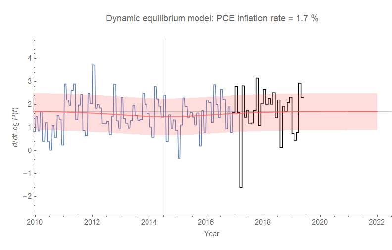
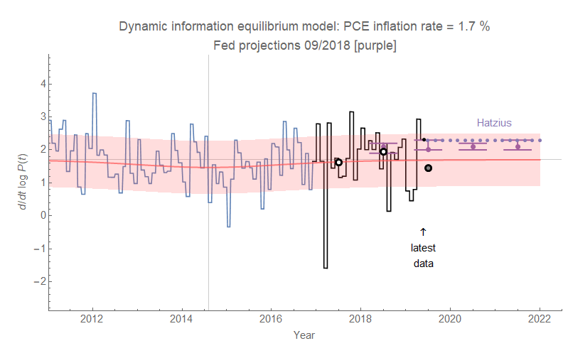

The [DIEM](https://papers.ssrn.com/sol3/papers.cfm?abstract_id=3094757) for PCE inflation continues to perform fairly well ... though it's not the most interesting model in the current regime ([the lowflation](https://informationtransfereconomics.blogspot.com/2018/01/is-low-inflation-ending.html) period [has ended](https://informationtransfereconomics.blogspot.com/2018/03/cpi-data-and-end-of-lowflation.html)).

The new gray dot with a black outline shows the estimated annual PCE inflation for 2019 assuming the previous data is a good sample (this is not the best assumption, but it gives an idea where inflation might end up given what we know today). The purple dots with the error bars are Fed projections, and the other purple dotted line is [the forecast from Jan Hatzius of Goldman Sachs](https://informationtransfereconomics.blogspot.com/2018/11/ill-say-similar-things-for-half-salary.html).

Mostly just to troll the DSGE haters, here's the FRB NY DSGE model forecast compared to the latest data — it's doing great!

But then the DIEM is right on as well with smaller error bands ...
