I came across [this 2018 NBER working paper](https://www.nber.org/papers/w25293) from Baqaee and Farhi again today ([on Twitter](https://twitter.com/fuiud/status/1140748440499961858)) after seeing it around the time it came out. The abstract spells it out:

> _Aggregate production functions are reduced-form relationships that emerge endogenously from input-output interactions between heterogeneous producers and factors in general equilibrium. We provide a general methodology for analyzing such aggregate production functions by deriving their first- and second-order properties. Our aggregation formulas provide non-parametric characterizations of the macro elasticities of substitution between factors and of the macro bias of technical change in terms of micro sufficient statistics. They allow us to generalize existing aggregation theorems and to derive new ones. We relate our results to the famous Cambridge- Cambridge controversy._

One thing that they do in their paper is reference Samuelson's (version of Robinson's and Sraffa's) re-switching arguments. I'll quote liberally from the paper (this is actually the introduction and Section 5) because it sets up the problem we're going to look at:

> _Eventually, the English Cambridge prevailed against the American Cambridge, decisively showing that aggregate production functions with an aggregate capital stock do not always exist. They did this through a series of ingenious, though perhaps exotic looking, “re-switching” examples. These examples demonstrated that at the macro level, “fundamental laws” such as diminishing returns may not hold for the aggregate capital stock, even if, at the micro level, there are diminishing returns for every capital good. This means that a neoclassical aggregate production function could not be used to study the distribution of income in such economies._ 

> _... In his famous “Summing Up” QJE paper (Samuelson, 1966), Samuelson, speaking for the Cambridge US camp, finally conceded to the Cambridge UK camp and admitted that indeed, capital could not be aggregated. He produced an example of an economy with “re-switching”: an economy where, as the interest rate decreases, the economy switches from one technique to the other and then back to the original technique. This results in a non-monotonic relationship between the capital-labor ratio as a function of the rate of interest r._ 

> _... \[In\] the post-Keynesian reswitching example in Samuelson (1966). ...  \[o\]utput is used for consumption, labor can be used to produce output using two different production functions (called “techniques”). ... the economy features reswitching: as the interest rate is increased, it switches from the second to the first technique and then switches back to the second technique._

I wrote a blog post four years ago titled "[Resolving the Cambridge capital controversy with abstract algebra](https://informationtransfereconomics.blogspot.com/2015/05/resolving-cambridge-capital-controvery.html)" which was in part tongue-in-cheek, but also showed how Cambridge, UK (Robinson and Sraffa) had the more reasonable argument. With Samuelson's surrender summarized above, it's sort of a closed case. I'd like to re-open it, and show how a resolution in my blog post renders the post-Keynesian re-switching arguments as describing _pathological_ cases unlikely to be realized in a real system — and therefore calling the argument in favor of the existence of aggregate production functions and Solow and Samuelson.

To some extent, this whole controversy is due to economists seeing economics as a logical discipline — more akin to mathematics — instead of an empirical one — more akin to the natural sciences. The pathological case of re-switching does in fact invalidate a general rigorous mathematical proof of the existence of aggregate production functions in all cases. But it is just that — a pathological case. It's the kind of situation where you have to show instead some sort of empirical evidence it exists until you take the impasse it presents to mathematical existence seriously.

If you follow through the NBER paper, they show a basic example of re-switching from Samuelson's 1966 paper. As the interest rate increases, one of the "techniques" becomes optimal over the other and we get a shift in capital to output and capital to labor:

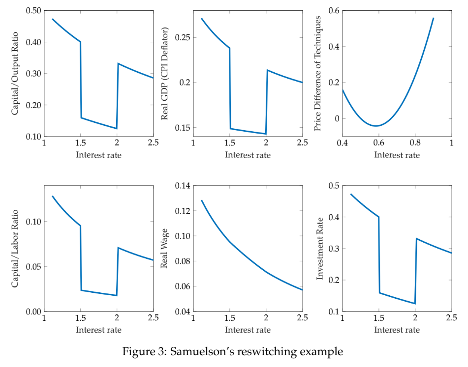

Effectively, this is a shift in $\alpha$ in a production function

or more simply in terms of the neoclassical model in per-labor terms ($x \equiv X/L$)

That is to say in one case we have $y \sim k^{\alpha_{1}}$ and $y \sim k^{\alpha_{2}}$ in the other. As the authors of the paper put it:

> _The question we now ask is whether we could represent the disaggregated post-Keynesian example as a version of the simple neoclassical model with an aggregate capital stock given by the sum of the values of the heterogeneous capital stocks in the disaggregated post-Keynesian example. The non-monotonicity of the capital-labor and capital-output ratios as a function of the interest rate shows that this is not possible. The simple neoclassical model could match the investment share, the capital share, the value of capital, and the value of the capital-output and capital-labor ratios of the original steady state of the disaggregated model, but not across steady states associated with different values of the interest rate. In other words, aggregation via financial valuation fails._

But we must stress that this is essentially one (i.e. representative) firm with this structure, and that across a real economy, individual firms would have multiple "techniques" that change in a myriad ways — and there would be many firms.

The ensemble approach to information equilibrium (where we have a large number of production  functions $y_{i} \sim k^{\alpha_{i}}$) recovers the traditional aggregate production function ([see my paper here](https://papers.ssrn.com/sol3/papers.cfm?abstract_id=3094757)), but with ensemble average variables (angle brackets) evaluated with a partition function:

(see the paper for the details). This formulation does not depend on any given firm staying in a particular "production state" $\alpha_{i}$, and it is free to change from any one state to another in a different time period or at a different interest rate. The key question is that **_we do not know_** which set of $\alpha_{i}$ states describes every firm for every interest rate. With constant returns to scale, we are restricted to $\alpha$ states between zero and one, but we have no other knowledge available without a detailed examination of every firm in the economy. We'd be left to a uniform distribution over \[0,1\] if that is all we had, but we could (in principle) average the $\alpha$'s we observe and constrain our distribution to respect $\langle \alpha \rangle$ to be some (unknown) real value in \[0, 1\]. That defines a [beta distribution](https://en.wikipedia.org/wiki/Beta_distribution):

Getting back to the Samuelson example, I've reproduced the capital to labor ratio:

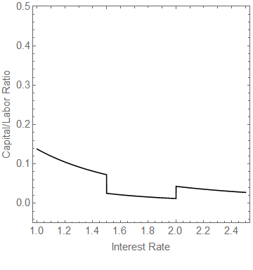

Of course, our model has no compunctions against drawing a new $\alpha$ from a beta distribution for any value of the interest rate ...

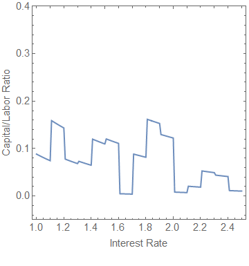

That's **_a lot_** of re-switching. If we have a large number of firms, we'll have a large number of re-switching (micro) production functions — Samuelson's post-Keynesian example is but one of many paths:

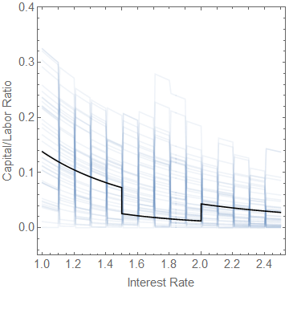

The ensemble average (over that beta-distribution above) produces the bolder blue line:

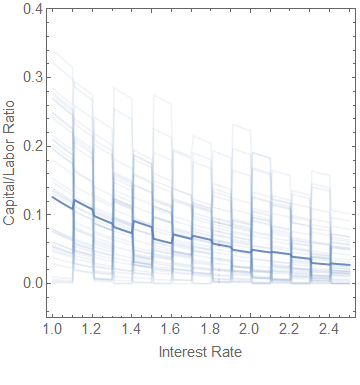

This returns a function with respect to the interest rate that approximates a constant $\alpha$ as a function of the interest rate — and which only gets better as more firms are added and more re-switching is allowed:

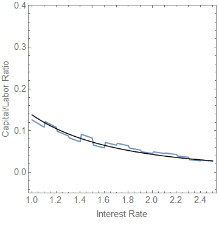

This represents an _emergent_ aggregate production function smooth in the interest rate where each individual production function is non-monotonic. The aggregate production function of the Solow model is in fact well-defined and does not suffer from the issues of re-switching _unless the draw from the distribution is pathological_ — for example, all firms being the same or, equivalently, a representative firm assumption). 

This puts the onus on the Cambridge, UK side to show that empirically such cases exist and are common enough to survive aggregation. However, if we do not know about the production structure of a sizable fraction of firms with respect to a broad swath of interest rates, we must plead ignorance and go with maximum entropy. As the complexity of an economy increases, we become less and less likely to see a scenario that cannot be aggregated.

Again, I mentioned this back four years ago in my blog post. The ensemble approach offers a simple workaround to the inability to simply add apples and oranges (or more accurately printing presses and drill presses). However, the re-switching example is a good one to show how a real economy — with heterogeneous firms and heterogeneous techniques — can aggregate into a sensible macroeconomic production function.

...

**Update 18 June 2019**

I am well aware of the Cobb-Douglas derangement syndrome associated with the Cambridge capital controversy that exists in on Econ twitter and the econoblogosphere (which is in part why I put that gif with the muppet in front of a conflagration on the tweets about this blog post ... three times). People — in particular post-Keynesian acolytes — **_hate_** Cobb-Douglas production functions. One of the weirder strains of thought out there is that a Cobb-Douglas function can fit any data arbitrarily well. This plainly false as

$$ 
a \log X + b \log Y + c 
$$

is but a small subset of all possible functions $f(X, Y)$. Basically, this strain of thought is equivalent to saying a line $y = m x + b$ can fit any data.

A subset of this mindset appears to be a case of a logical error based on accounting identities. There have been a couple papers out there (not linking) that suggest that Cobb-Douglas functions are just accounting identities. The source of this might be that you can approximate any accounting identity by a Cobb Douglas form. If we define $X \equiv \delta X + X_{0}$, then

$$ 
X_{0} \left( \log (\delta X + X_{0}) + 1\right) + Y_{0} \left( \log (\delta Y + Y_{0}) + 1\right) + C 
$$

is equal to $X + Y$ for $\delta X / X_{0} \ll 1$ if

$$ 
C \equiv - X_{0} \log X_{0}- Y_{0} \log Y_{0} 
$$

That is to say you can locally approximate an accounting identity by taking into account that log linear is approximately linear for small deviations.

It appears that some people have taken this $p \rightarrow q$ to mean $q \rightarrow p$ — that any Cobb Douglas form $f(X, Y)$ can be represented as an accounting identity $X+Y$. That is false in general. Only the form above under the conditions above can do so, so if you have a different Cobb Douglas function it cannot be so transformed.

Another version of this thinking (from Anwar Shaikh) was brought up on Twitter. Shaikh [has a well-known paper](https://www.jstor.org/stable/1927538) where he created the "Humbug" production function. I've reproduced it here:

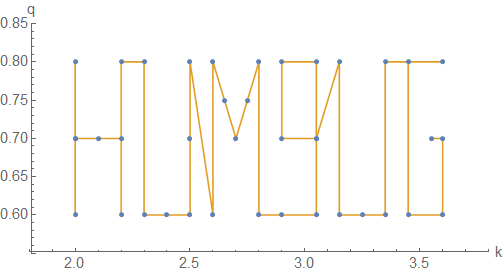
I was originally going to write about something else here, but in working through the paper and reproducing the result for the production function ...

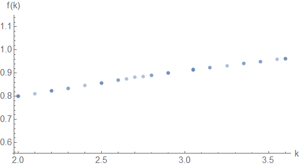
... I found out this paper is a fraud. Because of the way the values were chosen, the resulting production function has no dependence on the variation in $q$ aside from an overall scale factor. Here's what happens if you set $q$ to be a constant (0.8) — first "HUMBUG" turns into a line:

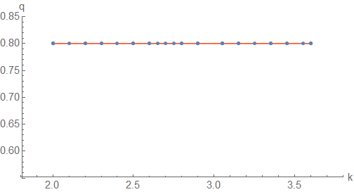
And the resulting production function? It lies almost exactly on top of the original:

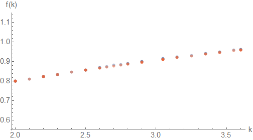
It's not too hard to pick a set of $q$ and $k$ data that gives a production function that looks nothing like a Cobb-Douglas function by just adding some noise:

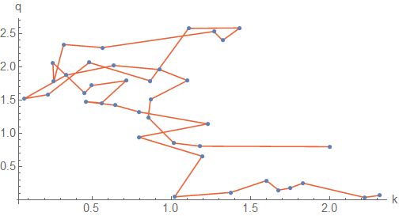
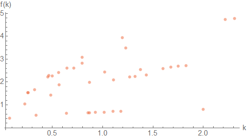
The reason can be seen in the table and relies mostly on Shaikh's choice of the variance in the $k$ values (click to enlarge):

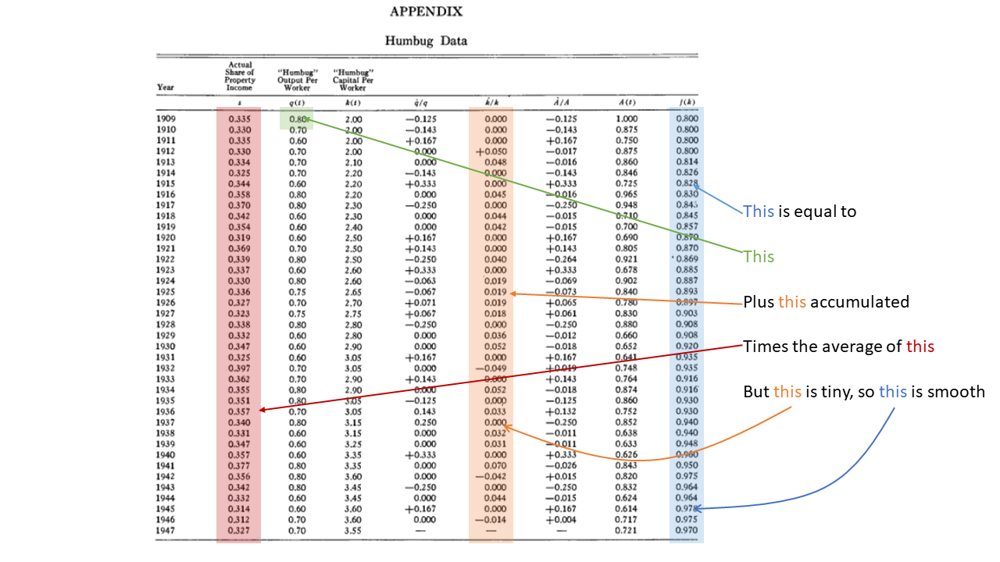
But also, if we just plot the $k$-values and the $q$-values versus time, we have log-linear functions:

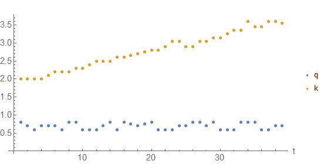
Is it any surprise that a Cobb-Douglas production function fits this data? Sure, it seems weird if we look at the "HUMBUG" parametric graph of $q$ versus $k$, but $k(t)$ and $q(t)$ are lines. The production function is smooth because the variance in $A(t)$ depends almost entirely on the variance in $q(t)$ so that taking $q(t)/A(t)$ leaves approximately a constant. The bit of variation left is the integrated $\dot{k}/k$, which is derived from a log-linear function — so it's going to have a great log-linear fit. It's log-linear!

Basically, Shaikh mis-represented the "HUMBUG" data as having a lot of variation — obviously nonsense by inspection, right?! But it's really just two lines with a bit of noise.

...

**Update + 2 hours**

I was unable to see the article earlier, but apparently this is exactly what Solow said. Solow was actually much nicer (click to enlarge):

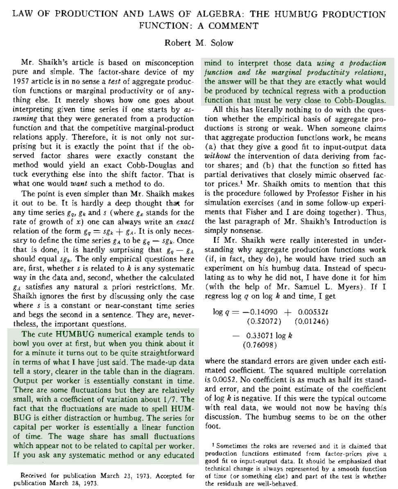

Solow:

> _The cute HUMBUG numerical example tends to bowl you over at first, but when you think about it for a minute it turns out to be quite straightforward in terms of what I have just said. The made-up data tell a story, clearer in the table than in the diagram. Output per worker is essentially constant in time. There are some fluctuations but they are relatively small, with a coefficient of variation about 1/7. The fact that the fluctuations are made to spell HUMBUG is either distraction or humbug. The series for capital per worker is essentially a linear function of time. The wage share has small fluctuations which appear not to be related to capital per worker. If you as any systematic method or educated mind to interpret those data **using a production function and the marginal productivity relations**, the answer will be that they are exactly what would be produced by technical regress with a production function that must be very close to Cobb-Douglas._

Emphasis in the original. That's exactly what the graph above (and reproduced below) shows. Shaikh not only [does not address this comment in his follow up](http://anwarshaikhecon.org/index.php/publications/aggregate-production-functions/44-1974/87-laws-of-production-and-laws-of-algebra-the-humbug-production-function) — he quotes only the last sentence of this paragraph and then doubles down on eliding the HUMBUG data as representative of "any data":

> _Yet confronted with the humbug data, Solow says: “If you ask any systematic method or any educated mind to interpret those data using a production function and the marginal productivity relations, the answer will be that they are exactly what would be produced by technical regress with a production function that must be very close to Cobb-Douglas” (Solow, 1957 \[sic\], p. 121). What kind of “systematic method” or “educated mind”  is it that can interpret almost any data, even the humbug data, as arising from a neoclassical production function?_

This is further evidence that Shaikh is not practicing academic integrity. Even after Solow points out that "Output per worker is essentially constant in time ... The series for capital per worker is essentially a linear function of time" continues to suggest that "even the humbug data" is somehow representative of the universe of "any data" when it is in fact a line.

The fact that Shaikh chose to graph "HUMBUG" rather than this time series is obfuscation and in my view academic fraud. As of 2017, he continues to misrepresent this paper in an Institute for New Economic Thinking (INET) [video on YouTube](https://www.youtube.com/watch?v=4BeWBy8gYHA) saying "... this is essentially an accounting identity and I illustrated that putting the word humbug and putting points on the word humbug and showing that I could fit a perfect Cobb-Douglas production function to that ..."

...**Update 20 June 2019**
I did want to add a bit about how the claims about the relationship between Cobb-Douglas production functions and accounting identities elide the direction of implication. Cobb-Douglas implies an accounting identity holds, but the logical content of the accounting identity on its own is pretty much vacuous without something like Cobb-Douglas. In his 2005 paper, Shaikh elides the point (and also re-asserts his disingenuous claim about the humbug production function above).

