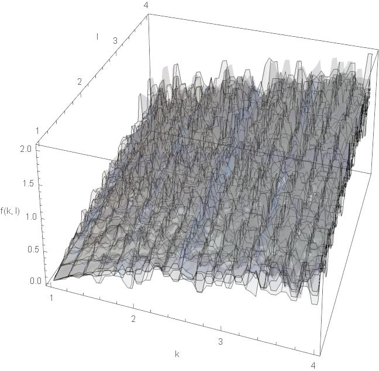
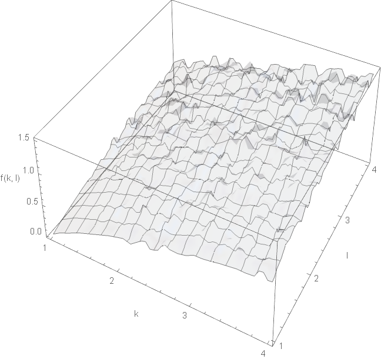

So I wrote somewhat tongue-in-cheek blog post a few years ago titled "[Resolving the Cambridge capital controversy with abstract algebra](https://informationtransfereconomics.blogspot.com/2015/05/resolving-cambridge-capital-controvery.html)" \[RCCC I\] that called the Cambridge Capital Controversy \[CCC\] for Cambridge, UK in terms of the original debate they they were having — summarized by Joan Robinson's claim that you can't really add apples and oranges (or in this case printing presses and drill presses) to form a sensible definition of capital. I used a bit of group theory and the information equilibrium framework to show that you can't simply add up factors of production. I mentioned at the bottom of that post that there are really easy ways around it — [including a partition function approach in my paper](https://papers.ssrn.com/sol3/papers.cfm?abstract_id=3094757) — but Cambridge, MA (Solow and Samuelson) never made those arguments.

On the Cambridge, MA side no one seemed to care because the theory seemed to "work" (debatable). A few years passed and eventually Samuelson conceded Robinson and Sraffa were in fact right about their re-switching arguments. A short summary is available in an [NBER paper from Baqaae and Farhi](https://www.nber.org/papers/w25293), but what interested me about that paper was that the particular way they illustrated it made it clear to me that the partition function approach also gets around the re-switching arguments. So I wrote that up in a blog post with another snarky title "[Resolving the Cambridge capital controversy with MaxEnt](https://informationtransfereconomics.blogspot.com/2019/06/resolving-cambridge-capital-controversy.html)" \[RCCC II\] (a partition function is maximum entropy distribution or MaxEnt).

This of course opened a can of worms on Twitter when I tweeted out the link to my post. The first volley was several people saying Cobb-Douglas functions were just a consequence of accounting identities or that they fit any data — a lot of which was based on papers by Anwar Shaikh (in particular the "humbug" production function). [I added an update to my post](https://informationtransfereconomics.blogspot.com/2019/06/resolving-cambridge-capital-controversy.html) saying these arguments were disingenuous — and in my view academic fraud because they rely on a visual misrepresentation of data as well as a elision of the direction of mathematical implication. Solow pointed out the former in his 1974 response to Shaikh's "humbug" paper (as well as the fact that Shaikh's data shows labor output is independent of capital which would render the entire discussion moot if true), but Shaikh has continued to misrepresent "humbug" until [at least 2017 in an INET interview on YouTube](https://www.youtube.com/watch?v=4BeWBy8gYHA).

The funny thing is that I never really cared about the CCC — my interest on this blog is research into economic theory based on information theory. RCCC I and RCCC II were both primarily about how you would go about addressing the underlying questions in the information equilibrium framework. However, the subsequent volleys have brought up even more illogical or plainly false arguments against aggregate production functions that seem to have sprouted in the Post-Keynesian walled garden. I believe it's because "mainstream" academic econ has long since abandoned arguing about it, and like my neglected back yard a large number of weeds have grown up. This post is going to do a bit of weeding.

**Constant factor shares!**

Several comments brought up that Cobb-Douglas production functions can fit any data _assuming_ (empirically observed) _constant factor shares_. However, this is just a claim that the gradient 

_a fortiori_

A backtrack is that it's only constant factor shares in the neighborhood of observed values, but that just means Cobb-Douglas functions are a local approximation (i.e. the tangent plane in log-linear space) to the observed region. Either way, saying "with constant factor shares, Cobb Douglas can fit any data" is saying vacuously "data that fits a Cobb-Douglas function can be fit with a Cobb-Douglas function". [Leontief production functions](https://en.wikipedia.org/wiki/Leontief_production_function) also have constant factor shares _locally_, but in fact have two tangent planes, which just retreats to the local description (data that is locally Cobb-Douglas can be fit with a local Cobb-Douglas function).

**Aggregate production functions don't exist!**

The denial that the functions even exist is by far the most interesting argument, but it's still not logically sound. At least it's not disingenuous — it could just use a bit of interdisciplinary insight. Jo Michell linked me to [a paper](http://econ2.econ.iastate.edu/tesfatsi/AggregProdFunctionsDontExist.Temple.pdf) by Jonathan Temple with the nonthreatening title "Aggregate production functions and growth economics" (although the filename is "Aggreg Prod Functions Dont Exist.Temple.pdf" and the first line of the abstract is "Rigorous approaches to aggregation indicate that aggregate production functions do not exist except in unlikely special cases.")

However, not too far in (Section 2, second paragraph) it makes a logical error of extrapolating from $N = 2$ to $N \gg 1$:

> _It is easy to show that if the two sectors each have Cobb-Douglas production technologies, and if the exponents on inputs differ across sectors, there cannot be a Cobb-Douglas aggregate production function._

It's explained how the argument proceeds in a footnote:

> _The way to see this is to write down the aggregate labour share as a weighted average of labour shares in the two sectors. If the structure of output changes, the weights and the aggregate labour share will also change, and hence there cannot be an aggregate Cobb-Douglas production function (which would imply a constant labour share at the aggregate level)._

This is true for $N = 2$, because the change of one "labor share state" (specified by $\alpha_{i}$ for a individual sector $y_{i} \sim k^{\alpha_{i}}$) implies an overall change in the ensemble average labor share state $\langle \alpha \rangle$. However, this is a bit like saying if you have a two-atom ideal gas, the kinetic energy of one of the atoms can change and so the average kinetic energy of the two-atom gas doesn't exist therefore (rigorously!) there is no such thing as temperature (i.e. a well defined kinetic energy $\sim k T$) for an ideal gas in general with more than two atoms ($N \gg 1$) except in unlikely special cases.

I was quite surprised that econ has disproved the existence of thermodynamics!

Joking aside, if you have more than two sectors, it is possible you could have an empirically stable distribution over labor share states $\alpha_{i}$ and a partition function ([details of the approach appear in my paper](https://papers.ssrn.com/sol3/papers.cfm?abstract_id=3094757)):

There are likely more ways than this partition function approach based on information equilibrium to get around the $N = 2$ case, but we only need to construct one example to disprove nonexistence. Basically this means that unless the output structure of a single firm affects the whole economy, it is entirely possible that the output structure of an ensemble of firms could have a stable distribution of labor share states. You cannot _logically_ rule it out.

What's interesting to me is that in a whole host of situations, [the distributions of these economic states appear to be stable](https://informationtransfereconomics.blogspot.com/2016/09/the-economic-state-space-mini-seminar.html) (and in some cases in an unfortunate pun, [stable distributions](https://en.wikipedia.org/wiki/Stable_distribution)). For some specific examples, we can look at [profit rate states](https://informationtransfereconomics.blogspot.com/2016/07/a-statistical-equilibrium-approach-to.html) and [stock growth rate states](https://informationtransfereconomics.blogspot.com/2016/12/stocks-and-k-states.html).

Now you might not believe these empirical results. Regardless, the _logical_ argument is not valid unless your model of the economy is unrealistically extremely simplistic (like modeling a gas with a single atom — not too unlike the unrealistic representative agent picture). There is of course the possibility that _empirically_ this doesn't work (much like it doesn't work for a whole host of non-equilibrium thermodynamics processes). But Jonathan Temple's paper is a bunch of wordy prose with the odd equation — it does not address the empirical question. In fact, Temple re-iterates one of the defenses of the aggregate production function approaches that has vexed these theoretical attempts to knock them down (section 4, first paragraph):

> _One of the traditional defenses of aggregate production functions is a pragmatic one: they may not exist, but empirically they ‘seem to work’._

They of course would seem to work if economies are made up of more than two firms (or sectors) and have relatively stable distributions of labor share states.

To put it yet another way, Temple's argument relies on a host of unrealistic assumptions about an economy — that we know the distribution isn't stable, and that there are only a few sectors, and that the output structure of these few firms changes regularly enough to require a new estimate of the exponent $\alpha$ but not regularly enough that the changes create a temporal distribution of states.

**Fisher! Aggregate production functions are highly constrained!**

There's a lot of references that trace all the way back to Fisher (1969) "The existence of aggregate production functions" and several people who mentioned Fisher or work derived from his papers. The paper is itself a survey of restrictions believed to constrain aggregate production functions, but it seems to have been written from the perspective that an economy is a highly mathematical construct that can either only be described by $C^{2}$ functions or not at all. In a later section (Sec. 6) talking about whether maybe aggregate production functions can be good approximations, Fisher says:

> _approximations could only result if \[the approximation\] ... exhibited very large rates of change ... In less technical language, the derivatives would have to wiggle violently up and down all the time._

[Heaven forbid](https://informationtransfereconomics.blogspot.com/2019/06/resolving-cambridge-capital-controversy.html) were that the case!

He cites in a footnote the rather ridiculous example of $\lambda \sin (x/\lambda)$ (locally $C^{2}$!) — I get the feeling he was completely unaware of stochastic calculus or quantum mechanics and therefore could not imagine a smooth macroeconomy made up of noisy components, only a few pathological examples from his real analysis course in college. Again, a nice case for some interdisciplinary exchange! [I wrote a post some years ago](https://informationtransfereconomics.blogspot.com/2015/06/the-importance-of-transversality.html) about the $C^{2}$ view economists seem to take versus a far more realistic noisy approach in the context of the Ramsey-Cass-Koopmans model. In any case, why exactly should we expect firm level production functions to be $C^{2}$ functions that add to a $C^{2}$ function?

One of the constraints Fisher notes is that individual firm production functions (for the $i^{th}$ firm) must take a specific additive form:

This is probably true if you think of an economy as one large $C^{2}$ function that has to factor (mathematically, like, say, [a polynomial](https://en.wikipedia.org/wiki/Factorization_of_polynomials)) into individual firms. But like Temple's argument, it denies the possibility that there can be stable distributions of states $(\alpha_{i}, \beta_{i})$ for individual firm production functions (that even might change over time!) such that 

but

The left/first picture is a bunch of random production functions with beta distributed exponents. The right/second picture is an average of 10 of them. In the limit of an infinite number of firms, constant returns to scale hold (i.e. $\langle \alpha \rangle + \langle \beta \rangle \simeq 0.35 + 0.65 = 1$) at the macro level — however individual firms aren't required to have constant returns to scale (many don't in this example). In fact, none of the individual firms have to have any of the properties of the aggregate production function. (You don't really have to impose that constraint at either scale — and in fact, in the whole Solow model [works much better](https://informationtransfereconomics.blogspot.com/2016/09/the-kaldor-facts.html) **_[empirically](https://informationtransfereconomics.blogspot.com/2016/09/the-kaldor-facts.html)_** in terms of nominal quantities and without constant returns to scale.) Since these are simple functions, they don't have that many properties but  we can include things like constant factor shares or constant returns to scale.

The information-theoretic partition function approach actually [has a remarkable self-similarity](https://informationtransfereconomics.blogspot.com/2017/06/self-similarity-of-macro-and-micro.html) between macro (i.e. aggregate level) and micro (i.e. individual or individual firm level) — this self-similarity is behind the reason why Cobb-Douglas or diagrammatic ("crossing curve") models at the macro scale aren't obviously implausible.

Both the arguments of Temple and Fisher seem to rest on strong assumptions about economies constructed from clean, noiseless, abstract functions — and either a paucity or surfeit of imagination (I'm not sure). It's a kind of love-hate relationship with neoclassical economics — working within its confines to try to show that it's flawed. A lot of these results are cases of what I personally would call mathiness. I'm sure Paul Romer might think they're fine, but to me they sound like an all-too-earnest undergraduate math major fresh out of [real analysis](https://en.wikipedia.org/wiki/Real_analysis) trying to tell us what's what. _Sure, man, individual firms production functions are continuous and differentiable additive functions. So what exactly have you been smoking?_

These constraints on production functions from Fisher and Temple actually remind me a lot of Steve Keen's [definition of an equilibrium that isn't attainable](https://informationtransfereconomics.blogspot.com/2016/02/attainable-definitions-of-equilibrium.html) — it's mathematically forbidden! It's probably not a good definition of equilibrium if you can't even come up with a _theoretical_ case that satisfies it. Fisher and Temple can't really come up with a theoretical production function that meets all their constraints besides the trivial "all firms are the same" function. It's funny that Fisher actually touches on that in one of his footnotes (#31):

> _Honesty requires me to state that I have no clear idea what technical differences actually look like. Capital augmentation seems unduly restrictive, however. If it held, all firms would produce the same market basket of outputs and hire the same relative collection of labors._

But the bottom line is that these claims to have exhausted all possibilities are just not true! I get the feeling that people have already made up their minds which side of the CCC they stand on, and it doesn't take much to confirm their biases so they don't ask questions after e.g. Temple's two sector economy. _That settles it then!_ Well, no ... as there might be more than two sectors. Maybe even three!
