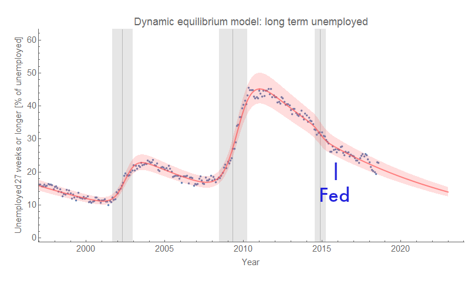

_Sometimes I feel like my only friend._

I've seen [links to this nymag article](http://nymag.com/intelligencer/2019/06/the-fed-needlessly-undermined-growth-study-confirms.html) floating around the interwebs that purports to examine labor market data for evidence that the Fed rate hike of 2015 was some sort of ominous thing:

> _But refrain they did not._ 

> _Instead, the Federal Reserve began raising interest rates in 2015 ..._

Scott Lemieux (a poli sci lecturer at the local university) [puts it this way](http://www.lawyersgunsmoneyblog.com/2019/06/underrated-historical-disasters):

> _But the 2015 Fed Rate hike was based on false premises and had disastrous consequences, not only because of the direct infliction of unnecessary misery on many Americans, but because it may well have been responsible for both President Trump and the Republican takeover of the Senate, with a large amount of resultant damage that will be difficult or impossible to reverse._ 

Are we looking at the same data? Literally nothing happened in major labor market measures in December of 2015 (here: prime age labor force participation, JOLTS hires, unemployment rate, wage growth from ATL Fed):

There were literally **_no_** consequences from the Fed rate hike in terms of labor markets. All of these time series continued along their merry log-linear equilibrium paths. It didn't even end [the 2014 mini-boom](https://informationtransfereconomics.blogspot.com/2018/10/extended-jolts-hires-series-and-2014.html) (possibly triggered by Obamacare going into effect) which was already ending.

But it's a good opportunity [to plug my book](https://www.amazon.com/dp/B07T8T9G93/ref=as_li_ss_tl?&linkCode=ll1&tag=arandomphysic-20&linkId=e9a808ffd25b93c4130b471fbbf49ed1&language=en_US) which says that the Fed is largely irrelevant (although it can make a recession worse). The current political situation is about changing alliances and identity politics amid the backdrop of institutions that under-weight urban voters.

...

**Update + 30 minutes**

Before someone mentions something about the way the BLS and CPS count unemployment, let me add that nothing happened in long term unemployment either:

The mini-boom was already fading. [Long term unemployment **_has_** changed](https://informationtransfereconomics.blogspot.com/2018/08/something-has-changed-in-long-term.html), but the change (like the changes in many measures) [came in the 90s](https://informationtransfereconomics.blogspot.com/2019/04/things-that-changed-in-90s.html).
