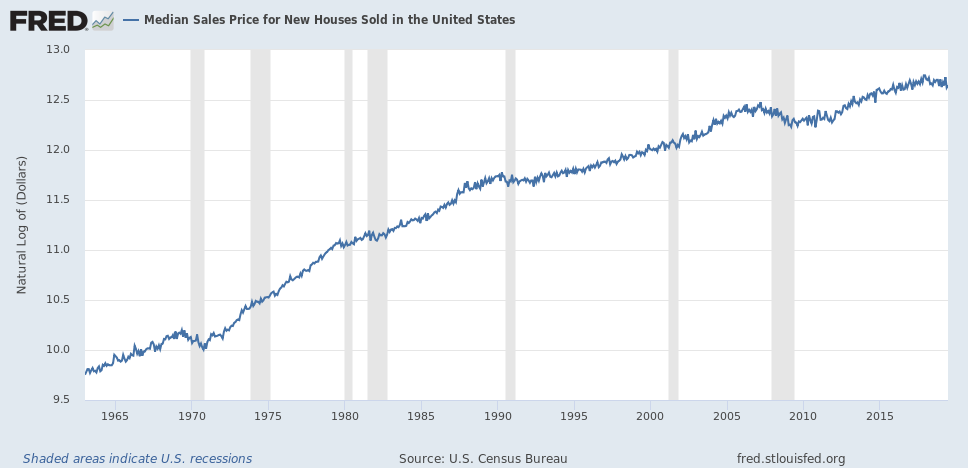
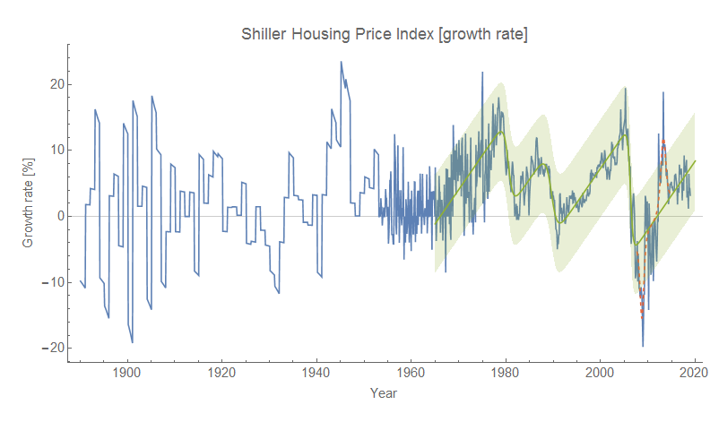
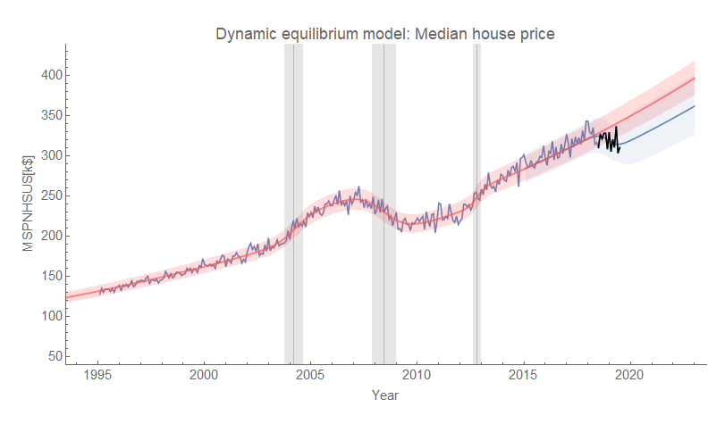
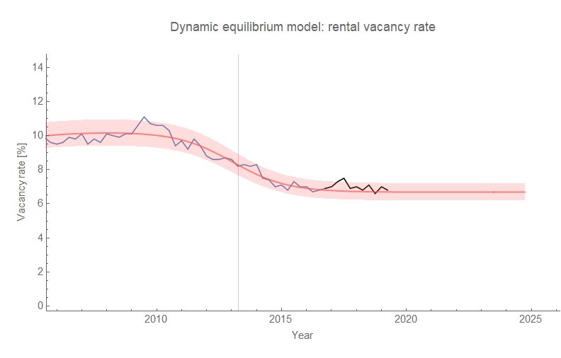
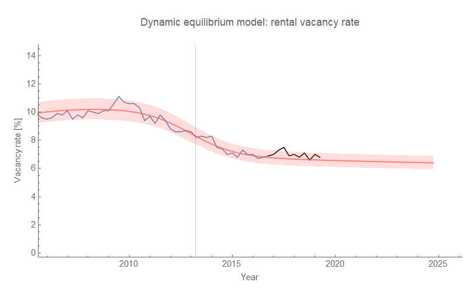
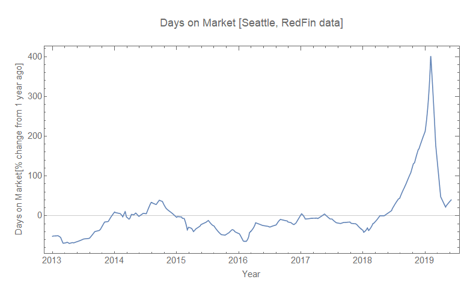

Every decline of the same (log) scale in the median house price ([FRED](https://fred.stlouisfed.org/series/MSPNHSUS)) as the current one has been associated with a recession. Of course, there have only been three times in the data since 1963 — the 1970 recession, the 1990 recession, and the 2008 recession.

As I have noted previously [on twitter](https://twitter.com/infotranecon/status/1145110354675953664?s=20) (and [in my book](https://www.amazon.com/dp/B07T8T9G93/ref=as_li_ss_tl?&linkCode=ll1&tag=arandomphysic-20&linkId=a88c07598406ea3aeb90a96131f68fd8&language=en_US)), the Case-Shiller housing price index and wage growth have similar structure since the 70s (click to enlarge):

My hypothesis here is that "white flight" and _de facto_ segregation has set up a dynamic where white people essentially drive up housing prices so much that they price themselves out of housing — requiring a crash of some kind. This dynamic is not entirely dissimilar to the hypothesized "[limits to wage growth](https://informationtransfereconomics.blogspot.com/2018/10/limits-to-wage-growth.html)", where nominal wage growth between recessions climbs until it exceeds nominal GDP growth and triggers a recession. Which of these mechanisms is the more fundamental is not clear, but there was a recession without a (significant) decline in housing prices (Case-Shiller or median) in 2001. However the 2008 and 2018-9 (i.e. recent) declines in housing prices seem to have preceded (be preceding) declines in labor market metrics.

In any case, this looks like it could be a leading indicator — and some proposed mechanisms of recessions involve people thinking they're poorer than they used to be (e.g. their house isn't worth as much) and cut back on spending. As a side note, in the once hot housing market in Seattle where I live the "For Sale" signs seem to be sticking around for a lot longer than they used to \[1\].

The latest data came out this week and we're still seeing the non-equilibrium shock (per [the Dynamic Information Equilibrium Model](https://papers.ssrn.com/sol3/papers.cfm?abstract_id=3094757) or DIEM) we saw [in the last update](https://informationtransfereconomics.blogspot.com/2019/06/median-sales-price-of-new-houses.html):

Also, rental vacancy data came out today and depending on whether the DIEM has a slightly negative dynamic equilibrium rate (−0.5%) or a 0% rate is still undetermined:

I've been following this [for over two years now](https://informationtransfereconomics.blogspot.com/2017/04/dynamic-equilibrium-rental-vacancy-rate.html). However — no non-equilibrium shock to rental vacancies.

**Footnotes:**

\[1\] Actually true! (Especially accounting for the seasonal cycles).

