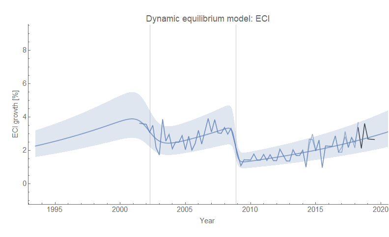
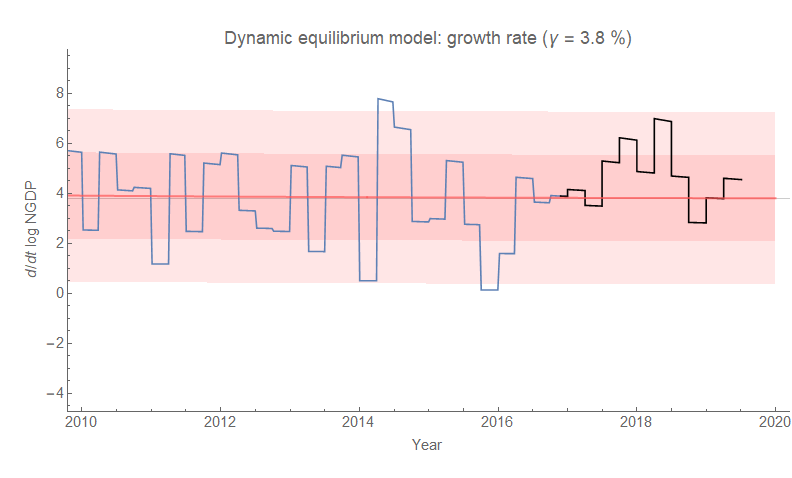
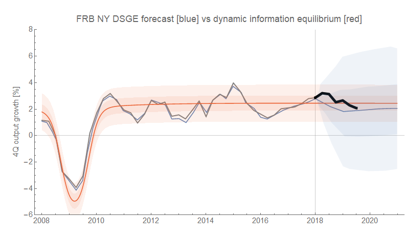
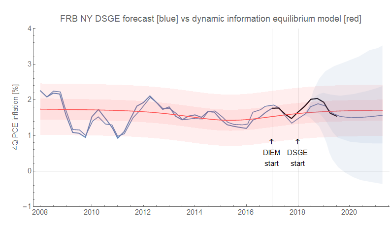

Roger Farmer and Olivier Blanchard have been in a mini-debate about the Phillips curve on Twitter, and [David Andolfatto has a nice overview](https://andolfatto.blogspot.com/2019/07/blanchard-and-farmer-on-phillips-curve.html). My thoughts on the Phillips curve are [in a post from a couple weeks ago](https://informationtransfereconomics.blogspot.com/2019/07/the-phillips-curve-overview.html). But generally without a big upswing in labor force participation, price level (e.g. CPI) inflation and unemployment won't have a relationship. The only relationship will be between unemployment and wage growth — with unemployment shocks in recessions [causing wage growth shocks six months later](https://informationtransfereconomics.blogspot.com/2018/10/building-models.html). If we take the models of wage growth and unemployment (click to embiggen):

... and combine them into a parametric plot, we get a [Beveridge](https://en.wikipedia.org/wiki/Beveridge_curve)\-like curve (though not as clean as the one between unemployment and vacancies [described in more detail in my paper](https://papers.ssrn.com/sol3/papers.cfm?abstract_id=3094757) because wage growth fluctuations are smaller and the data noisier):

The black points \[were supposed to be\] the last 24 months of data \[but I realized just now that I think I left off the last two years of data (it's using only the pre-forecast unemployment rate data which starts in January 2017) ... I will have to fix it. _Update 9pm: Fixed._\]. The light gray lines are the "equilibrium" paths in the absence of shocks (which move the path from one equilibrium to another) — data travels up these curves in equilibrium. Of course, this relationship between wages and unemployment was the one Phillips was originally talking about — not the macro-relevant Phillips curve relating price level inflation (e.g. CPI inflation) to unemployment.

**\*  \*  \***

**Added 31 July 2019**

The ECI measure of wages also came out and the latest data is exactly where [this forecast from a year ago](https://informationtransfereconomics.blogspot.com/2018/06/wage-growth-showing-signs-of-downward.html) said it would be:

Of course the "[Ozimek curve](https://twitter.com/ModeledBehavior/status/1156543702879363075?s=20)", plotted versus prime age 'non-employment' (i.e. one minus employment) is effectively showing the exact same behavior as the "Beveridge curve" above. However since a) ECI is much noisier than ATL Fed data, b) ECI is only quarterly, c) ECI is a shorter time series, and d) 'non-employment' moves in a smaller range than the unemployment rate the actual result is less illustrative of the structure:

**\*  \*  \***

\[Back to the original post.\] In other news, last week 2019 Q2 GDP data came out (along with some data revisions) which is basically in line with the dynamic information equilibrium model (DIEM) forecasts. Here's NGDP:

You can see [the TCJA effect](https://informationtransfereconomics.blogspot.com/2019/05/tcja-and-pce-growth.html) a bit more clearly, but it's still within the error bands of the model.

The FRB DSGE model forecast of RGDP has been as accurate as the DIEM in its mean forecast, but given its wider error bands we can say that the DIEM forecast is more informative:

**Update 31 July 2019** 

