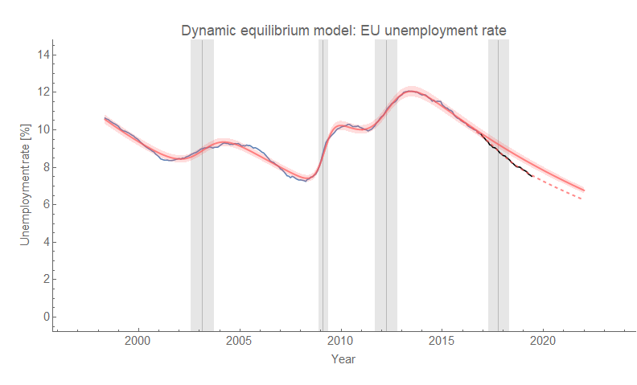

One of the major tenets of science is being as honest as possible, and showing e.g. bad forecasts. Back when I first put the [Dynamic Information Equilibrium Model](https://papers.ssrn.com/sol3/papers.cfm?abstract_id=3094757) (DIEM) together, I quickly looked at other countries [including the European Union](https://informationtransfereconomics.blogspot.com/2017/01/dynamic-unemployment-equilibrium.html). However, I hadn't checked back in on that forecast in the intervening two years. Unfortunately for the forecast, but fortunately for people in the EU, the unemployment rate dropped much faster than the DIEM expected right after the forecast ...

The gray bands are the non-equilibrium shock centers and widths (shock duration). The discrepancy can easily be understood as a positive shock to employment, and fitting the parameters means this shock began in January of 2017 — coincidentally (and aggravatingly) exactly when the original forecast was made. But still, this shows a shortcoming of the model. If you make a forecast right before a non-equilibrium shock hits, it's going to be wrong.

What's interesting is that this means the [2014 mini-boom](https://informationtransfereconomics.blogspot.com/2018/10/extended-jolts-hires-series-and-2014.html) in the US may not have been unique to the US — the same drop in the unemployment rate of comparable size appears in the EU starting in January of 2017 \[1\]. It's possible this EU mini-boom could have been caused by the US mini-boom, but there could be other causes as well. It's not entirely certain what caused the mini-boom in the US.

There is another possibility — since the EU time series is much shorter than the US version, we might have underestimated the dynamic equilibrium slope. However, even if I re-estimate it using all the available data, there's still a slight shock in the same place:

This gives us some confidence that the non-equilibrium shock hypothesis might be the better one. However, the only real way to tell will be to continue to follow forecasts. Hopefully I won't wait another two years before checking in on it this time!

**Footnotes:**

\[1\] Here's a side by side comparison of the EU and US unemployment rates showing the mini-booms:

