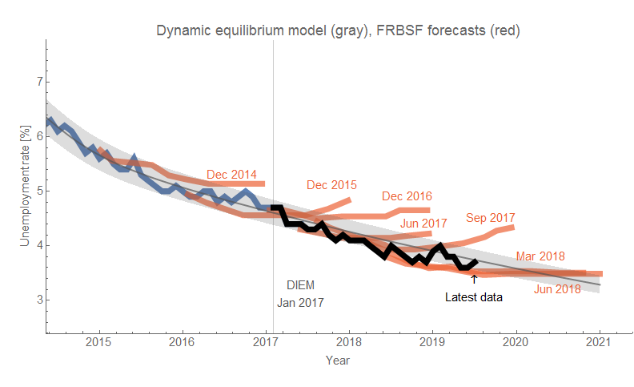
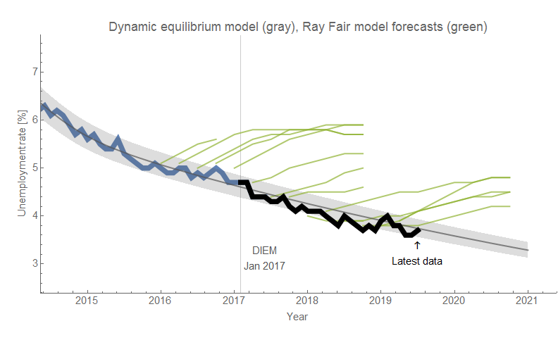
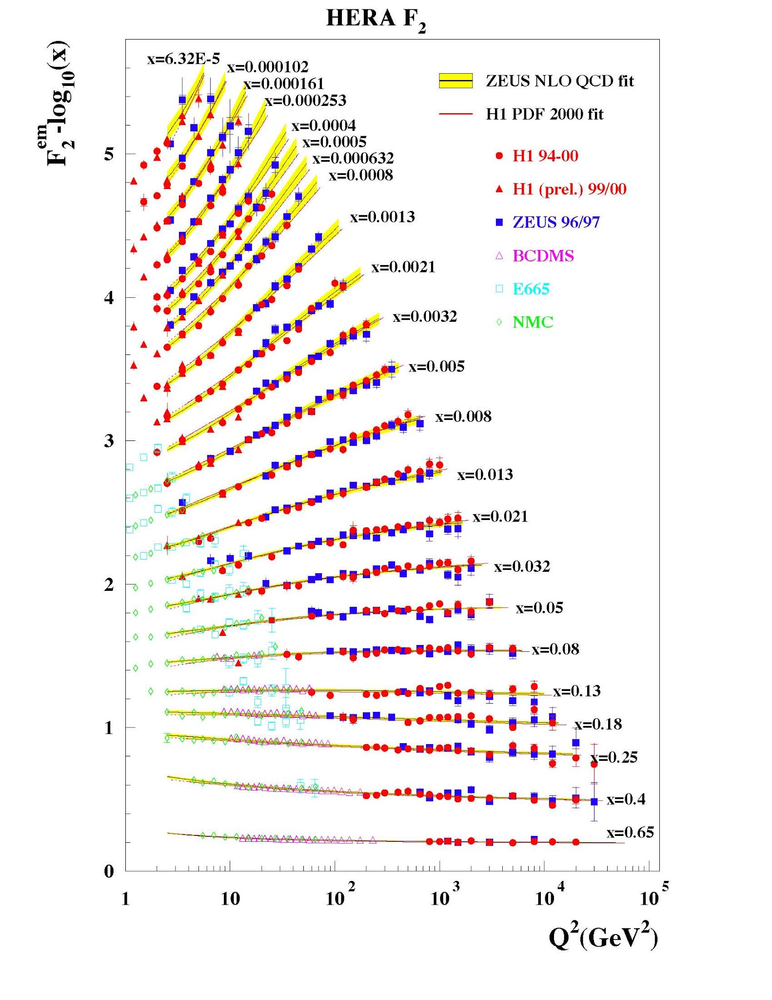

There were several threads on twitter (e.g. [here](https://twitter.com/infotranecon/status/1146983739148255232), [here](https://twitter.com/dsquareddigest/status/1147052133369430016), [here](https://twitter.com/infotranecon/status/1145443647061516288)) the past couple days that tie up under the theme of "external validity" versus "internal validity". It's a distinction that appears to mean something different in macroeconomics [than it does in other sciences](https://en.wikipedia.org/wiki/External_validity), but I can't quite put my finger on it. Operationally, its definition appears to imply you can derive some kind of "understanding" from a model that doesn't fit out-of-sample data.

Let's say I observe some humans running around, jumping over things at a track and field event. I go back to my computer and code up an idealized model of a human reproducing the appearance of a representative human and giving it some of the behaviors I saw. Now I want to use this model to derive some understanding when I experiment with some policy changes ... say, watching the interaction between the human and angry mushroom people ...

A lot of macro models are basically like this — neither internal validity nor external validity. It's just kind of a simulacrum — sure, Mario looks a bit like a person, and people can move around. But no one can jump that high or change direction of their jump 180° in mid-air. A more precise analogy would be the invented virtual economies of video games like _Civilization_ or _Eve Online_, but they're still not real because there is no connection with macro data.

In science, a conclusion about e.g. effects of some treatment on mice may be internally valid (i.e. it was done correctly and shows a real and reproducible effect, per a snarky twitter account, [in mice](https://twitter.com/justsaysinmice)), but not externally valid (i.e. the effect will not not occur in humans). There's even a joke version of the linked "in mice" twitter account [for DSGE models](https://twitter.com/indsgemodels), but that's really not even remotely the same thing at all. DSGE models do not have internal validity in the scientific sense — they are not valid representations of even the subset of data they are estimated for. Or a better way to put it: **_we don't know_** if they are valid representations of the data they are estimated for.

We can know if the test on mice is internally valid — someone else can reproduce the results, or you can continue to run the experiment with more mice. Usually something like this is done in the paper itself. There's been a [crisis in psychology](https://en.wikipedia.org/wiki/Replication_crisis#In_psychology) recently due to failing to meet this standard, but it's knowable through doing the experiments again. 

_We cannot know if a macro model is internally valid in this sense._ Why? Because macro models are estimated using time series for individual countries. If I estimate a regression over a set of data from 1980-1990 for the US, there is no way to get more data from 1980-1990 for the US in the same way we can get more mice — I effectively used all the mice already. Having someone else estimate the model or run the codes isn't testing internal validity because it's basically just re-doing some math (though some models fail even this).

The macro model might be an incredibly precise representation of the US economy between 1980 and 1990 in the same way [old quantum theory and the Bohr model](https://en.wikipedia.org/wiki/Old_quantum_theory#Hydrogen_atom) was an incredibly precise representation of the energy levels of Hydrogen. But old quantum theory was wrong.

Macro models are sometimes described as having "internal consistency" which is sometimes confused for "internal validity" \[1\]. _Super Mario Brothers_ is internally consistent, but it's not internally valid.

So if internal validity is "unknowable" for a macro model, we can look at external validity — out-of-sample data from other countries or other times, i.e. forecasting. It is through external validity that macro models gain internal validity — we can only know if a macro model is a valid description of the data it was tested on (instead of being a simulacrum) if it works for other data.

Which brings me to today's data release from BLS — and an unemployment rate forecast I've been tracking for over two years (click to enlarge):

Note that the model works not only for other countries ([like Australia](https://informationtransfereconomics.blogspot.com/2019/06/employment-situation-day-and-other.html)), but also different time series such as the prime age labor force participation rate also released today:

That is to say the [dynamic information equilibrium model (DIEM)](https://papers.ssrn.com/sol3/papers.cfm?abstract_id=3094757) has demonstrated some degree of external validity. This basically obviates any talk about whether DSGE models, ABMs, or other macro models can be useful for "understanding" if they do not accurately forecast. There are models that accurately forecast — that is now the standard. If the model does not accurately forecast, then it lacks external validity **_which means it cannot have internal validity_** — we can ignore it \[1\].

That said, the DSGE model [from FRB NY](https://libertystreeteconomics.newyorkfed.org/2018/03/the-new-york-fed-dsge-model-forecast-march-2018.html) has been [doing fairly well with inflation](https://informationtransfereconomics.blogspot.com/2019/06/pce-inflation.html) for bit over a year ... so even discussion of whether a DSGE model has to forecast accurately is obviated _even if you are only considering DSGE models_. They have to now — at least a year. This one has.

**Footnotes:**

\[1\] Often people bring up microfoundations as a kind of logical consistency. A DSGE model has microfoundations, so even if it doesn't forecast exactly right the fact that we can fit macro data with a microfounded DSGE model provides some kind of understanding.

The reasoning is that we're extrapolating from the micro scale (agents, microfoundations) to the macro scale. It's similar to "external validity" except instead of moving to a different time (i.e. forecasting) or a different space (i.e. other countries), we are moving to a different **_scale_**. In physics, there's an excellent example of doing this correctly — in fact, [it's related to my thesis](https://inspirehep.net/record/690305). The quark model ([QCD](https://en.wikipedia.org/wiki/Quantum_chromodynamics)) is kind of like a set of microfoundations for nuclear physics. It's especially weird because we cannot really test the model very well at the micro scale (though recent [lattice calculations](https://en.wikipedia.org/wiki/Lattice_QCD) have been getting better and better). The original tests of QCD came from extrapolating from the different energy scales (in the diagram below, _Q²_) using evolution equations. QCD was quite excellent at describing the data (click to enlarge):

Measurement of the structure function of a nucleon at one scale allows QCD to tell us what it looks like at another scale. We didn't prove QCD to be a valid description of reality at the scale it was formulated at in terms of quarks and gluons ("microfoundations"), but rather we extrapolated to different scales — external validity. Other experiments confirmed various properties of the quark microfoundations, but this experiment was one that confirmed the whole structure of QCD.

But we can in fact measure various aspects of the microfoundations of economics — humans, unlike quarks, are readily accessible without building huge accelerators. [These often turn out to be wrong](https://noahpinionblog.blogspot.com/2014/01/the-equation-at-core-of-modern-macro.html). But more importantly, the DSGE models extrapolated from these microfoundations do not have external validity — they don't forecast and economists don't use them to predict things at other scales (AFAICT) like, say, predicting state by state GDP.

What's weird is that the inability to forecast is downplayed, and the macro models are instead seen as providing some kind of "understanding" because they incorporate microfoundations, when in actuality the proper interpretation of the evidence and the DSGE construction is that either the microfoundations or the aggregation process are wrong. The only wisdom you should gain is that you should try something else.
