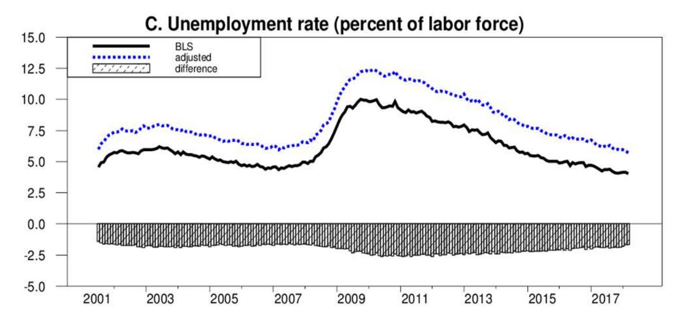
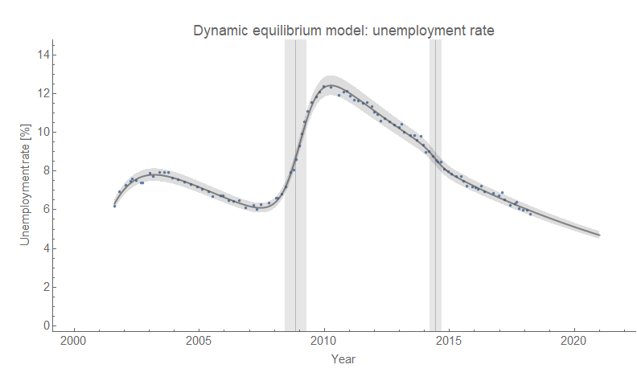
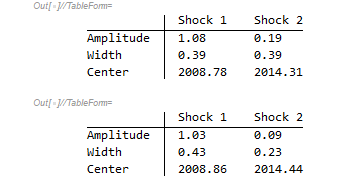

A recent [NBER working paper](http://papers.nber.org/conf_papers/f123773.pdf) \[pdf\] has called into question the BLS measurement of the unemployment rate, concluding that the metric is actually a couple of percentage points higher than reported. The paper is "Measuring Labor-Force Participation and the Incidence and Duration of Unemployment" by Hie Joo Ahn and James D. Hamilton (2019) — and a H/T to [Ernie Tedeschi](https://twitter.com/ernietedeschi/status/1151489773392916483) and [Ben Casselman](https://twitter.com/bencasselman/status/1151487496125108224) for it appearing in my twitter feed. The overall difference appears to be that it's almost a uniform shift to a higher rate, but my question was whether/how this impacts the [dynamic information equilibrium model](https://papers.ssrn.com/sol3/papers.cfm?abstract_id=3094757) (DIEM).

Here's their result for the unemployment rate (they actually look at multiple measures) and the DIEM fit to their adjusted data:

This adjusted unemployment rate is pretty much as well described by a DIEM as the BLS number. In fact, you have to dive down into the shock parameters to notice anything besides the uniform shift.

The data only contains two complete shocks (Great Recession/2008, mini-boom/2014), so I'm only looking at those parameters. Overall, the only real difference is that the [2014 "mini-boom"](https://informationtransfereconomics.blogspot.com/2018/10/extended-jolts-hires-series-and-2014.html) for the unemployment rate is smaller and narrower — possibly shedding some light on why it seems to have gone largely unnoticed.

But overall, this mis-measurement doesn't have any impacts on the DIEM's ability to describe the data — and the adjusted data tells essentially the same story of the BLS data for the past couple decades.

PS We could potentially conclude that the fraction of unemployment that is long term (>27 weeks) might be lower because the average duration of unemployment has fallen in the paper's analysis. This might explain [something puzzling about the elevated rate of long term unemployment](https://informationtransfereconomics.blogspot.com/2018/08/something-has-changed-in-long-term.html) — but the paper's analysis doesn't go back far enough to see if there's a change in the 90s (when long term unemployment started to stay elevated relative to headline unemployment).
