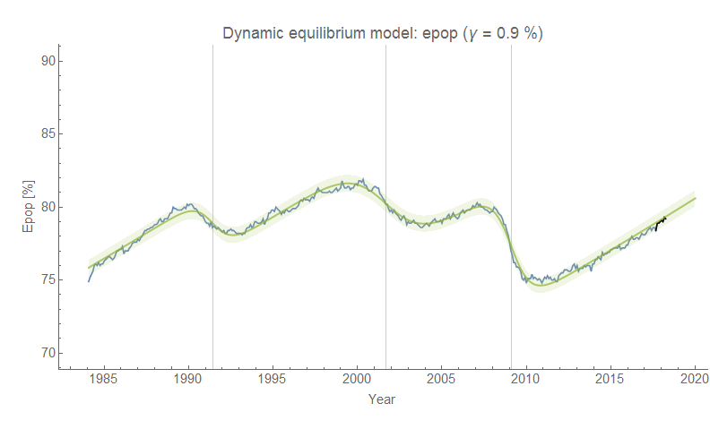
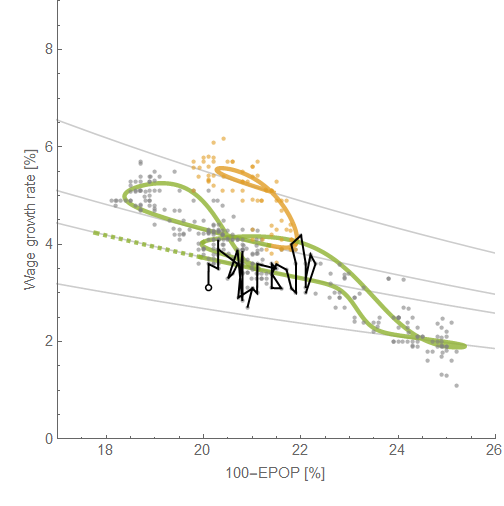

[Noah Smith has an article in Bloomberg today](https://www.bloomberg.com/opinion/articles/2019-07-12/fed-can-cut-rates-as-phillips-curve-jobs-inflation-trade-off-ends) about the Phillips curve — the relationship between employment and inflation where "employment" and "inflation" can mean a couple of different things. Phillips' original paper talked about wage inflation (wage growth) and unemployment, but sometimes these can refer to inflation the price level in general (e.g. CPI inflation) or even expected inflation (in the New Keynesian Phillips Curves \[NKPC\] in DSGE models). I realized I don't have a good one-stop post for discussion of the Phillips curve, so this is going to be that post.

Noah's frame is the recent congressional hearings with Fed Chair Powell, and in particular the pointed questioning from Alexandria Ocasio-Cortez about whether the Phillips curve is "no longer describing what is happening in today’s economy." He continues to discuss the research finding a 'fading Phillips curve' and mentioned Adam Ozimek's claim that the Phillips curve is alive and well — all things I have discussed on this blog in the context of the [Dynamic Information Equilibrium Model](https://papers.ssrn.com/sol3/papers.cfm?abstract_id=3094757) \[DIEM\]. Let's begin!

**1\. There is a direct relationship between wage growth and the unemployment rate**

The structure of wage growth and the unemployment rate over the past few decades shows a remarkable similarity (as always, click to enlarge):

The [wage growth model](https://informationtransfereconomics.blogspot.com/2018/02/dynamic-equilibrium-in-wage-growth.html) has [continued to forecast well](https://informationtransfereconomics.blogspot.com/2019/07/wage-growth-inflation-interest-rates.html) for a year and a half so far, while the unemployment rate model not only has done well for over two years now (I started it earlier) but has [outperformed forecasts from the Fed as well as Ray Fair's model](https://informationtransfereconomics.blogspot.com/2019/07/labor-market-update-external-validity.html). Regardless of whether the models are correct (but seriously, that forecasting performance should weigh pretty heavily), they are still excellent fits to the prior data and describe the time series' structure accurately. There's actually another series with this exact shock pattern ('economic seismogram') match — [JOLTS hires](https://informationtransfereconomics.blogspot.com/2018/10/extended-jolts-hires-series-and-2014.html). The hires measure confirms the 2014 mini-boom appearing in wage growth and unemployment so we're not just matching negative recession shocks, _**but positive booms**_. We can put the models together on the same graph to highlight the similarity ... [and we can basically transform them to fall on top of each other](https://informationtransfereconomics.blogspot.com/2018/10/building-models.html) by simply scaling and lagging:

This find that shocks to JOLTS hires lead unemployment by about 5 months, and shocks to wages by 11 months — with first two leading NBER recessions and the last one happening after a recession is over. We can be pretty confident that changes in hires cause changes in unemployment which in turn cause changes in wage growth. Between shocks, the normal pattern is that unemployment falls and wage growth rises (accelerates). The rate of the latter is slow, but consistent (and forecast correctly by the DIEM):

**2\. Adam Ozimek's graph is more like a Beveridge curve and isn't quite as clean as presented**

I used the wage growth model above and a similar model of prime age employment to reproduce a version of Ozimek's graph [in an earlier post](https://informationtransfereconomics.blogspot.com/2018/07/wage-growth-versus-employment.html). Ozimek uses the Employers Cost Index (ECI), but I use the Atlanta Fed wage growth tracker data because it is monthly and goes back a bit farther in time \[3\]. However, this pretty much produces an identical graph to Ozimek's when we plot the same time period:

The DIEMs for wage growth and prime age employment population ratio \[EPOP\] also have some similar structure — however the 2014 mini-boom is not as obvious in EPOP if it appears at all ...

This indicates that these two series might have a more complex relationship than unemployment and wage growth. In fact, if you plot them on Ozimek's axes highlighting the temporal path through the data points in green (and yellow) as well as some additional earlier data in yellow (and highlighting the recent data in black) you see how the nice straight line above is somewhat spurious and the real slope is actually a bit lower:

The green dashed line shows where the data is headed (in the absence of a recession), and the light gray lines show the "dynamic equilibria" — the periods between shocks when wage growth and employment steadily grow. When a recession shock hits, we move from one "equilibrium" to another, much like the Beveridge curve (as I discuss [in this blog post](https://informationtransfereconomics.blogspot.com/2017/10/the-beveridge-curve.html) and [in my paper](https://papers.ssrn.com/sol3/papers.cfm?abstract_id=3094757)).

**3\. The macro-relevant Phillips curve has faded away**

The Phillips curves above talk about wage inflation, but in macro models the relationship is between unemployment and the price level (e.g. CPI or PCE inflation) — the NKPC. Now it's true that wages are a "price" and a lot of macro models don't distinguish between the price of labor and the price of goods. But it appears empirically we cannot just ignore this distinction because there does not appear to be any signal in price level data today ... but there used to be!

Much like in the first part of this post, we can look at DIEMs for (in this case) core PCE inflation and unemployment, and note that they [really do seem to be related in the 60s through the 80s](https://informationtransfereconomics.blogspot.com/2017/09/was-phillips-curve-due-to-women.html):

We see spikes of inflation cut off by spikes in unemployment, which fade out in the 90s. This is where a visualization of these "shocks" I've called "economic seismograms" is helpful — the following is a chart [in a presentation from last year](https://informationtransfereconomics.blogspot.com/2018/03/trends-in-macro-observables-twitter.html) (this time its the GDP deflator):

Spikes in inflation are "cut-off" by recessions during the 60s and 70s, but that effect begins to fade out over time. What's interesting is that the period of a "strong Phillips curve" pretty much matches up with the long demographic shift of women entering the workforce in the 60s, 70s, and 80s. The Phillips curve vanishes when women's labor force participation becomes highly correlated with men's (i.e. only really showing signs of recession shocks). This is among [several things that seem to change after the 1990s](https://informationtransfereconomics.blogspot.com/2019/04/things-that-changed-in-90s.html).

Why does this happen? I have some speculation (a metaphor I use is that mass labor force entry [is like a "gravity wave" for macro](https://informationtransfereconomics.blogspot.com/2018/05/labor-force-participation-and-gravity.html)) that I most concisely wrote up in a [comment about my new book](http://www.arandomphysicist.com/2019/06/a-workers-history-of-united-states-1948.html?showComment=1561487619131#c4913449600224712252):

> _My thinking behind it is that high rates of labor force expansion (high compared to population growth) are more susceptible to the business cycle. Unlike adding people at the population growth rate, adding people at an accelerated rate because of something else happening — women entering the workforce — is more easily affected by macro conditions. Population grows and people have to find jobs, but women don't have to go against existing social norms and enter the workforce in a downturn, but are more likely to do so during an upturn (i.e. breaking social norms gets easier if it pays better than if it doesn't)._ 

> _This would cause the business cycle to pro-cyclically amplify and modulate the rate of women entering the workforce, which gives rise to bigger cyclical fluctuations and also the Phillips curve._ 

> _As a side note: I think a similar mechanism played out during industrialization, when people were being drawn from rural agriculture into urban industry. And also a similar mechanism plays out when soldiers return from war (post-war inflation and recession cycles)._

That [new book's first chapter](https://www.amazon.com/dp/B07T8T9G93/ref=as_li_ss_tl?&linkCode=ll1&tag=arandomphysic-20&linkId=8a7b2518ff63ab8abcfee45de461e175&language=en_US) is largely about how this effect is generally behind the "Great Inflation" — and that it has nothing to do with monetary policy. Which brings us back to the beginning of this post: the Fed can't produce inflation because it never really could \[1\].

_Update 13 July 2019:_ I wanted to add that this relationship between inflation and unemployment and the fading of it isn't about "expected" inflation (the expectations augmented Phillips curve), but observed inflation. It remains entirely possible that the "[Lucas critique](https://en.wikipedia.org/wiki/Lucas_critique)" is behind the fading — that agents learned how the Fed exploits the Phillips curve and so the relationship began to break down. Of course, the direct consequence is that apparently the Fed became a master of shaping expectations ... only to result in sub-target inflation after the Great Recession. It would also mean that the apparent match between rising labor force participation and the magnitude of the Phillips curve is purely a coincidence. I personally would go with Occam's razor here \[2\] — [generally expectations-based theories verge on the unfalsifiable](https://informationtransfereconomics.blogspot.com/2018/10/lets-not-assume-that.html).

**Summary**

So 1. yes, wage growth and unemployment appear to be directly causally related; 2. wage growth and EPOP are not as closely or causally related; and 3. yes, the Phillips curve relationship between unemployment and the macro-relevant price level inflation has faded away as the surge of women entering the workforce ended.

...

**Footnotes:**

\[1\] This is not to say a central bank can never create inflation — it could easily create hyperinflation, which is more a political problem than a macroeconomic mechanism. The cut-off between the "hyperinflation" effective theory and the "monetary policy is irrelevant" effective theory seems to be [on the order of sustained 10% inflation](https://informationtransfereconomics.blogspot.com/2017/03/belarus-and-effective-theories.html). (Ina side note mentioned at that link, that might also be where MMT — or really any one-dimensional theory of how an economy works — is a good effective theory. Your economy simplifies to a single dimension when money printing, inflation and government spending all far outpace population and labor force growth.)

\[2\] Is granting the Fed and monetary policy control of inflation so important that we must come up with whatever theory allows it no matter how contrived?

\[3\] _Update 14 July 2019_: Here's the ECI version alongside the [Atlanta Fed wage growth tracker](https://www.frbatlanta.org/chcs/wage-growth-tracker.aspx?panel=1) data — graph originally from [here](https://informationtransfereconomics.blogspot.com/2018/06/wage-growth-showing-signs-of-downward.html). ECI's a bit too uncertain to see the positive shock in [the 2014 mini-boom](https://informationtransfereconomics.blogspot.com/2018/10/extended-jolts-hires-series-and-2014.html).

