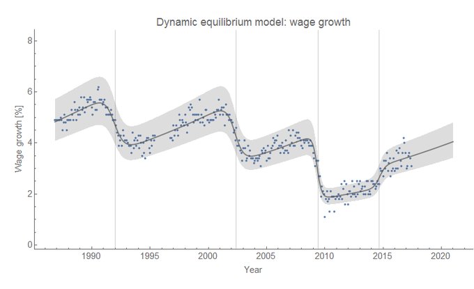
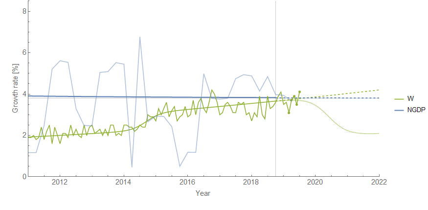
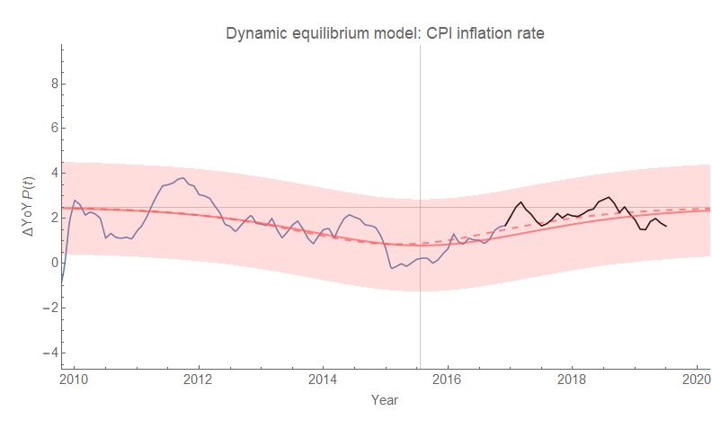
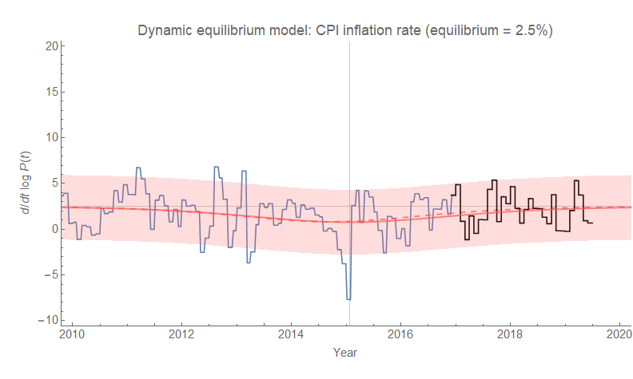
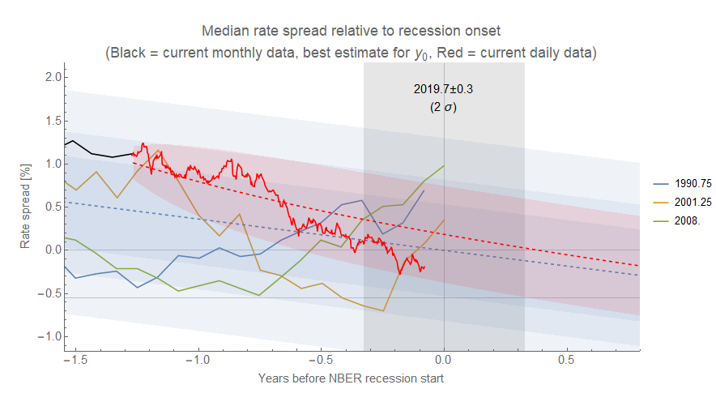
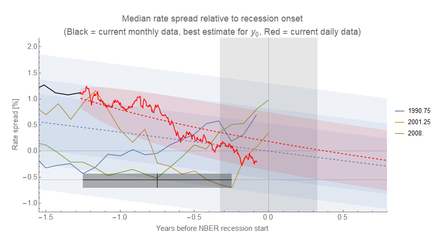
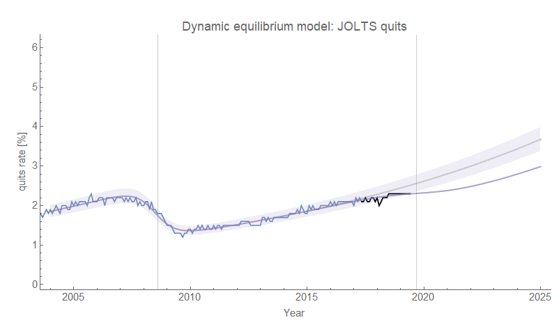
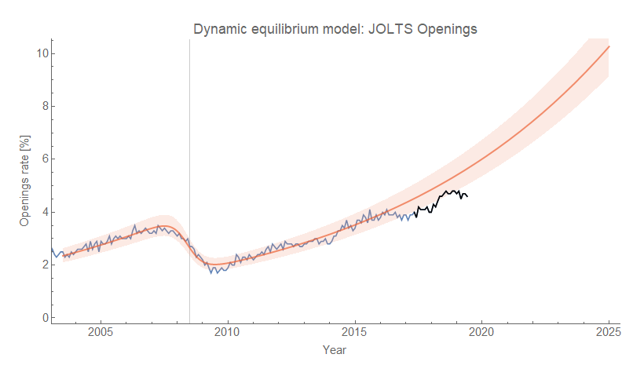
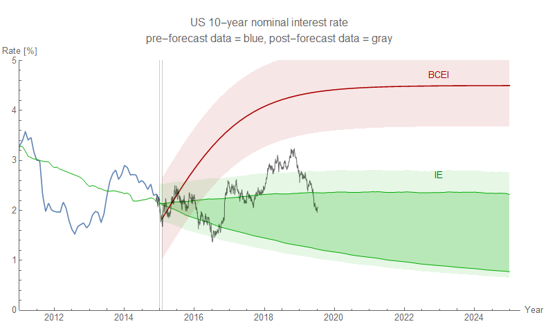

With the Fed hearings in Congress this week and some new data releases this week, I thought it'd be good to get a [dynamic information equilibrium model](https://papers.ssrn.com/sol3/papers.cfm?abstract_id=3094757) (DIEM) snapshot just before the end of the month and what many people are thinking is going to be the first Fed rate cut since the Great Recession. The [Atlanta Fed's Wage growth tracker](https://www.frbatlanta.org/chcs/wage-growth-tracker.aspx?panel=1) was updated today and the latest results are in line with [the DIEM forecast from a year and a half ago](https://informationtransfereconomics.blogspot.com/2018/02/dynamic-equilibrium-in-wage-growth.html):

We're pretty much at the point where wage growth has reached the NGDP growth dynamic equilibrium, which [I've speculated is the point where a recession is triggered](https://informationtransfereconomics.blogspot.com/2018/10/limits-to-wage-growth.html) (by e.g. wages eating into profits, resulting in falling investment). Of course, the NGDP series is noisy, but this is what the "limits to wage growth" picture looks like with an average-sized shock (in the wage growth time series):

Inflation (CPI all items, seasonally adjusted) came in today lower than the 2.5% dynamic equilibrium this month but well within the error bands. This is year-over-year and continuously compounded annual rate of change (i.e. log derivative):

But inflation doesn't give us much of a sign of a recession (it can react after the fact, but isn't a leading indicator).

A metric many people look at is the yield curve — I've been tracking [the median of a collection of rate spreads](https://informationtransfereconomics.blogspot.com/2018/06/yield-curve-inversion-and-future.html) (which basically matches the principal component). This is only loosely based on dynamic information equilibrium (i.e. there's a long-term tendency for interest rates to decline), but is really more a linear model of the interest rate data before the last three recessions (so _caveat emptor_) coupled with an AR process forecast:

That linear model gives us an estimate of when the yield curve should invert as an indication of a recession. One thing to note is that with the Fed potentially lowering interest rates at the end of the month, the path of the interest rate spread will likely "turnaround" and start climbing — it's done so in the past three recessions. That turnaround point has been between one and five quarters before the recession onset, but then the turnaround has also usually been at about -50 bp — these are indicated with the gray box on the next graph:

As a side note: when people say AR processes outperform DSGE models, this is an example of one of those AR processes.

If the fed lowers rates this month, then the turnaround will be 20-30 bp higher than the past three recessions — is this an indication of looser policy than in the past? Political pressure? This is not necessarily to say the Fed's rate decisions will have an impact. It's just a representation of how the Fed changes policy in the face of economic weakness. Much like how a person who sees themselves about to get in a car accident might tense up, tensing up does not do anything to mitigate or prevent the accident.

Earlier this week, JOLTS data came out. I've speculated that these measures are leading indicators, and it appears that [shocks to JOLTS hires appear at around 5 months before shocks to the unemployment rate](https://informationtransfereconomics.blogspot.com/2018/10/building-models.html) and around 11 months before shocks to wage growth (the model above) — the latter coming **_after_** the recession has begun. In any case, JOLTS quits appears to be showing a flattening indicating a turnaround:

I talked about this on Twitter a bit. In the last recession, hires led the pack but that might have been a result of the housing bubble where [construction hires](https://fred.stlouisfed.org/series/JTS2300HIR) started falling nearly 2 years before the recession onset. If that was a one-off, then quits and openings look like the better indicators. Here's openings:

As a side note, I talk about that atypical early lead for hires [in my book](https://www.amazon.com/dp/B07T8T9G93/ref=as_li_ss_tl?ie=UTF8&linkCode=ll1&tag=arandomphysic-20&linkId=3969edf133e37823c0aca390ea0c1354&language=en_US) as an indication that potentially the big xenophobic outbreak around the 2006 election might have had an impact on the housing bubble (an earlier draft version appears [here as a blog post](https://informationtransfereconomics.blogspot.com/2018/11/an-information-equilibrium-history-of.html)).

Again, a lot of this is speculative — I'm trying to put out clear tests of the usefulness of the dynamic information equilibrium model for forecasting and understanding data. But the series that seem to lag recessions (wage growth, inflation) are right in line with the DIEMs, while the series that seem to lead recessions (JOLTS) are showing the signs of deviations.

...

**Update 4:30pm PDT**

Here's the 10-year-rate forecast from 2015 still doing much better than the BCEI forecast of roughly the same vintage ...

