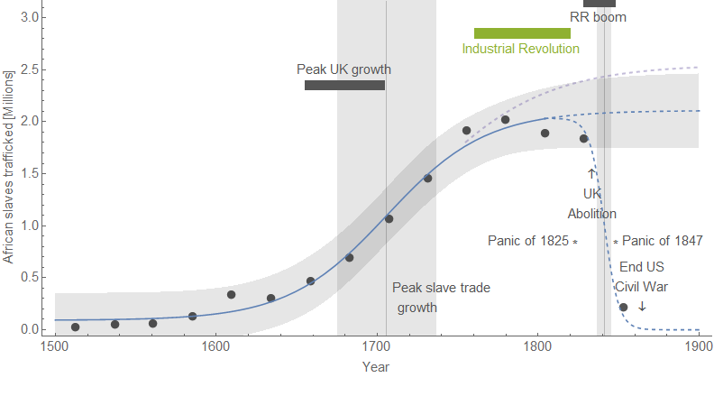
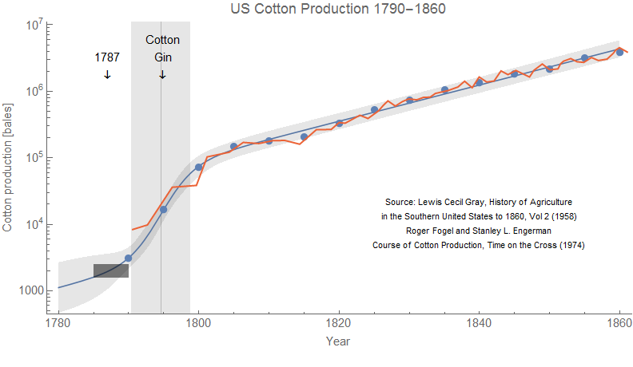
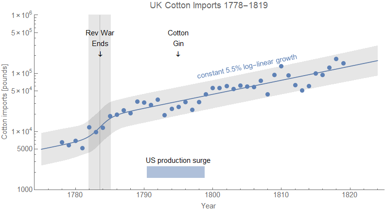
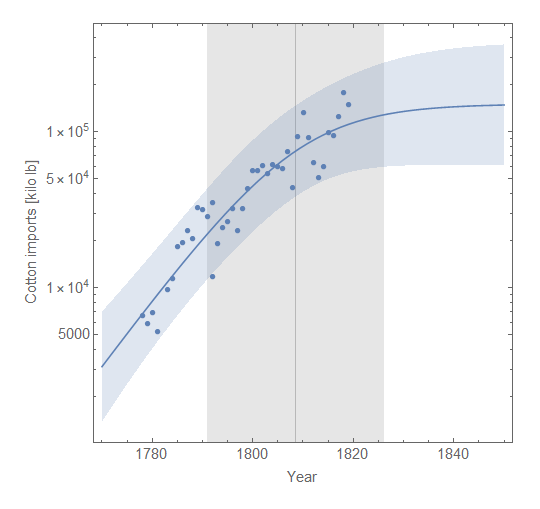

I've been toying with the idea of applying the _[Workers' History](http://www.arandomphysicist.com/2019/06/a-workers-history-of-united-states-1948.html)_ methodology to the Industrial Revolution and the rise of "capitalism" for my next book. The recent 1619 project articles in the _New York Times_ magazine set off a weird firestorm on the internet involving this very subject.

The underlying debate here appears to be a moral/ethical one — are capitalism and the industrial revolution (IR) the offspring of slavery (and therefore "tainted" morally), or did they help bring about slavery's demise (as a technocratic "white savior")? Was the wealth of the US (and/or the UK) built on slavery or was growth and industrialization in the Southern US hindered by it?

I'm not going to be the person who answers this moral question, but one thing that I do think I can contribute to is analysis of the time series data. If we can get the events in the time series straight, then it helps focus the discussion of moral questions.

In fact, I already have looked at this a bit, inspired by Dietrich Vollrath's [great blog post](https://growthecon.com/blog/When-Growth/) on the question of when "sustained growth" started \[0\]. Recent analysis of the data seems to point to an earlier starting point around 1650:

> _"... the onset of sustained growth in annual earnings **much** earlier than the actual Industrial Revolution. Both the GDP per capita and the annual earnings series being to accelerate around 1650."_

Emphasis in the original. [When I looked at the UK annual income data index](https://informationtransfereconomics.blogspot.com/2018/04/sustained-growth.html) with the dynamic information equilibrium model \[1\], I came up with similar results — possibly even earlier due to an overlapping negative shock to income growth in the late 1500s. This earlier shock may be purely a nominal one due to the so-called [price revolution](https://en.wikipedia.org/wiki/Price_revolution).

Important observations in this framework are that:

1.  The growth shock to UK income matches up with the slave trade
2.  The IR comes along as surge in income growth fades (i.e. no income growth from the IR)
3.  It's not a permanent shock to sustained growth, but rather part of a series with the second shock coming in the 1830-40s possibly associated with the railroad boom in the UK

As an aside, [I noted parallels](https://twitter.com/infotranecon/status/1164994019467726848) between the IR the Solow paradox/IT revolution — both occurring as a growth shock fades (slavery, women entering the workforce), and neither showing up in macro growth metrics. This discussion brought up some [additional questions about the causality](https://twitter.com/PoliEconEnergy/status/1165154373682393089) — did the IR cause the decline in the slave trade? But the data on the number of African slaves trafficked shows the fading of the growth shock had already begun before the IR:

This graph shows that if we just look at data before 1780, we still see the same saturation (purple dashed curve). It also shows that abolition comes as a genuine surprise in this data at this resolution (25 years) — only appearing in the last data point.

A plausible interpretation of events here is that exploitation of slaves began to see diminishing returns so that investment was directed elsewhere (i.e. [seeking "alpha"](https://en.wikipedia.org/wiki/Alpha_\(finance\))) — in particular the rail boom (that took over transportation from [the canal system](https://en.wikipedia.org/wiki/History_of_the_British_canal_system)). The products of the industrial revolution — specifically rail — were a plausible target \[2\]. Whether abolition forced this shift in attention or instead just came after slavery was no longer as lucrative (and rail became lucrative) is not definitively adjudicated in the data, but the latter proposition has slightly stronger evidence.

This doesn't really say whether slavery caused (e.g. funded) the IR, but it does say that the IR did not cause the decline in slavery — slavery might have just been limited by its own logistics. The Haitian revolution (1791-1804) might be seen in this light as evidence of the limits of controlling slaves. In the aftermath, white Southerners in the US moved toward tighter controls which may have impacted exploitative growth in slavery. It's also possible practical limits on the number of slave ships traversing the middle passage intervened. Whatever the reason, slavery's expansion slowed because of factors that would have been already apparent in the first half of the 18th century.

The other question is whether "investment" in exploiting slaves delay industrialization of the US South (or even more broadly in the British Empire). This counterfactual analysis is possibly unanswerable as it involves knowing what redirecting investment to other areas (like industrialization) would have accomplished. However, there's something that came up when I began reading about this aspect — a myth about Eli Whitney's cotton gin.

I was reading [this Bloomberg article by Karl Smith](https://www.bloomberg.com/opinion/articles/2019-08-25/how-slavery-hurt-the-u-s-economy) summarizing one case that instead of being a source of growth, slavery held back growth in the US compared to a (dubious) counterfactuals. In it, Smith says that:

> _"In 1795, the year after the invention of the cotton gin, the U.S. produced 8 million pounds of cotton. Widespread adoption of the gin raised that to 40 million pounds by 1801."_

The implication here is that the cotton gin had an impact on cotton production. However, the only apparent change in cotton production in the US is a surge that begins sometime before 1790, with the gin coming right in the middle of that surge in 1795:

I made the cheeky suggestion/hypothesis that the legal framework established by the adoption of the US Constitution was a more likely cause of that jump in cotton production. But it's also plausible that the end of the US Revolutionary War resulted in some "catch-up" growth along with opening up new markets besides Britain — remember that aim of the revolution? In any case, the data shows precious little else happened between 1790 and 1860 except for that 10 year growth spurt at the beginning. The war of 1812 is almost indistinguishable from a statistical fluctuation.

Likely because of my claim, [Sri Thiruvadanthai sicced Pseudoerasmus on me](https://twitter.com/teasri/status/1165726080055107584) who agreed with my point about the cotton gin but then said my interpretation of the time series was "silly and preposterous" \[3\] before sending me a time series that not only didn't support Pseudoerasmus' claims about it (there is no "surge" in British demand evident in the data) but in fact confirmed my claims that if anything happened, it happened before 1790. Pseudoerasmus' time series came without a source, but covered cotton imports to Britain from 1778 to 1819. As you can see there are very few features in the data besides a surge around the end of the US revolutionary war and a fluctuation around the war of 1812.

There's actually a bit of below trend imports right in the middle of the US production surge!

My claim that nothing happened after about 1790 holds up even if you look at that data with a pure logistic description (per discussion with [Michael aka @profplum99 on Twitter](https://twitter.com/profplum99/status/1166023290256670723)):

You might ask what level of confidence we should have in using these simplistic models to describe the data. The truth is that there's so little data (~ 70 points for US production, ~ 41 points for UK imports), it cannot support a complex model. In fact, a heuristic estimate (1 parameter per 20 data points) says that anything beyond 2-3 parameters is probably over-fitting leaving us with log-linear models. With circumstantial evidence (independent measures of the timing of the wars), we can probably add a couple more.

Of course, Pseudoerasmus takes it a bit further ([here](https://twitter.com/pseudoerasmus/status/1165744947208871937?s=20), [here](https://twitter.com/pseudoerasmus/status/1165765022267662341?s=20)) ...

> _England imported 7 million lbs of cotton in 1780 but 56 mn lbs in 1800. There was this thing called the Industrial Revolution going on, Jason might have heard of it. At the same time, there was a surge in cotton output not only in the USA, but also in the West Indies & Brazil._ 

> _The USA just prior to the Louisiana Purchase in 1803. the southern states but especially Georgia opened up new (within-state) frontier lands, one major reason being to plant cotton to meet suddenly booming British demand._ 

> _It's pretty simple: the extra 50 million pounds of cotton (esp long-lint cotton) England imported by 1800 (relative to 1780) could not be all met from traditional sources. Also states like Georgia only acquired its hinterland after 1776._

As we can see, these claims from Pseudoerasmus are not supported by the data. There was a surge around the US Revolutionary war and a statistically significant drop around the War of 1812. There is no signal from the industrial revolution, and growth proceeds at roughly a constant rate from 1800 to 1860 (US production data) or 1790 to 1820 (British import data). Any causal factor happens before 1790. It is possible these claims might be supported by evidence besides this data — however, that would mean his claims still had no impact on the recorded time series and historical estimates.

To a great degree, it seems there's a "Solow paradox" around the Industrial Revolution — it shows up everywhere except the macroeconomic statistics \[3\]. The primary effect is that the IR appears to have provided the technological substrate for the railroad boom in the UK that ended in the [Panic of 1847](https://en.wikipedia.org/wiki/Panic_of_1847). The IR might have had an effect on manufacturing and industrial processes, but many of those got their start [in gun manufacture](https://www.smithsonianmag.com/history/century-warfare-launched-britains-industrial-revolution-and-created-enormous-market-guns-180968774/) (which incidentally, was a "medium of exchange" for the slave market). Plus, any growth beyond the 1840s is more likely dwarfed by sanitation improvements and the resulting population growth. 

Where are the macro effects of the industrial revolution?

**Update**

Also in Karl Smith's article, he makes a claim about growth in cotton production that is basically false — while the saturation level might have been higher (likely due to cotton being grown in more areas of the US without having to compete with slave labor), the growth rate was only 8.5% after the Civil War while being 9.0% before it:

**Footnotes:**

\[0\] It also points to Malthus possibly being wrong even in the time he was speaking — or at least his mechanism had a smaller impact than is commonly assumed.

\[1\] Paper [here](https://papers.ssrn.com/sol3/papers.cfm?abstract_id=3094757). The model itself is a maximum entropy approach to complex systems where exponential growth is an equilibrium with sparse non-equilibrium "shocks" away from it. In a sense, we are making minimal assumptions about the underlying processes given the guiding assumption that growth rates are well-defined observables. If growth rates aren't well-defined observables, then pretty much any question about economic growth is actually moot.

\[2\] As a second parallel between the post-WWII period and the IR, we have a rail boom and bust coming after the growth surge of the 1700s fades while in the US we have a dot-com and a housing boom (and respective busts) after the growth surge of the 60s and 70s fades.

\[3\] It seems to show up in the micro statistics — in the productivity of individual laborers given industrial equipment to run. But it's a fallacy of composition to assume these micro impacts aggregate to a macro effect.
