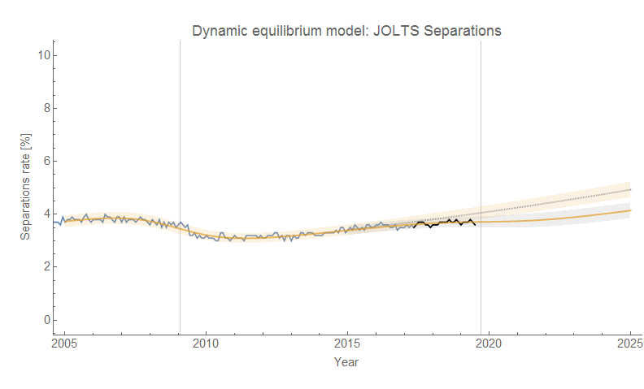
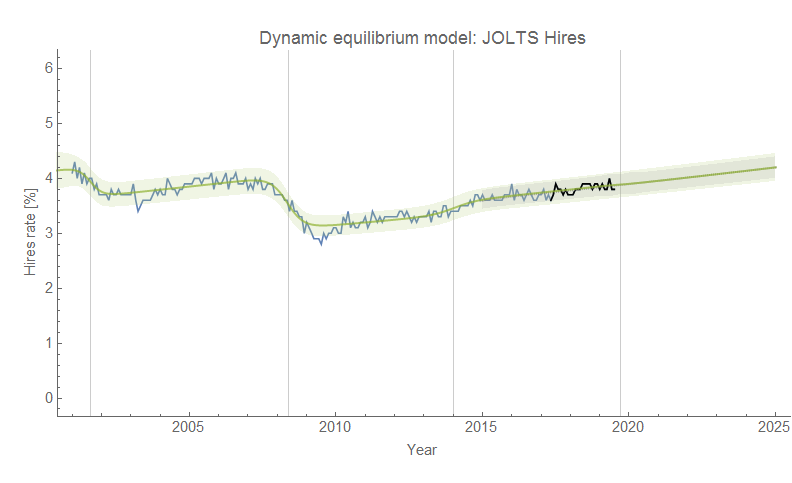
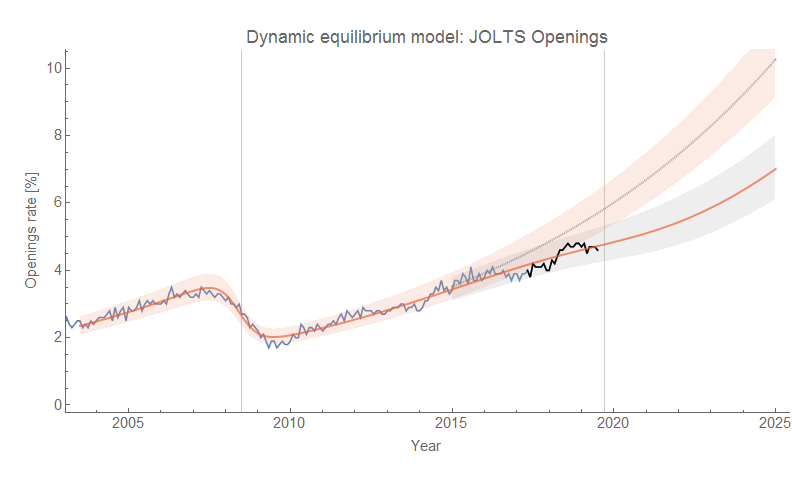
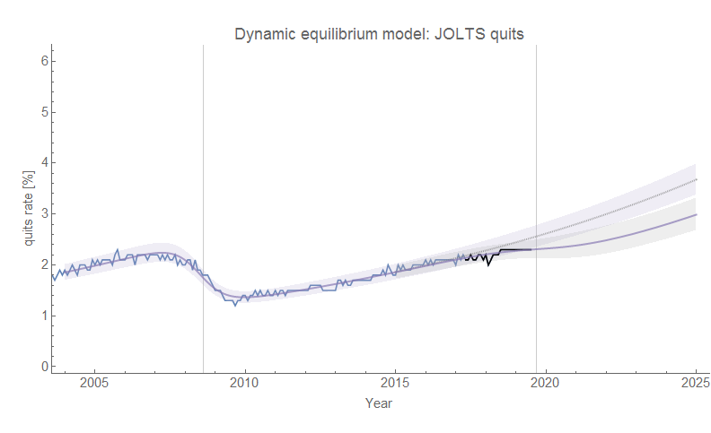
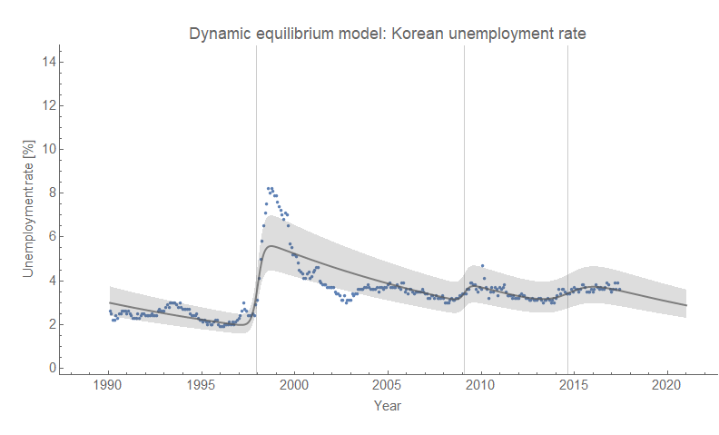
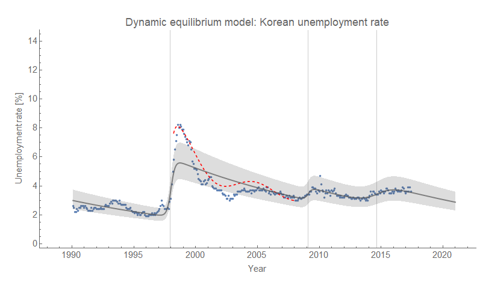

I had an early morning and all-day meeting at work today so didn't get to look at the JOLTS forecasts in the light of [the latest data release](https://fred.stlouisfed.org/release?rid=192). Again, we continue the status quo where openings, separations and quits are all showing deviations consistent with the leading edge of a recession ... and hires continues to show no signs of any changes (click to embiggen):

I'm still using the 2019.7 year to fix the recession shock to be consistent with the previous counterfactuals — though it's increasingly looking like the center will be later. (In fact, the 2019.7 date is actually the recession onset [in the original determination](https://informationtransfereconomics.blogspot.com/2018/06/yield-curve-inversion-and-future.html).)

**\*  \*  \***

In addition to JOLTS data, [John Handley on Twitter](https://twitter.com/jwhandley17/status/1158780360735379456?s=20) low-key challenged me to look at the unemployment rate data for South Korea:

There might be an additional recession in the 90s (it's within the noise), but otherwise it looks like a dynamic information equilibrium model with a bit of a [step response](https://informationtransfereconomics.blogspot.com/2017/11/unemployment-rate-step-response-over.html) (red dashed line is kind of a heuristic sinc function response) in the [Asian financial crisis](https://en.wikipedia.org/wiki/1997_Asian_financial_crisis) and a local version of the long, slow unofficial "recession" that appears in Australia in the last decade (see [here](https://informationtransfereconomics.blogspot.com/2017/02/dynamic-equilibrium-australias.html), [here](https://informationtransfereconomics.blogspot.com/2019/06/employment-situation-day-and-other.html)) associated with [the commodities slowdown](https://informationtransfereconomics.blogspot.com/2018/03/economic-growth-in-australia-1960.html). It's not necessarily the cause, but it looks related in terms of magnitude and duration.
