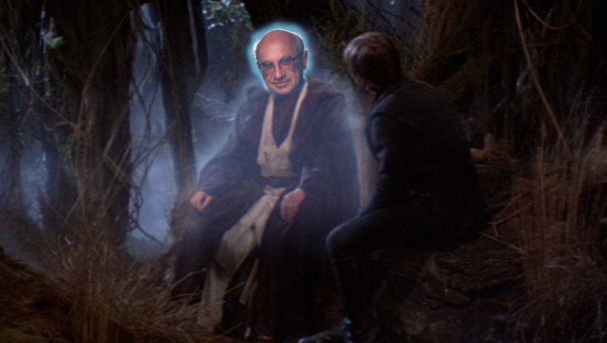
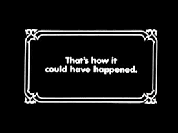

**Ext. Dagobah — Swamp**

**Jason:** It seems monetary policy and inflation are completely uncorrelated. It seems reasonable to believe monetary policy doesn't actually affect inflation.

\[_Milton Friedman appears as a force ghost dressed as a Jedi from behind some foliage._\]

**Milton:** I see you haven't heard my thermostat argument! Imagine a car ...

**Jason:** Actually, I have but ...

**Milton:** \[_Undaunted_\] ... driving on a hilly road trying to keep the same speed. If the driver was really good, the speed on the speedometer would be constant and you'd see the gas pedal go down and up in perfect correlation with the hills. But what you wouldn't see is speed changing — it'd be uncorrelated with the hills and the gas pedal.

**Jason:** Wait, is this a speedometer or a thermostat?

**Milton:** Quiet, you! I'm not finished ... Now if the driver wasn't very good, you might think you could tease out the relationship by looking at the gas pedal and the hills. But no! All you'd see in the gas pedal data when compared to the hills are the driver's random errors. No information about the relationship between the gas pedal and speed is available.

**Jason:** Ok, but how did we figure out looking at the gas pedal was important?

**Milton:** This isn't about whether we know about the gas pedal. We could be ignorant of the gas pedal — the point is that the model could exist!

**Jason:** So assume a complex model relationship between gas and speed when there appears to be no correlation?

**Milton:** Yes!

**Jason:** Sounds kind of like the opposite of Occam's razor to me. I think I'll stick with Occam.

**Milton:** Wait, I mean no! Anyone can see monetary policy affects inflation.

**Jason:** How?

**Milton:** Look at hyperinflation!

**Jason:** Ok, but can we extrapolate from 100% inflation down to 2% inflation? That's equivalent to extrapolating processes that happen on a time scale of a year to a time scale of 50 years ...

**Milton:** Gah! Physicists!

**Jason:** In fact, data seems to show a definite change in behavior [around 10% inflation](https://informationtransfereconomics.blogspot.com/2017/03/belarus-and-effective-theories.html), which is remarkably close to the time scale between recessions ... \[_trails off, staring up at the sky_\]

**Milton:** Look, you. We have lots of evidence that monetary policy affects inflation.

**Jason:** Awesome! Why didn't you just show me that evidence instead of basically telling me that Occam's razor isn't always right? I mean, Occam's razor is a _heuristic_, not a theorem ... of course it's not always right. So are the models built using this evidence pretty good at forecasting, then?

**Milton:** Well, [not exactly](https://www.federalreserve.gov/pubs/feds/2011/201111/201111pap.pdf) ...

**Jason:** Hmm. Can I see your evidence monetary policy affects inflation?

**Milton:** Here you go! All the evidence that monetary policy affects inflation!

**Jason:** Thanks, wow! Why didn't you just show me this in the first place?

**Milton:** I wanted to teach you about the thermostat!

**Jason:** But the reason we don't go with Occam's razor in this case is that we have all this evidence you just showed me ... it has nothing to do with thermostats or speedometers ... that's just question begging ... assuming we already have all this evidence ...

**Milton:** You're welcome!

\[_The force ghost suddenly vanishes_.\]

_But here's what really happened ..._

**Jason:** Hmm. Can I see your evidence monetary policy affects inflation?

**Milton:** You see, you won't be able to tease it out of the data. Imagine the Fed is a thermostat keeping a constant temperature ... the turning on and off of the heater is going to be completely uncorrelated with the temperature inside the house.

**Jason:** That's the same argument as the speedometer. Are you just trying to get out of showing me evidence because you don't have any?

**Milton:** You see, what I said is true ... from a certain point of view.

**Jason:** Certain point of view!??

**Milton:** Bye!

\[_The force ghost suddenly vanishes_.\]
